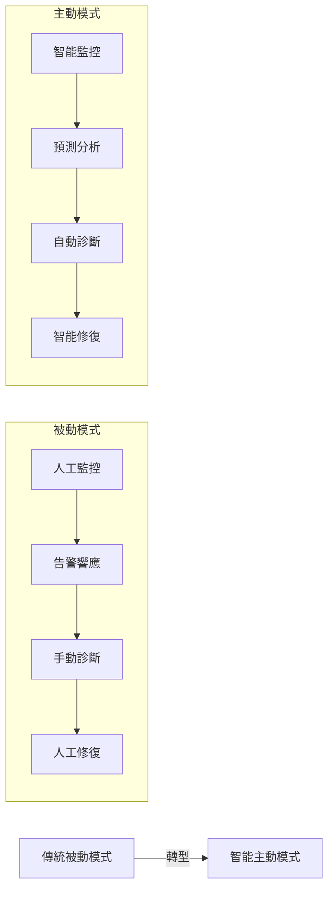
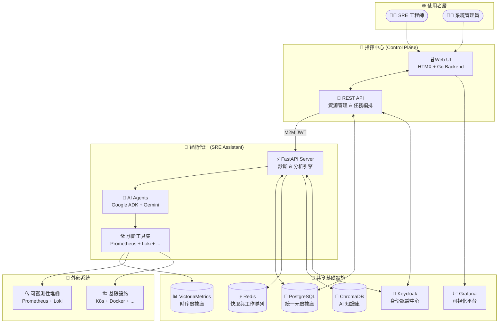
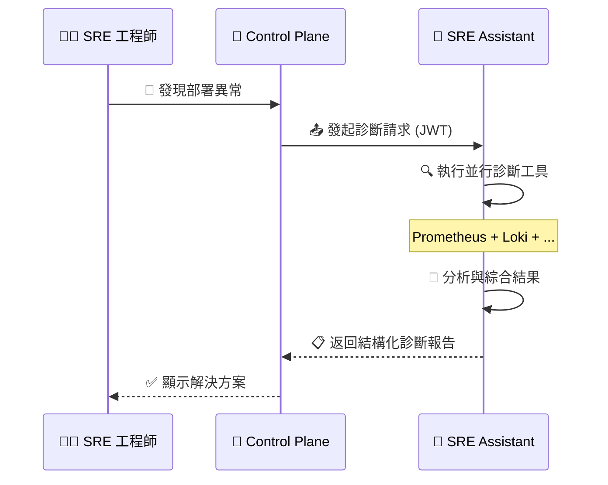

# SRE Platform - 新一代自動化維運平台

[](https://go.dev/)
[](https://www.python.org/)
[](https://htmx.org/)
[](https://fastapi.tiangolo.com/)
[](https://www.postgresql.org/)
[](LICENSE)
[]()
[]()

> 🚀 **現代化 SRE 工作流程的智能化平台 - 從被動故障應對到主動系統管理的完美轉型**

---

## 🎯 專案亮點

- **🧠 智能化診斷**: 提供可擴展的診斷引擎與自動化工作流程
- **⚡ 零配置啟動**: 一鍵 `make setup-dev` 完成所有環境設定
- **🔄 實時協作**: Control Plane 與 SRE Assistant 無縫整合，實現秒級響應
- **📊 全方位監控**: 整合 Prometheus、Loki、Grafana 構建完整可觀測性
- **🛡️ 企業級安全**: 基於 Keycloak 的 OIDC 認證與 M2M 服務間通訊
- **🎨 現代化 UI**: HTMX 驅動的響應式介面，輕量且高效

## 📖 目錄

- [專案簡介](#1-專案簡介)
- [核心架構](#2-核心架構) 
- [快速入門](#3-快速入門)
- [功能展示](#4-功能展示)
- [詳細文件](#5-詳細文件)
- [開發指南](#6-開發指南)
- [部署說明](#7-部署說明)
- [貢獻指南](#8-貢獻指南)
- [常見問題](#9-常見問題)
- [技術支援](#10-技術支援)

---

## 1. 專案簡介

SRE Platform 是一個採用 **Monorepo 架構**的現代化維運平台，專為企業級 SRE 團隊設計。透過智能化的診斷引擎和自動化工作流程，實現從傳統的被動故障應對模式向主動系統管理的革命性轉變。

### 🏗️ 核心組件

<table>
<tr>
<td width="50%">

**🎖️ Control Plane (指揮官)**
- **角色**: Web UI 指揮中心
- **技術**: Go + HTMX + Tailwind CSS
- **職責**: 
  - 統一的管理介面
  - 資源生命週期管理
  - 任務編排與調度
  - 使用者認證與授權

</td>
<td width="50%">

**🤖 SRE Assistant (專家代理)**
- **角色**: 無介面智能代理
- **技術**: Python + FastAPI + Google ADK
- **職責**:
  - 可擴展的診斷引擎
  - 複雜分析任務執行
  - 多源數據整合
  - 自動化決策支援

</td>
</tr>
</table>

### 🎨 設計理念



---

## 2. 核心架構

### 🏛️ 整體架構圖



### 🔄 數據流與協作模式

**雙向增強機制**：
1. **Control Plane → SRE Assistant**: 提供審計日誌、變更歷史等上下文資訊
2. **SRE Assistant → Control Plane**: 回寫 AI 分析結果、診斷報告等智能洞察

**關鍵特性**：
- **🔒 零信任安全**: 所有服務間通訊皆透過 JWT 認證
- **📈 實時監控**: 端到端的可觀測性與性能追蹤
- **🔄 彈性擴展**: 微服務架構支援水平擴展
- **🎛️ 統一管理**: 單一介面管理所有 SRE 工作流程

---

## 3. 快速入門

### 🎯 環境要求

| 項目 | 版本要求 | 說明 |
|------|----------|------|
| **作業系統** | Ubuntu 20.04+ / Debian 11+ | 建議使用 LTS 版本 |
| **Go** | 1.21+ | 用於 Control Plane 開發 |  
| **Python** | 3.11+ | 用於 SRE Assistant 開發 |
| **Poetry** | 1.4+ | Python 依賴管理 |
| **Make** | 4.0+ | 統一開發指令 |
| **Docker** | 20.10+ | 容器化支援 (可選) |
| **記憶體** | 8GB+ | 建議 16GB 以獲得最佳體驗 |
| **磁碟** | 20GB+ | 包含所有依賴與數據 |

### 🚀 一鍵啟動

```bash
# 📥 1. 下載專案
git clone https://github.com/detectviz/sre-platform
cd sre-platform

# ⚡ 2. 一鍵安裝與啟動 (包含所有系統依賴)
make setup-dev

# ✅ 3. 驗證安裝結果
make verify
```

### 🔗 服務訪問點

啟動成功後，您可以透過以下 URL 訪問各項服務：

| 服務 | URL | 說明 | 認證 |
|------|-----|------|------|
| **🎯 Control Plane** | http://localhost:8081 | 主要管理介面 | Keycloak SSO |
| **🤖 SRE Assistant** | http://localhost:8000 | API 文件 | JWT Token |
| **📊 Grafana** | http://localhost:3000 | 監控儀表板 | admin/admin |
| **🔐 Keycloak** | http://localhost:8080 | 身份認證 | admin/admin |
| **📈 VictoriaMetrics** | http://localhost:8481 | 時序數據庫 | 無需認證 |

### 🛠️ 開發指令速查

```bash
# 📊 狀態檢查
make ps                    # 查看所有服務運行狀態
make logs                  # 查看服務日誌

# 🧪 測試執行  
make test                  # 執行全部測試
make test-go              # 僅測試 Control Plane
make test-py              # 僅測試 SRE Assistant

# 🔄 服務管理
make start-services       # 啟動所有背景服務
make stop-services        # 停止所有背景服務
make restart-services     # 重啟所有服務

# 🧹 環境清理
make clean                # ⚠️ 清理所有數據 (謹慎使用)
```

### 🔧 故障排除

<details>
<summary>📋 常見問題及解決方案</summary>

**🚨 問題：`make setup-dev` 執行失敗**
```bash
# 檢查系統依賴
sudo apt update
sudo apt install -y curl wget git build-essential

# 檢查權限
sudo usermod -aG docker $USER
newgrp docker
```

**🚨 問題：PostgreSQL 連接失敗**
```bash
# 檢查服務狀態
sudo systemctl status postgresql
sudo systemctl restart postgresql

# 檢查連接權限
sudo -u postgres psql -c "SELECT version();"
```

**🚨 問題：Keycloak 啟動緩慢**
```bash
# Keycloak 需要較長時間初始化，請耐心等待
tail -f /tmp/keycloak.log

# 手動檢查狀態
curl -f http://localhost:8080/realms/sre-platform || echo "Still starting..."
```

</details>

---

## 4. 功能展示

### 🎬 互動原型體驗

我們提供了一個功能完整的互動原型，讓您無需安裝即可體驗平台的核心功能：

🌟 **[立即體驗 Live Demo](https://detectviz.github.io/control-plane/demo-page.html)**

**🔑 測試帳號**：
- **🔴 超級管理員**: `admin` / `admin` (全權限)
- **🟡 團隊管理員**: `manager` / `manager` (管理權限)  
- **🟢 一般使用者**: `member` / `member` (基礎權限)

### 📱 核心功能預覽

<table>
<tr>
<td width="33%">

**🎯 資源管理**
- 統一的基礎設施視圖
- 批次操作與網段掃描
- 即時狀態監控
- 智能分組管理

</td>
<td width="33%">

**🚨 智能告警**
- AI 驅動的根因分析
- 自動化修復建議
- 告警關聯與去重
- 結構化事件報告

</td>
<td width="33%">

**📊 容量規劃**
- 基於機器學習的預測
- 多維度趨勢分析
- 主動容量建議
- 成本優化建議

</td>
</tr>
</table>

### 🔥 核心工作流程演示



---

## 5. 詳細文件

我們提供了完整的文件體系，涵蓋使用、開發、架構等各個層面：

### 📚 核心文件

| 文件 | 目標讀者 | 內容概述 |
|------|----------|----------|
| **[🎯 使用者指南](docs/USER_GUIDE.md)** | SRE 工程師、運維人員 | Control Plane UI 操作指南、功能說明 |
| **[🏗️ 架構設計書](docs/ARCHITECTURE.md)** | 技術架構師、開發者 | 系統架構、設計理念、技術選型 |
| **[🗺️ 開發路線圖](docs/ROADMAP.md)** | 專案經理、開發團隊 | 開發階段、任務規劃、里程碑 |
| **[🤖 SRE Assistant 指南](docs/SRE_ASSISTANT.md)** | Python 開發者 | SRE Assistant 開發、API、工具 |
| **[🔌 API 契約規格](pkg/api/openapi.yaml)** | API 開發者、整合者 | 服務間通訊的唯一真實來源 |
| **[🤖 AI 代理指南](AGENT.md)** | AI 開發者、代理系統 | AI 代理操作指南、自動化流程 |

### 📖 專業文件

<details>
<summary>📋 擴展文件清單</summary>

- **[🔒 安全配置指南](docs/SECURITY.md)** - 認證、授權、加密配置
- **[📈 監控與告警](docs/MONITORING.md)** - 可觀測性最佳實踐  
- **[🚀 部署指南](docs/DEPLOYMENT.md)** - 生產環境部署說明
- **[🔧 故障排除](docs/TROUBLESHOOTING.md)** - 常見問題與解決方案
- **[⚡ 性能調優](docs/PERFORMANCE.md)** - 性能優化指南
- **[🔄 備份恢復](docs/BACKUP.md)** - 數據備份與災難恢復

</details>

---

## 6. 開發指南

### 🏗️ 專案結構

```
sre-platform/
├── 📁 services/
│   ├── 🎯 control-plane/          # Go 後端服務
│   │   ├── cmd/server/            # 應用入口
│   │   ├── internal/              # 核心業務邏輯
│   │   ├── templates/             # HTMX 模板
│   │   └── static/                # 靜態資源
│   └── 🤖 sre-assistant/          # Python AI 服務  
│       ├── src/sre_assistant/     # 核心代碼
│       ├── tests/                 # 測試套件
│       └── config/                # 配置檔案
├── 📁 pkg/
│   └── api/openapi.yaml          # API 契約
├── 📁 docs/                      # 文件目錄
├── 📁 local/                     # 本地開發腳本
├── 🔧 Makefile                   # 統一開發指令
└── 📋 README.md                  # 專案說明
```

### 🔄 開發工作流程

```mermaid
gitgraph
    commit id: "🎯 Feature Planning"
    branch feature/new-diagnostic
    checkout feature/new-diagnostic
    commit id: "🔧 API Contract Update"
    commit id: "💻 Control Plane Implementation" 
    commit id: "🤖 SRE Assistant Implementation"
    commit id: "🧪 Testing & Documentation"
    checkout main
    merge feature/new-diagnostic
    commit id: "🚀 Release v1.x.x"
```

### 📝 開發規範

**🎯 代碼規範**：
- **Go**: 遵循 `gofmt` + `golint` + `go vet`
- **Python**: 使用 `black` + `isort` + `flake8` + `mypy`
- **Git**: 採用 [Conventional Commits](https://www.conventionalcommits.org/zh-hant/)

**📋 Commit 訊息範例**：
```
feat: 新增部署診斷功能
fix: 修復 JWT 驗證錯誤  
docs: 更新 API 文件
test: 增加工具整合測試
refactor: 重構診斷工作流程
```

### 🧪 測試策略

| 測試類型 | 覆蓋範圍 | 執行指令 |
|----------|----------|----------|
| **單元測試** | 個別函數/類別 | `make test-go` / `make test-py` |
| **整合測試** | 服務間互動 | `make test-integration` |
| **端到端測試** | 完整工作流程 | `make test-e2e` |
| **性能測試** | 負載與壓力 | `make test-performance` |

---

## 7. 部署說明

### 🎯 部署選項

<table>
<tr>
<th width="25%">部署方式</th>
<th width="25%">適用場景</th>
<th width="25%">複雜度</th>
<th width="25%">推薦指數</th>
</tr>
<tr>
<td>🖥️ <strong>本地開發</strong></td>
<td>開發測試</td>
<td>⭐</td>
<td>⭐⭐⭐⭐⭐</td>
</tr>
<tr>
<td>🐳 <strong>Docker Compose</strong></td>
<td>小型部署</td>
<td>⭐⭐</td>
<td>⭐⭐⭐⭐</td>
</tr>
<tr>
<td>☸️ <strong>Kubernetes</strong></td>
<td>生產環境</td>
<td>⭐⭐⭐⭐</td>
<td>⭐⭐⭐⭐⭐</td>
</tr>
<tr>
<td>☁️ <strong>雲端託管</strong></td>
<td>企業級部署</td>
<td>⭐⭐⭐</td>
<td>⭐⭐⭐⭐</td>
</tr>
</table>

### 🐳 Docker 快速部署

```bash
# 🏗️ 建置映像
docker-compose build

# 🚀 啟動服務
docker-compose up -d

# 📊 檢查狀態  
docker-compose ps
```

### ☸️ Kubernetes 部署

```bash
# 📁 部署配置檔案位於 k8s/ 目錄
kubectl apply -f k8s/namespace.yaml
kubectl apply -f k8s/configmaps/
kubectl apply -f k8s/deployments/
kubectl apply -f k8s/services/

# ✅ 驗證部署
kubectl get pods -n sre-platform
```

---

## 8. 貢獻指南

我們歡迎社群貢獻！請遵循以下流程：

### 🤝 貢獻流程

1. **🍴 Fork 專案** → 點擊 GitHub 上的 Fork 按鈕
2. **🌿 建立分支** → `git checkout -b feature/amazing-feature`  
3. **💻 開發功能** → 實現您的想法
4. **🧪 執行測試** → `make test` 確保一切正常
5. **📝 更新文件** → 同步更新相關文件
6. **📤 提交 PR** → 提交 Pull Request

### 📋 貢獻指引

**🎯 我們特別歡迎以下貢獻**：
- 🐛 Bug 修復與問題回報
- ✨ 新功能與增強建議  
- 📖 文件改進與翻譯
- 🧪 測試覆蓋率提升
- 🚀 性能優化

**📝 提交前檢查清單**：
- [ ] 代碼遵循專案規範
- [ ] 所有測試通過
- [ ] 文件已更新
- [ ] Commit 訊息清晰
- [ ] 沒有敏感資訊洩露

---

## 9. 常見問題

<details>
<summary>❓ 為什麼選擇 Monorepo 架構？</summary>

**優勢**：
- 🔄 **統一版本管理**: 避免版本衝突與相依性問題
- 🛠️ **共享工具鏈**: 統一的建置、測試、部署流程  
- 📦 **代碼重用**: 共享庫與工具函數
- 🎯 **原子性變更**: 跨服務的功能可以一次性交付

</details>

<details>
<summary>❓ SRE Assistant 與傳統監控工具有何不同？</summary>

**核心差異**：
- 🧠 **AI 驅動**: 不只是數據收集，更提供智能分析
- 🔍 **根因分析**: 自動關聯多源數據找出問題根源
- ⚡ **主動預防**: 預測性維護而非被動響應
- 🎯 **上下文感知**: 整合歷史資料與變更歷史

</details>

<details>
<summary>❓ 如何確保系統安全性？</summary>

**安全措施**：
- 🔐 **零信任架構**: 所有通訊都需認證
- 🔑 **OIDC 標準**: 基於業界標準的身份認證
- 📜 **RBAC 權限**: 細粒度的角色權限控制
- 🔒 **加密傳輸**: TLS/SSL 加密所有網路通訊

</details>

<details>
<summary>❓ 系統的擴展性如何？</summary>

**擴展能力**：
- 🏗️ **微服務架構**: 可獨立擴展各個服務
- 📊 **水平擴展**: 支援負載均衡與多實例部署
- 🔌 **插件化設計**: 易於新增新的診斷工具
- ☁️ **雲原生**: 原生支援 Kubernetes 部署

</details>

---

## 10. 技術支援

### 🆘 獲取幫助

如果您遇到問題或需要協助，請透過以下方式聯繫我們：

| 問題類型 | 聯繫方式 | 回應時間 |
|----------|----------|----------|
| 🐛 **Bug 回報** | [GitHub Issues](https://github.com/detectviz/sre-platform/issues) | 24小時內 |
| 💡 **功能建議** | [GitHub Discussions](https://github.com/detectviz/sre-platform/discussions) | 48小時內 |
| 📖 **使用問題** | [文件中心](docs/) | 即時 |
| 🔧 **技術諮詢** | support@detectviz.com | 72小時內 |

### 🏷️ 問題標籤

提交 Issue 時請使用適當標籤：
- 🔴 `bug` - 功能缺陷
- ✨ `enhancement` - 功能增強  
- 📖 `documentation` - 文件相關
- ❓ `question` - 使用問題
- 🆘 `help wanted` - 需要協助

### 📊 專案狀態

[](https://github.com/detectviz/sre-platform/issues)
[](https://github.com/detectviz/sre-platform/pulls)
[](https://github.com/detectviz/sre-platform/stargazers)
[](https://github.com/detectviz/sre-platform/network/members)

---

## 📄 授權條款

本專案採用 [Apache License 2.0](LICENSE) 開源授權條款。

```
Copyright 2025 DetectViz Team

Licensed under the Apache License, Version 2.0 (the "License");
you may not use this file except in compliance with the License.
You may obtain a copy of the License at

    http://www.apache.org/licenses/LICENSE-2.0

Unless required by applicable law or agreed to in writing, software
distributed under the License is distributed on an "AS IS" BASIS,
WITHOUT WARRANTIES OR CONDITIONS OF ANY KIND, either express or implied.
See the License for the specific language governing permissions and
limitations under the License.
```

---

## 🙏 致謝

感謝所有為 SRE Platform 做出貢獻的開發者、測試者與使用者。特別感謝：

- [Go 團隊](https://golang.org/) 提供優秀的後端語言
- [FastAPI](https://fastapi.tiangolo.com/) 提供現代化的 Python Web 框架  
- [HTMX](https://htmx.org/) 提供簡潔的前端解決方案
- [Google](https://cloud.google.com/ai) 提供強大的 AI 服務
- 所有開源社群的無私奉獻

---

<div align="center">

**🚀 開始您的 SRE 自動化之旅！**

[立即安裝](#3-快速入門) • [體驗 Demo](#4-功能展示) • [查看文件](#5-詳細文件) • [參與貢獻](#8-貢獻指南)

---

**⭐ 如果這個專案對您有幫助，請給我們一個 Star！**

</div>