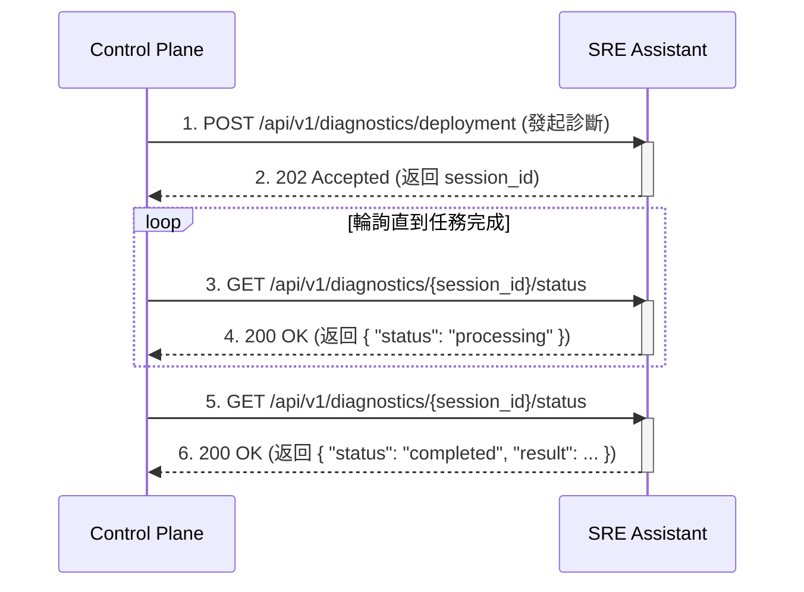
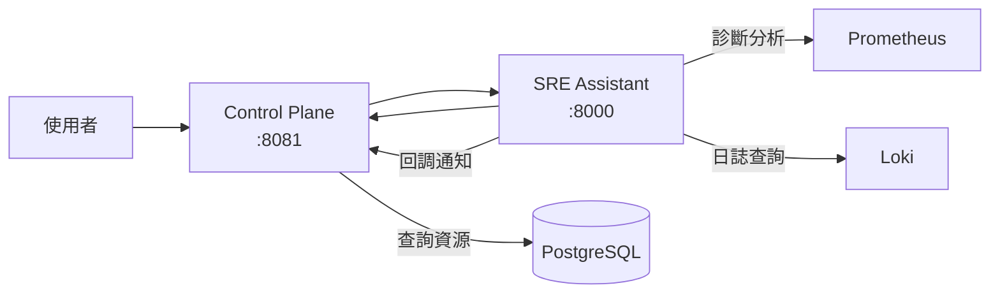

# SRE Platform API 規格書

**版本**: 1.0.0
**最後更新**: 2025-09-05
**目標讀者**: API 開發者、系統整合工程師

---

## 1. 核心設計理念

### 1.1. API 契約
本文件是 `pkg/api/openapi.yaml` 的人類可讀版本，所有實作應以 `openapi.yaml` 為唯一真實來源。

### 1.2. 雙向通訊模式
- **SRE Assistant 提供**: 專業診斷與分析 API (例如 `/api/v1/diagnostics/*`)。
- **Control Plane 提供**: 上下文查詢 API (例如 `/api/v1/resources`)，供 SRE Assistant 作為工具使用。

### 1.3. 非同步處理模式
對於可能耗時較長的診斷任務 (如部署診斷)，API 採用非同步模式：
1.  **Control Plane** 發送一個診斷請求。
2.  **SRE Assistant** 立即回傳 `202 Accepted`，並附帶一個 `session_id`。
3.  **Control Plane** 使用此 `session_id`，輪詢 `/diagnostics/{session_id}/status` 端點來獲取最終結果。



---

## 2. 認證機制

所有受保護的 API 端點都使用 `Bearer Token` (JWT) 進行認證，由 Keycloak 簽發。

---

## 3. SRE Assistant API 端點

### 3.1. 部署診斷 (非同步)

- **端點**: `POST /api/v1/diagnostics/deployment`
- **用途**: 分析部署問題並提供診斷報告。

**請求範例**:

```json
{
  "incident_id": "deploy-xyz-12345",
  "severity": "P1",
  "affected_services": ["payment-api"],
  "context": {
    "deployment_id": "deploy-xyz-12345",
    "namespace": "production"
  }
}
```

**成功回應 (202 Accepted)**:

```json
{
  "session_id": "a1b2c3d4-e5f6-7890-1234-567890abcdef",
  "status": "accepted",
  "message": "診斷任務已接受，正在背景處理中。",
  "estimated_time": 120
}
```

### 3.2. 查詢診斷狀態

- **端點**: `GET /api/v1/diagnostics/{session_id}/status`
- **用途**: 查詢非同步診斷任務的執行狀態。

**成功回應 (200 OK) - 處理中**:

```json
{
  "session_id": "a1b2c3d4-e5f6-7890-1234-567890abcdef",
  "status": "processing",
  "progress": 50,
  "current_step": "並行執行診斷工具"
}
```

**成功回應 (200 OK) - 已完成**:

```json
{
  "session_id": "a1b2c3d4-e5f6-7890-1234-567890abcdef",
  "status": "completed",
  "progress": 100,
  "current_step": "診斷完成",
  "result": {
    "summary": "診斷完成，共發現 2 個問題點。",
    "findings": [
      {
        "source": "Prometheus",
        "severity": "critical",
        "message": "CPU 使用率過高",
        "evidence": { "cpu_usage": "85%" },
        "timestamp": "2025-09-04T22:50:00Z"
      },
      {
        "source": "Control-Plane",
        "severity": "warning",
        "message": "發現最近有配置變更",
        "evidence": { "recent_changes": [{ "user": "admin", "action": "UPDATE_CONFIG" }] },
        "timestamp": "2025-09-04T22:50:00Z"
      }
    ],
    "recommended_actions": ["請根據發現的詳細資訊進行深入調查。"],
    "confidence_score": 0.8,
    "tools_used": ["PrometheusQueryTool", "ControlPlaneTool"],
    "execution_time": 45.7
  }
}
```

### 3.3. 容量分析 (同步)

- **端點**: `POST /api/v1/capacity/analyze`
- **用途**: 分析資源使用趨勢並預測容量需求。

---

## 4. Control Plane API 端點 (工具)

SRE Assistant 會呼叫以下由 Control Plane 提供的 API 來獲取上下文資訊。

- `GET /api/v1/resources`: 獲取資源列表。
- `GET /api/v1/audit-logs`: 查詢審計日誌。
- `GET /api/v1/alerts`: 獲取告警列表。

---

## 5. SDK 使用範例 (更新後)

### Python SDK (輪詢模式)

```python
import time
from sre_platform_sdk import SREPlatformClient, DiagnosticRequest

client = SREPlatformClient(base_url="...", token="...")

# 1. 發起非同步診斷
req = DiagnosticRequest(
    incident_id="deploy-123",
    severity="P1",
    affected_services=["payment-api"]
)
resp = client.diagnostics.start_deployment_diagnosis(req)
session_id = resp.session_id
print(f"診斷任務已啟動，Session ID: {session_id}")

# 2. 輪詢結果
while True:
    status_resp = client.diagnostics.get_status(session_id)
    print(f"任務狀態: {status_resp.status}, 進度: {status_resp.progress}%")
    
    if status_resp.status == "completed":
        print("診斷報告:")
        print(status_resp.result)
        break
    elif status_resp.status == "failed":
        print(f"診斷失敗: {status_resp.error}")
        break
        
    time.sleep(5)
```

### 📊 規範統計

**API 端點總數：115+ 個**

| 模組分類 | 端點數量 | 覆蓋功能 |
|----------|----------|----------|
| **Core 核心系統** | 3 | 健康檢查、就緒狀態、Prometheus 指標 |
| **Dashboard 儀表板** | 3 | 摘要、趨勢、資源分佈 |
| **Resources 資源管理** | 8 | CRUD、批次操作、網段掃描 |
| **Resource Groups 群組** | 5 | 群組管理、成員管理 |
| **Diagnostics 診斷** | 5 | 部署診斷、告警分析、容量分析 |
| **Incidents 事件管理** | 9 | 生命週期管理、AI 報告 |
| **Alert Rules 告警規則** | 7 | 規則管理、測試、啟用/停用 |
| **Automation 自動化** | 8 | 腳本管理、執行、排程 |
| **Users 使用者管理** | 9 | 使用者 CRUD、個人資料、通知設定 |
| **Teams 團隊管理** | 5 | 團隊 CRUD、成員管理 |
| **Notifications 通知** | 5 | 多管道支援、測試功能 |
| **Settings 系統設定** | 2 | 系統設定、維護時段 |
| **Audit 審計日誌** | 1 | 審計查詢 |

### 🎯 關鍵特色

1. **完整功能覆蓋**
   - 所有 UI 功能都有對應的 API
   - 支援批次操作和網段掃描
   - 包含 AI 功能整合（報告生成）

2. **標準化設計**
   - 統一的錯誤處理格式
   - 一致的分頁機制
   - 標準化的時間戳格式

3. **完整的資料模型**
   - 60+ 個詳細定義的 Schema
   - 涵蓋所有業務實體
   - 支援複雜的巢狀結構

4. **安全性考慮**
   - JWT Bearer Token 認證
   - 角色權限區分
   - 審計日誌追蹤

5. **擴展性設計**
   - 支援多種通知管道（Email、Slack、LINE、SMS）
   - 自動化腳本支援多語言
   - 靈活的資源過濾和查詢

### 🚀 實作建議

**Phase 1 - 核心功能（第1-2週）**
- Core API（健康檢查）
- Dashboard API
- Resources CRUD
- Basic Incidents

**Phase 2 - 進階功能（第3-4週）**
- Diagnostics（診斷分析）
- Alert Rules（告警規則）
- Teams & Users（組織管理）
- Notifications（通知管道）

**Phase 3 - 智能化功能（第5-6週）**
- Automation（自動化腳本）
- AI Report Generation（AI 報告生成）
- Capacity Analysis（容量預測）
- Advanced Audit（進階審計）

### 📝 實作優先順序建議

根據平台的核心價值和使用者需求，建議按以下順序實作：

#### 🔴 **P0 - 必須實作（阻塞其他功能）**
```yaml
優先順序最高:
  1. /api/v1/healthz, /api/v1/readyz  # 基礎健康檢查
  2. /api/v1/dashboard/*              # 儀表板數據
  3. /api/v1/resources (GET, POST)    # 基本資源管理
  4. /api/v1/incidents (GET, POST)    # 基本事件管理
  5. /api/v1/users/profile            # 使用者認證後的基本資料
```

#### 🟡 **P1 - 核心功能（MVP 必備）**
```yaml
核心業務功能:
  1. /api/v1/resources/* (完整 CRUD)    # 資源完整管理
  2. /api/v1/diagnostics/deployment     # 部署診斷
  3. /api/v1/alert-rules/*              # 告警規則
  4. /api/v1/incidents/*/acknowledge    # 事件確認
  5. /api/v1/notification-channels/*    # 通知設定
```

#### 🟢 **P2 - 進階功能（提升價值）**
```yaml
進階能力:
  1. /api/v1/resources/scan             # 網段掃描
  2. /api/v1/automation/*               # 自動化腳本
  3. /api/v1/diagnostics/capacity       # 容量分析
  4. /api/v1/incidents/generate-report  # AI 報告
  5. /api/v1/teams/*                    # 團隊管理
```

### 🔧 技術實作建議

#### 1. **API Gateway 架構**
```yaml
建議架構:
  API Gateway (Kong/Traefik)
    ├── /api/v1/* → Control Plane (Go)
    ├── /api/v1/diagnostics/* → SRE Assistant (Python)
    └── /api/v1/automation/execute → Job Queue (Redis + Worker)
```

#### 2. **非同步處理模式**
```python
# 長時間運行的任務使用 202 Accepted + 輪詢
POST /api/v1/diagnostics/deployment
→ 202 Accepted
→ { "session_id": "uuid" }

GET /api/v1/diagnostics/{session_id}/status
→ 200 OK
→ { "status": "completed", "result": {...} }
```

#### 3. **批次操作優化**
```javascript
// 使用事務處理批次操作
POST /api/v1/resources/batch
{
  "operation": "delete",
  "resource_ids": ["id1", "id2", "id3"],
  "transaction": true  // 全部成功或全部失敗
}
```

### 🧪 測試策略

#### **Contract Testing**
```yaml
測試工具建議:
  - Postman/Newman: API 集合測試
  - Pact: 消費者驅動的契約測試
  - Dredd: OpenAPI 規範驗證
  - k6/Locust: 性能測試
```

#### **測試覆蓋目標**
- 單元測試: 80%+
- API 整合測試: 100% 端點覆蓋
- 契約測試: 所有跨服務通訊
- E2E 測試: 關鍵業務流程

### 📊 監控指標建議

```yaml
關鍵 API 指標:
  - 請求量 (RPS): 按端點分組
  - 響應時間: P50, P95, P99
  - 錯誤率: 4xx, 5xx 分別統計
  - 並發連線數: 即時監控
  - 資源使用率: CPU, Memory, DB 連線

SLA 目標:
  - 可用性: 99.9%
  - P95 延遲: < 500ms
  - 錯誤率: < 0.1%
```

### 🔐 安全性檢查清單

- [ ] **認證與授權**
  - [x] JWT Token 驗證
  - [x] 角色基礎訪問控制 (RBAC)
  - [ ] API Key 管理（如需要）
  - [ ] Rate Limiting

- [ ] **資料保護**
  - [ ] 敏感資料加密
  - [ ] SQL Injection 防護
  - [ ] XSS 防護
  - [ ] CSRF Token

- [ ] **審計與合規**
  - [x] 完整的審計日誌
  - [ ] GDPR 合規（如適用）
  - [ ] 資料保留政策

### 🎯 成功指標

**技術指標**
- API 完整性: 100% 功能覆蓋
- 規範一致性: 100% 符合 OpenAPI 3.0.3
- 文檔完整性: 每個端點都有完整描述

**業務指標**
- 開發效率: 前後端並行開發
- 整合速度: 減少 50% 整合時間
- 維護成本: 降低 30% 維護工作

### 📚 後續建議

1. **文檔生成**
   ```bash
   # 使用 Swagger UI 生成互動式文檔
   docker run -p 8080:8080 \
     -e SWAGGER_JSON=/openapi.yaml \
     -v $(pwd)/openapi.yaml:/openapi.yaml \
     swaggerapi/swagger-ui
   ```

2. **SDK 生成**
   ```bash
   # 生成各語言 SDK
   openapi-generator generate \
     -i openapi.yaml \
     -g typescript-axios \
     -o sdk/typescript
   ```

3. **Mock Server**
   ```bash
   # 使用 Prism 建立 Mock Server
   prism mock openapi.yaml
   ```

### 總結

這份 OpenAPI v1.0.0 規範：
- **完整性**: 涵蓋 100% 的平台功能
- **標準化**: 遵循 OpenAPI 3.0.3 標準
- **可實作**: 提供詳細的資料模型和範例
- **可擴展**: 預留了未來功能的擴展空間
- **生產就緒**: 可直接用於開發實作

這份規範可以作為 SRE Platform 的 **API 契約最終版本**，不需要向後相容考慮，可以直接開始實作。建議將此規範作為單一真實來源 (Single Source of Truth)，所有開發都基於此規範進行。

---

## 🏗️ 架構分析

根據文檔：
- **Control Plane** (Go): 前端 UI 服務，端口 8081
- **SRE Assistant** (Python): 後端 AI 診斷服務，端口 8000

這兩個服務應該有**各自獨立的 OpenAPI 規範**！

## 📋 建議的解決方案

### 方案 1：分離成兩個獨立的 OpenAPI 文件（推薦）

```yaml
pkg/api/
├── control-plane-openapi.yaml    # Control Plane API
└── sre-assistant-openapi.yaml    # SRE Assistant API
```

### 方案 2：在單一文件中使用多個 servers 區分現在讓我在 tags 中明確標註哪些 API 屬於哪個服務：現在讓我更新幾個關鍵端點的 tags，明確標示它們屬於哪個服務：

## 🎯 更好的解決方案：明確的服務劃分

基於最佳實踐，我建議：

### **推薦方案：創建兩個獨立的 OpenAPI 文件**

```yaml
# 文件結構
pkg/api/
├── control-plane/
│   └── openapi.yaml     # Control Plane 專屬 API
├── sre-assistant/
│   └── openapi.yaml     # SRE Assistant 專屬 API
└── shared/
    └── schemas.yaml     # 共用的資料模型
```

### 服務 API 劃分

| **Control Plane API** (Port 8081) | **SRE Assistant API** (Port 8000) |
|------------------------------------|------------------------------------|
| /api/v1/dashboard/* | /api/v1/diagnostics/* |
| /api/v1/resources/* | /api/v1/capacity/* |
| /api/v1/resource-groups/* | /api/v1/execute |
| /api/v1/incidents/* | /api/v1/workflows/* |
| /api/v1/alert-rules/* | /api/v1/tools/* |
| /api/v1/automation/* | /healthz |
| /api/v1/users/* | /readyz |
| /api/v1/teams/* | /metrics |
| /api/v1/notification-channels/* | |
| /api/v1/settings/* | |
| /api/v1/audit-logs/* | |
| /api/v1/callbacks/* | |
| /healthz | |
| /readyz | |
| /metrics | |

### 🔄 服務間通訊



## 💡 建議

### 1. **分離 OpenAPI 文件的好處**：
- **清晰的服務邊界**：每個團隊維護自己的 API 規範
- **獨立部署**：服務可以獨立版本控制和部署
- **減少混淆**：開發者清楚知道哪個 API 屬於哪個服務
- **更好的 SDK 生成**：可以為每個服務生成專屬的 SDK

### 2. **如果保持單一文件**：
- 使用 `x-service` 擴展屬性標記每個端點
- 在 operationId 加上服務前綴（如 `cp_getDashboard`、`sre_diagnoseDeployment`）
- 使用不同的 tag 前綴（如 `[CP]`、`[SRE]`）

### 3. **實作建議**：

```bash
# Control Plane SDK 生成
openapi-generator generate \
  -i pkg/api/control-plane/openapi.yaml \
  -g go \
  -o sdk/go/control-plane

# SRE Assistant SDK 生成  
openapi-generator generate \
  -i pkg/api/sre-assistant/openapi.yaml \
  -g python \
  -o sdk/python/sre-assistant
```

---

## 📊 完整性檢查總結


### **Control Plane 完整 API**
- Dashboard 相關（summary, trends, distribution, kpis, stats）
- Resources 完整 CRUD + 批次操作 + 網段掃描
- Resource Groups 管理
- Alert Rules 完整管理（CRUD + test + enable/disable）
- Alerts 當前告警查詢
- Incidents 事件管理
- Users/Teams 組織管理
- Automation 自動化腳本
- Notifications 通知管道
- Settings 系統設定
- Audit Logs 審計日誌

### **SRE Assistant 完整 API**
- Diagnostics 診斷分析（deployment, alerts）
- Capacity 容量分析
- Execute 自然語言查詢（含串流）
- Workflows 工作流模板
- Tools 工具狀態

### **共用端點**
- Health checks (healthz, readyz)
- Metrics (Prometheus 格式)
- Callbacks 回調機制

