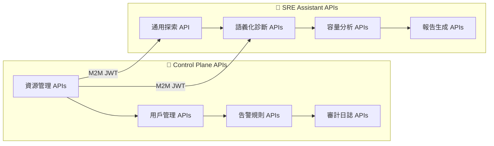
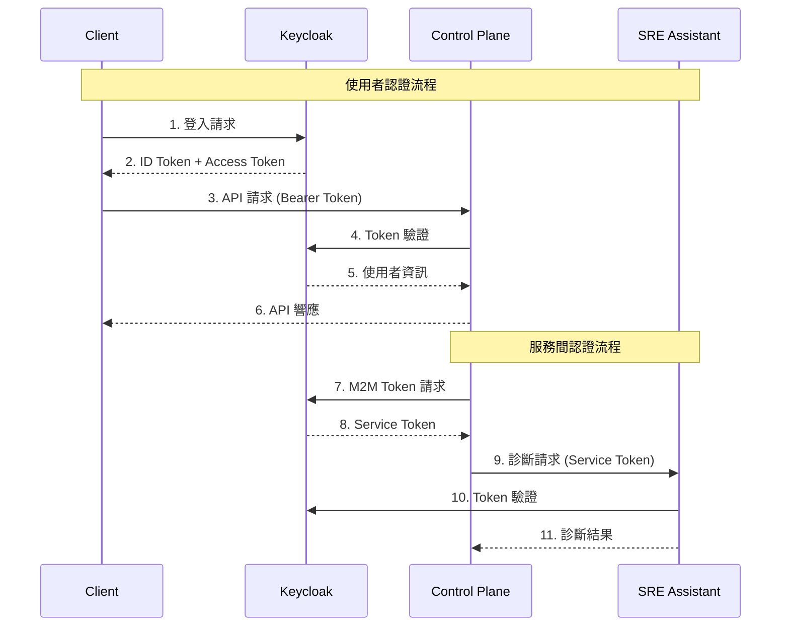

# SRE Platform API 完整文檔

**版本**: v1.0.0  
**最後更新**: 2025-09-05  
**目標讀者**: API 開發者、系統整合工程師、第三方開發者

---

## 📋 目錄

- [API 概覽](#api-概覽)
- [認證機制](#認證機制)
- [Control Plane APIs](#control-plane-apis)
- [SRE Assistant APIs](#sre-assistant-apis)
- [錯誤處理](#錯誤處理)
- [速率限制](#速率限制)
- [SDK 與範例](#sdk-與範例)
- [變更日誌](#變更日誌)

---

## API 概覽

### 🌟 設計理念

SRE Platform 採用 **兩層式 API 架構**，旨在平衡靈活性與穩定性：



### 🏗️ 架構特點

| 特性 | Control Plane | SRE Assistant |
|------|---------------|---------------|
| **設計模式** | RESTful + CRUD | Agent-based + AI |
| **認證方式** | OIDC + Session | JWT + M2M |
| **回應格式** | JSON | JSON + 結構化報告 |
| **主要用途** | 資源管理 | 智能診斷分析 |

### 📊 服務端點總覽

| 服務 | 基礎 URL | API 版本 | 文檔 |
|------|----------|----------|------|
| **Control Plane** | `https://api.sre-platform.com` | v1 | [OpenAPI 規格](pkg/api/openapi.yaml) |
| **SRE Assistant** | `https://assistant.sre-platform.com` | v1 | [Interactive Docs](http://localhost:8000/docs) |

---

## 認證機制

### 🔐 認證流程圖



### 🎯 認證類型

#### 1. OIDC 使用者認證

**適用於**: Web UI、移動應用

```bash
# Step 1: 重定向到 Keycloak 登入
GET /auth/login

# Step 2: 登入後回調
GET /auth/callback?code=<authorization_code>&state=<state>

# Step 3: 使用 Session Cookie 訪問 API
GET /api/v1/resources
Cookie: session_id=<session_token>
```

#### 2. JWT Bearer 認證

**適用於**: API 客戶端、第三方整合

```bash
# Step 1: 獲取 Access Token
POST https://keycloak.sre-platform.com/realms/sre-platform/protocol/openid-connect/token
Content-Type: application/x-www-form-urlencoded

grant_type=client_credentials&
client_id=your-client-id&
client_secret=your-client-secret&
scope=sre-platform:read

# Step 2: 使用 Token 訪問 API
GET /api/v1/resources
Authorization: Bearer <access_token>
```

#### 3. M2M 服務認證

**適用於**: 服務間通訊

```yaml
Flow: Client Credentials Grant
Token Endpoint: /realms/sre-platform/protocol/openid-connect/token
Scope: sre-platform:diagnose sre-platform:write
Token Lifetime: 1 hour
Refresh: Automatic
```

---

## Control Plane APIs

### 🎯 資源管理 APIs

#### 獲取資源列表

```http
GET /api/v1/resources
Authorization: Bearer <token>
```

**查詢參數**:
```yaml
page: 1                    # 頁碼
limit: 20                  # 每頁數量
type: server|network|app   # 資源類型
status: active|inactive    # 狀態篩選
team_id: 123              # 團隊篩選
search: "web-server"      # 關鍵字搜尋
```

**響應範例**:
```json
{
  "data": [
    {
      "id": 1,
      "name": "web-server-01",
      "type": "server",
      "ip_address": "192.168.1.10",
      "status": "active",
      "team_id": 1,
      "metadata": {
        "os": "Ubuntu 22.04",
        "cpu_cores": 8,
        "memory_gb": 32
      },
      "created_at": "2025-01-15T10:30:00Z",
      "updated_at": "2025-09-05T14:20:00Z"
    }
  ],
  "pagination": {
    "page": 1,
    "limit": 20,
    "total": 156,
    "total_pages": 8
  }
}
```

#### 創建新資源

```http
POST /api/v1/resources
Authorization: Bearer <token>
Content-Type: application/json
```

**請求體**:
```json
{
  "context": {
    "deployment_id": "deploy-xyz-12345",
    "service_name": "payment-api",
    "namespace": "production",
    "image_tag": "v2.1.3",
    "trigger_source": "ControlPlane::DeploymentMonitor",
    "deployment_strategy": "rolling",
    "replicas": {
      "desired": 6,
      "current": 4,
      "ready": 2
    }
  }
}
```

**響應範例**:
```json
{
  "status": "COMPLETED",
  "session_id": "deploy-diag-001",
  "deployment_summary": {
    "deployment_id": "deploy-xyz-12345",
    "service_name": "payment-api",
    "status": "DEGRADED",
    "health_score": 0.33,
    "issues_found": 3
  },
  "diagnosis_results": {
    "container_analysis": {
      "status": "ISSUES_FOUND",
      "findings": [
        {
          "type": "startup_failure", 
          "severity": "critical",
          "description": "2 of 6 pods failing to start due to image pull errors",
          "affected_pods": ["payment-api-78d9c-x4k2p", "payment-api-78d9c-m9n1q"],
          "error_details": "Failed to pull image: ImagePullBackOff"
        }
      ]
    },
    "resource_analysis": {
      "status": "WARNING",
      "findings": [
        {
          "type": "resource_constraint",
          "severity": "medium", 
          "description": "Memory usage approaching limits",
          "metrics": {
            "memory_usage": "1.8GB",
            "memory_limit": "2GB", 
            "utilization": "90%"
          }
        }
      ]
    },
    "network_analysis": {
      "status": "HEALTHY",
      "findings": []
    }
  },
  "recommended_actions": [
    {
      "priority": "critical",
      "category": "image_management",
      "action": "Verify image exists in registry and update image pull policy",
      "commands": [
        "kubectl describe pod payment-api-78d9c-x4k2p -n production",
        "docker pull payment-api:v2.1.3"
      ]
    },
    {
      "priority": "medium",
      "category": "resource_tuning",
      "action": "Increase memory limits to prevent OOM kills",
      "commands": [
        "kubectl patch deployment payment-api -p '{\"spec\":{\"template\":{\"spec\":{\"containers\":[{\"name\":\"payment-api\",\"resources\":{\"limits\":{\"memory\":\"3Gi\"}}}]}}}}'"
      ]
    }
  ],
  "confidence_score": 0.92,
  "metadata": {
    "execution_time_ms": 2100,
    "kubernetes_cluster": "prod-cluster-01", 
    "tools_executed": ["KubernetesAPITool", "PrometheusQueryTool", "ControlPlaneTool"]
  }
}
```

#### 告警診斷

```http
POST /diagnostics/alerts
Authorization: Bearer <token>
Content-Type: application/json
```

**請求體**:
```json
{
  "context": {
    "incident_ids": [101, 102, 103],
    "service_name": "user-service",
    "trigger_source": "ControlPlane::AlertDashboard",
    "time_window": "last_30_minutes"
  }
}
```

**響應範例**:
```json
{
  "status": "COMPLETED",
  "session_id": "alert-diag-001", 
  "alert_correlation": {
    "total_alerts": 3,
    "correlation_score": 0.85,
    "common_patterns": [
      "All alerts occurred within 5-minute window",
      "All alerts related to database connectivity",
      "Alerts escalated from warning to critical"
    ]
  },
  "incident_analysis": [
    {
      "incident_id": 101,
      "title": "High Database Connection Count",
      "severity": "critical",
      "timeline": {
        "start": "2025-09-05T14:15:00Z",
        "peak": "2025-09-05T14:18:00Z", 
        "current": "ongoing"
      },
      "metrics": {
        "db_connections": {
          "baseline": 45,
          "peak": 98,
          "limit": 100
        }
      }
    }
  ],
  "root_cause_analysis": {
    "primary_cause": "Database connection leak in user authentication service",
    "evidence": [
      "Connection count increased steadily over 30 minutes",
      "No corresponding increase in request volume",
      "Memory usage pattern suggests connection accumulation"
    ],
    "blast_radius": {
      "affected_services": ["user-service", "auth-service"],
      "affected_users": "~15% of active sessions",
      "estimated_impact": "Authentication delays averaging 2.3s"
    }
  },
  "recommended_actions": [
    {
      "priority": "immediate",
      "action": "Restart auth-service to release leaked connections",
      "risk_level": "low",
      "estimated_downtime": "30 seconds"
    },
    {
      "priority": "urgent", 
      "action": "Investigate connection leak in authentication code",
      "suggested_focus": "Database transaction handling in login endpoints"
    }
  ],
  "confidence_score": 0.81
}
```

#### 容量分析

```http
POST /diagnostics/capacity
Authorization: Bearer <token>
Content-Type: application/json
```

**請求體**:
```json
{
  "context": {
    "device_group_id": 5,
    "metric_name": "cpu_usage",
    "analysis_period": "last_30_days",
    "prediction_horizon": "next_60_days"
  }
}
```

**響應範例**:
```json
{
  "status": "COMPLETED",
  "session_id": "capacity-001",
  "capacity_analysis": {
    "current_status": {
      "resource_group": "Web Servers Production",
      "total_resources": 12,
      "metric": "CPU Usage",
      "current_utilization": {
        "average": "68%",
        "peak": "89%", 
        "p95": "82%"
      }
    },
    "trend_analysis": {
      "growth_rate": {
        "daily": "0.2%",
        "weekly": "1.4%", 
        "monthly": "5.8%"
      },
      "seasonality": {
        "detected": true,
        "pattern": "Business hours peak (09:00-17:00)",
        "weekend_reduction": "35%"
      }
    },
    "predictions": {
      "80_percent_threshold": {
        "estimated_date": "2025-10-15",
        "days_remaining": 40,
        "confidence": "high"
      },
      "95_percent_threshold": {
        "estimated_date": "2025-11-20", 
        "days_remaining": 76,
        "confidence": "medium"
      }
    },
    "recommendations": [
      {
        "type": "scaling",
        "priority": "medium",
        "action": "Plan to add 2-3 additional instances by mid-October",
        "cost_estimate": "$450/month",
        "performance_impact": "Reduce peak utilization to ~65%"
      },
      {
        "type": "optimization",
        "priority": "low", 
        "action": "Implement auto-scaling based on CPU and request metrics",
        "cost_estimate": "Cost neutral",
        "performance_impact": "Dynamic scaling during traffic spikes"
      }
    ]
  },
  "confidence_score": 0.78,
  "metadata": {
    "data_points_analyzed": 43200,
    "prediction_model": "ARIMA + Linear Regression",
    "historical_accuracy": "89%"
  }
}
```

### 📊 異步任務管理

#### 查詢任務狀態

```http
GET /sessions/{session_id}
Authorization: Bearer <token>
```

**響應範例**:
```json
{
  "session_id": "550e8400-e29b-41d4-a716-446655440001",
  "status": "PROCESSING",
  "progress": {
    "current_step": "Analyzing metrics data",
    "completed_steps": 3,
    "total_steps": 7,
    "percentage": 43
  },
  "estimated_completion": "2025-09-05T14:35:30Z",
  "created_at": "2025-09-05T14:33:00Z",
  "metadata": {
    "query_type": "deployment_diagnosis",
    "priority": "high"
  }
}
```

#### 取消任務

```http
DELETE /sessions/{session_id}
Authorization: Bearer <token>
```

---

## 錯誤處理

### 🚨 標準錯誤格式

所有 API 錯誤都遵循統一的格式：

```json
{
  "error": {
    "code": "AUTHENTICATION_FAILED",
    "message": "Invalid or expired JWT token",
    "details": {
      "error_id": "req_001_20250905_143000",
      "timestamp": "2025-09-05T14:30:00Z",
      "request_id": "550e8400-e29b-41d4-a716-446655440002"
    },
    "suggestions": [
      "Verify token is not expired",
      "Check token format and signing algorithm", 
      "Ensure proper Authorization header format"
    ]
  }
}
```

### 📋 錯誤代碼參考

| HTTP 狀態 | 錯誤代碼 | 描述 | 解決建議 |
|-----------|----------|------|----------|
| 400 | `INVALID_REQUEST` | 請求格式錯誤 | 檢查請求體格式和必填欄位 |
| 401 | `AUTHENTICATION_FAILED` | 認證失敗 | 檢查 Token 有效性 |
| 403 | `INSUFFICIENT_PERMISSIONS` | 權限不足 | 確認使用者角色和權限範圍 |
| 404 | `RESOURCE_NOT_FOUND` | 資源不存在 | 驗證資源 ID 是否正確 |
| 409 | `RESOURCE_CONFLICT` | 資源衝突 | 檢查是否有重複操作 |
| 422 | `VALIDATION_ERROR` | 數據驗證失敗 | 檢查數據格式和業務規則 |
| 429 | `RATE_LIMITED` | 超過速率限制 | 減少請求頻率或升級配額 |
| 500 | `INTERNAL_ERROR` | 內部服務錯誤 | 聯繫技術支援 |
| 502 | `SERVICE_UNAVAILABLE` | 依賴服務不可用 | 等待服務恢復或查看狀態頁 |
| 503 | `SYSTEM_OVERLOADED` | 系統負載過高 | 稍後重試或聯繫支援 |

### 🔄 錯誤重試策略

```javascript
// 推薦的重試邏輯
async function apiCallWithRetry(apiCall, maxRetries = 3) {
  const retryableErrors = [429, 500, 502, 503];
  
  for (let attempt = 0; attempt <= maxRetries; attempt++) {
    try {
      return await apiCall();
    } catch (error) {
      if (attempt === maxRetries || !retryableErrors.includes(error.status)) {
        throw error;
      }
      
      // 指數退避策略
      const delay = Math.min(1000 * Math.pow(2, attempt), 10000);
      await new Promise(resolve => setTimeout(resolve, delay));
    }
  }
}
```

---

## 速率限制

### ⚡ 限制策略

| API 類型 | 限制 | 時間窗口 | 超限處理 |
|----------|------|----------|----------|
| **認證 API** | 10 requests | /分鐘 | 429 + 15分鐘封鎖 |
| **查詢 API** | 100 requests | /分鐘 | 429 + 指數退避 |
| **寫入 API** | 50 requests | /分鐘 | 429 + 速率降級 |
| **診斷 API** | 20 requests | /分鐘 | 429 + 隊列排隊 |
| **批次 API** | 5 requests | /分鐘 | 429 + 強制延遲 |

### 📊 速率限制標頭

```http
HTTP/1.1 200 OK
X-RateLimit-Limit: 100
X-RateLimit-Remaining: 87
X-RateLimit-Reset: 1693910400
X-RateLimit-Window: 60
Retry-After: 13
```

### 💡 最佳實踐

1. **監控限制標頭**: 主動監控剩餘配額
2. **實施退避**: 使用指數退避避免持續超限
3. **批次操作**: 合併小請求為批次操作
4. **快取結果**: 快取不變的數據減少請求
5. **配額升級**: 聯繫支援升級高使用量應用

---

## SDK 與範例

### 🐍 Python SDK

#### 安裝

```bash
pip install sre-platform-sdk
```

#### 基本使用

```python
from sre_platform import SREPlatformClient

# 初始化客戶端
client = SREPlatformClient(
    base_url="https://api.sre-platform.com",
    token="your-access-token"
)

# 獲取資源列表
resources = client.resources.list(
    type="server",
    status="active",
    limit=50
)

# 執行部署診斷
diagnosis = client.assistant.diagnose_deployment(
    deployment_id="deploy-xyz-12345",
    service_name="payment-api"
)

# 異步診斷
async_task = client.assistant.execute_async(
    query="分析過去24小時的性能趨勢",
    context={"service_name": "user-service"}
)

# 輪詢結果
while async_task.status == "PROCESSING":
    time.sleep(5)
    async_task.refresh()

print(async_task.result)
```

### 🟨 JavaScript/Node.js SDK

#### 安裝

```bash
npm install @sre-platform/sdk
```

#### 基本使用

```javascript
import { SREPlatformClient } from '@sre-platform/sdk';

// 初始化客戶端
const client = new SREPlatformClient({
  baseURL: 'https://api.sre-platform.com',
  token: process.env.SRE_PLATFORM_TOKEN
});

// 獲取告警規則
const alertRules = await client.alertRules.list({
  page: 1,
  limit: 20
});

// 執行容量分析
const capacityAnalysis = await client.assistant.analyzeCapacity({
  deviceGroupId: 5,
  metricName: 'cpu_usage',
  predictionHorizon: 'next_60_days'
});

// 處理 Webhook 事件
app.post('/webhook/sre-platform', (req, res) => {
  const event = client.webhooks.parseEvent(req.body, req.headers);
  
  switch (event.type) {
    case 'diagnosis.completed':
      console.log('診斷完成:', event.data);
      break;
    case 'alert.triggered':
      console.log('新告警:', event.data);
      break;
  }
  
  res.status(200).send('OK');
});
```

### 🔧 cURL 範例

#### 基本認證流程

```bash
#!/bin/bash

# 1. 獲取 Access Token
TOKEN_RESPONSE=$(curl -s -X POST \
  "https://keycloak.sre-platform.com/realms/sre-platform/protocol/openid-connect/token" \
  -H "Content-Type: application/x-www-form-urlencoded" \
  -d "grant_type=client_credentials" \
  -d "client_id=your-client-id" \
  -d "client_secret=your-client-secret" \
  -d "scope=sre-platform:read sre-platform:write")

ACCESS_TOKEN=$(echo $TOKEN_RESPONSE | jq -r '.access_token')

# 2. 調用 API
curl -X GET \
  "https://api.sre-platform.com/api/v1/resources" \
  -H "Authorization: Bearer $ACCESS_TOKEN" \
  -H "Accept: application/json"
```

#### 執行診斷範例

```bash
# 部署診斷
curl -X POST \
  "https://assistant.sre-platform.com/diagnostics/deployment" \
  -H "Authorization: Bearer $ACCESS_TOKEN" \
  -H "Content-Type: application/json" \
  -d '{
    "context": {
      "deployment_id": "deploy-xyz-12345",
      "service_name": "payment-api",
      "namespace": "production"
    }
  }'
```

### 🌐 Webhook 整合

#### 設置 Webhook

```http
POST /api/v1/webhooks
Authorization: Bearer <token>
Content-Type: application/json
```

```json
{
  "url": "https://your-app.com/webhook/sre-platform",
  "events": [
    "diagnosis.completed",
    "alert.triggered", 
    "deployment.failed",
    "capacity.threshold_reached"
  ],
  "secret": "your-webhook-secret",
  "active": true
}
```

#### Webhook 事件格式

```json
{
  "id": "evt_1234567890",
  "type": "diagnosis.completed",
  "created": "2025-09-05T14:30:00Z",
  "data": {
    "session_id": "550e8400-e29b-41d4-a716-446655440001",
    "diagnosis_type": "deployment",
    "service_name": "payment-api",
    "status": "COMPLETED",
    "confidence_score": 0.87,
    "summary": "部署成功，但發現輕微性能下降"
  }
}
```

---

## 變更日誌

### 📅 Version 1.0.0 (2025-09-05)

**🎉 初始發布**
- ✅ 完整的 Control Plane REST APIs
- ✅ SRE Assistant 兩層式 API 架構
- ✅ OIDC/JWT 認證體系
- ✅ 標準化錯誤處理
- ✅ 速率限制機制
- ✅ Python 和 JavaScript SDK

**🔮 即將推出 (v1.1.0)**
- 🚀 GraphQL API 支援
- 🔄 實時 WebSocket 事件推送
- 📊 更豐富的指標和分析 API
- 🤖 更多專業化診斷端點
- 🌐 多語言 SDK 支援

---

## 📞 技術支援

### 🆘 獲取協助

| 問題類型 | 聯繫方式 | 響應時間 |
|----------|----------|----------|
| **API 文檔問題** | [GitHub Issues](https://github.com/detectviz/sre-platform/issues) | 24小時 |
| **SDK 問題** | [GitHub Discussions](https://github.com/detectviz/sre-platform/discussions) | 48小時 |
| **整合支援** | api-support@detectviz.com | 72小時 |
| **緊急技術問題** | [Discord #api-support](https://discord.gg/sre-platform) | 即時 |

### 📚 相關資源

- **🌟 [API 狀態頁面](https://status.sre-platform.com)** - 實時服務狀態
- **📖 [開發者指南](https://docs.sre-platform.com)** - 詳細開發文檔
- **🎯 [最佳實踐](https://docs.sre-platform.com/best-practices)** - API 使用最佳實踐
- **🔧 [測試工具](https://api-explorer.sre-platform.com)** - 互動式 API 測試
- **📊 [性能儀表板](https://metrics.sre-platform.com)** - API 性能監控

---

**📄 文件版本**: v1.0.0  
**🔄 最後更新**: 2025-09-05  
**📧 文件維護**: api-docs@detectviz.com
{
  "name": "web-server-02",
  "type": "server",
  "ip_address": "192.168.1.11",
  "team_id": 1,
  "metadata": {
    "os": "Ubuntu 22.04",
    "cpu_cores": 16,
    "memory_gb": 64,
    "environment": "production"
  }
}
```

**響應**: `201 Created`
```json
{
  "id": 157,
  "name": "web-server-02",
  "type": "server",
  "ip_address": "192.168.1.11",
  "status": "active",
  "team_id": 1,
  "metadata": {
    "os": "Ubuntu 22.04",
    "cpu_cores": 16,
    "memory_gb": 64,
    "environment": "production"
  },
  "created_at": "2025-09-05T15:00:00Z",
  "updated_at": "2025-09-05T15:00:00Z"
}
```

#### 批次操作

```http
POST /api/v1/resources/batch
Authorization: Bearer <token>
Content-Type: application/json
```

**批次刪除**:
```json
{
  "action": "delete",
  "resource_ids": [1, 2, 3, 4, 5]
}
```

**批次更新**:
```json
{
  "action": "update",
  "resource_ids": [1, 2, 3],
  "updates": {
    "team_id": 2,
    "metadata.environment": "staging"
  }
}
```

### 👥 使用者與團隊管理

#### 獲取團隊列表

```http
GET /api/v1/teams
Authorization: Bearer <token>
```

**響應範例**:
```json
{
  "data": [
    {
      "id": 1,
      "name": "Backend Team",
      "description": "後端服務開發團隊",
      "members": [
        {
          "user_id": "123e4567-e89b-12d3-a456-426614174000",
          "name": "張小明",
          "email": "ming.zhang@company.com",
          "role": "team_lead"
        }
      ],
      "notification_config": {
        "email_enabled": true,
        "slack_webhook": "https://hooks.slack.com/...",
        "escalation_minutes": 15
      }
    }
  ]
}
```

#### 更新團隊配置

```http
PUT /api/v1/teams/{team_id}
Authorization: Bearer <token>
Content-Type: application/json
```

**請求體**:
```json
{
  "name": "Backend Team",
  "description": "後端服務開發與維護團隊",
  "notification_config": {
    "email_enabled": true,
    "slack_webhook": "https://hooks.slack.com/services/...",
    "line_notify_token": "abc123...",
    "escalation_minutes": 10,
    "on_call_rotation": true
  }
}
```

### 🚨 告警規則管理

#### 創建告警規則

```http
POST /api/v1/alert-rules
Authorization: Bearer <token>
Content-Type: application/json
```

**請求體**:
```json
{
  "name": "High CPU Usage",
  "description": "當 CPU 使用率超過 85% 時觸發告警",
  "resource_group_id": 1,
  "condition": {
    "metric": "cpu_usage_percent",
    "operator": "greater_than",
    "threshold": 85,
    "duration_minutes": 5
  },
  "severity": "warning",
  "notification_config": {
    "teams": [1, 2],
    "channels": ["email", "slack"],
    "custom_message": "⚠️ CPU 使用率過高: {{ .ResourceName }} 當前 {{ .MetricValue }}%"
  },
  "automation": {
    "enabled": true,
    "script_id": 5,
    "parameters": {
      "target_cpu_limit": "80%",
      "scale_action": "horizontal"
    }
  }
}
```

### 📊 審計日誌 APIs

#### 查詢審計日誌

```http
GET /api/v1/audit-logs
Authorization: Bearer <token>
```

**查詢參數**:
```yaml
start_time: "2025-09-01T00:00:00Z"  # 開始時間
end_time: "2025-09-05T23:59:59Z"    # 結束時間
event_type: DEPLOYMENT              # 事件類型
author: "user@company.com"          # 操作者
resource_id: 123                    # 相關資源
page: 1
limit: 50
```

**響應範例**:
```json
{
  "data": [
    {
      "id": "550e8400-e29b-41d4-a716-446655440000",
      "timestamp": "2025-09-05T14:30:00Z",
      "event_type": "DEPLOYMENT",
      "author": "admin@company.com",
      "summary": "部署 payment-service v2.1.3 到生產環境",
      "details": {
        "service_name": "payment-service",
        "version": "v2.1.3",
        "environment": "production",
        "deployment_strategy": "blue-green",
        "affected_instances": 6
      },
      "resource_ids": [45, 46, 47],
      "ip_address": "10.0.1.100",
      "user_agent": "kubectl/v1.28.0"
    }
  ],
  "pagination": {
    "page": 1,
    "limit": 50,
    "total": 1205
  }
}
```

---

## SRE Assistant APIs

### 🧠 通用探索 API

這是一個高靈活性的 API，支援自然語言查詢和探索性分析。

#### 執行通用診斷

```http
POST /execute
Authorization: Bearer <token>
Content-Type: application/json
```

**請求體**:
```json
{
  "user_query": "分析 payment-service 在過去 2 小時內的性能問題，特別關注延遲和錯誤率",
  "context": {
    "trigger_source": "ControlPlane::DashboardUI",
    "user_id": "admin@company.com",
    "service_name": "payment-service",
    "time_range": {
      "start": "2025-09-05T12:00:00Z",
      "end": "2025-09-05T14:00:00Z"
    },
    "priority": "high",
    "related_incidents": [101, 102]
  }
}
```

**響應範例**:
```json
{
  "status": "COMPLETED",
  "session_id": "550e8400-e29b-41d4-a716-446655440001",
  "summary": "在過去 2 小時內，payment-service 出現明顯性能下降，主要表現為 P99 延遲從 200ms 激增至 1.2s，錯誤率從 0.01% 上升至 0.8%。",
  "findings": [
    {
      "category": "performance",
      "severity": "high",
      "title": "P99 延遲異常增加",
      "description": "P99 響應延遲在 13:15 開始激增，峰值達到 1.8s",
      "evidence": {
        "metric_query": "histogram_quantile(0.99, rate(http_request_duration_seconds_bucket[5m]))",
        "value_before": "0.2s",
        "value_current": "1.2s",
        "increase_percentage": "500%"
      }
    },
    {
      "category": "errors",
      "severity": "medium", 
      "title": "5xx 錯誤率上升",
      "description": "HTTP 5xx 錯誤主要集中在 /payment/process 端點",
      "evidence": {
        "log_samples": [
          "2025-09-05T13:20:15Z ERROR: Database connection timeout after 5s",
          "2025-09-05T13:21:03Z ERROR: Payment gateway timeout"
        ],
        "error_count": 45,
        "top_error_endpoint": "/payment/process"
      }
    }
  ],
  "root_cause_analysis": {
    "primary_cause": "Database connection pool exhaustion",
    "contributing_factors": [
      "Unexpected traffic spike (+200%)",
      "Payment gateway response delay",
      "Insufficient database connection pool size (max: 10)"
    ],
    "correlation_events": [
      {
        "timestamp": "2025-09-05T13:10:00Z", 
        "event": "Marketing campaign launch",
        "impact": "Traffic increased from 1000 RPM to 3000 RPM"
      }
    ]
  },
  "recommended_actions": [
    {
      "priority": "immediate",
      "action": "Increase database connection pool size from 10 to 25",
      "estimated_impact": "Reduce P99 latency by ~60%",
      "implementation": "kubectl patch deployment payment-service -p '{\"spec\":{\"template\":{\"spec\":{\"containers\":[{\"name\":\"payment-service\",\"env\":[{\"name\":\"DB_POOL_SIZE\",\"value\":\"25\"}]}]}}}}'"
    },
    {
      "priority": "short_term",
      "action": "實施自動擴展策略",
      "estimated_impact": "提高系統彈性應對流量峰值",
      "implementation": "Configure HPA with target CPU 70% and custom RPS metric"
    }
  ],
  "confidence_score": 0.87,
  "metadata": {
    "execution_time_ms": 3420,
    "tools_used": ["PrometheusQueryTool", "LokiLogQueryTool", "ControlPlaneTool"],
    "ai_model": "gemini-1.5-pro",
    "data_sources": 4,
    "metric_queries": 12
  }
}
```

### 🎯 語義化診斷 APIs

#### 部署診斷

專門用於分析部署相關問題的語義化 API。

```http
POST /diagnostics/deployment
Authorization: Bearer <token>
Content-Type: application/json
```

**請求體**:
```json