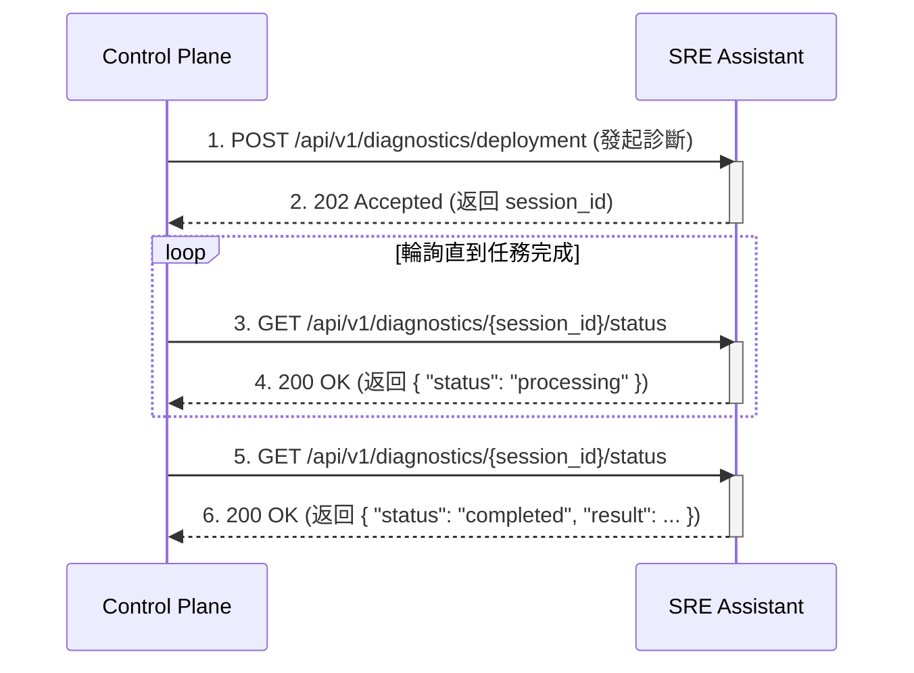

# SRE Platform API 規格書

**版本**: 1.0.0
**最後更新**: 2025-09-05
**目標讀者**: API 開發者、系統整合工程師

---

## 1. 核心設計理念

### 1.1. API 契約
本文件是 `pkg/api/openapi.yaml` 的人類可讀版本，所有實作應以 `openapi.yaml` 為唯一真實來源。

### 1.2. 雙向通訊模式
- **SRE Assistant 提供**: 專業診斷與分析 API (例如 `/api/v1/diagnostics/*`)。
- **Control Plane 提供**: 上下文查詢 API (例如 `/api/v1/resources`)，供 SRE Assistant 作為工具使用。

### 1.3. 非同步處理模式
對於可能耗時較長的診斷任務 (如部署診斷)，API 採用非同步模式：
1.  **Control Plane** 發送一個診斷請求。
2.  **SRE Assistant** 立即回傳 `202 Accepted`，並附帶一個 `session_id`。
3.  **Control Plane** 使用此 `session_id`，輪詢 `/diagnostics/{session_id}/status` 端點來獲取最終結果。



---

## 2. 認證機制

所有受保護的 API 端點都使用 `Bearer Token` (JWT) 進行認證，由 Keycloak 簽發。

---

## 3. SRE Assistant API 端點

### 3.1. 部署診斷 (非同步)

- **端點**: `POST /api/v1/diagnostics/deployment`
- **用途**: 分析部署問題並提供診斷報告。

**請求範例**:

```json
{
  "incident_id": "deploy-xyz-12345",
  "severity": "P1",
  "affected_services": ["payment-api"],
  "context": {
    "deployment_id": "deploy-xyz-12345",
    "namespace": "production"
  }
}
```

**成功回應 (202 Accepted)**:

```json
{
  "session_id": "a1b2c3d4-e5f6-7890-1234-567890abcdef",
  "status": "accepted",
  "message": "診斷任務已接受，正在背景處理中。",
  "estimated_time": 120
}
```

### 3.2. 查詢診斷狀態

- **端點**: `GET /api/v1/diagnostics/{session_id}/status`
- **用途**: 查詢非同步診斷任務的執行狀態。

**成功回應 (200 OK) - 處理中**:

```json
{
  "session_id": "a1b2c3d4-e5f6-7890-1234-567890abcdef",
  "status": "processing",
  "progress": 50,
  "current_step": "並行執行診斷工具"
}
```

**成功回應 (200 OK) - 已完成**:

```json
{
  "session_id": "a1b2c3d4-e5f6-7890-1234-567890abcdef",
  "status": "completed",
  "progress": 100,
  "current_step": "診斷完成",
  "result": {
    "summary": "診斷完成，共發現 2 個問題點。",
    "findings": [
      {
        "source": "Prometheus",
        "severity": "critical",
        "message": "CPU 使用率過高",
        "evidence": { "cpu_usage": "85%" },
        "timestamp": "2025-09-04T22:50:00Z"
      },
      {
        "source": "Control-Plane",
        "severity": "warning",
        "message": "發現最近有配置變更",
        "evidence": { "recent_changes": [{ "user": "admin", "action": "UPDATE_CONFIG" }] },
        "timestamp": "2025-09-04T22:50:00Z"
      }
    ],
    "recommended_actions": ["請根據發現的詳細資訊進行深入調查。"],
    "confidence_score": 0.8,
    "tools_used": ["PrometheusQueryTool", "ControlPlaneTool"],
    "execution_time": 45.7
  }
}
```

### 3.3. 容量分析 (同步)

- **端點**: `POST /api/v1/capacity/analyze`
- **用途**: 分析資源使用趨勢並預測容量需求。

---

## 4. Control Plane API 端點 (工具)

SRE Assistant 會呼叫以下由 Control Plane 提供的 API 來獲取上下文資訊。

- `GET /api/v1/resources`: 獲取資源列表。
- `GET /api/v1/audit-logs`: 查詢審計日誌。
- `GET /api/v1/alerts`: 獲取告警列表。

---

## 5. SDK 使用範例 (更新後)

### Python SDK (輪詢模式)

```python
import time
from sre_platform_sdk import SREPlatformClient, DiagnosticRequest

client = SREPlatformClient(base_url="...", token="...")

# 1. 發起非同步診斷
req = DiagnosticRequest(
    incident_id="deploy-123",
    severity="P1",
    affected_services=["payment-api"]
)
resp = client.diagnostics.start_deployment_diagnosis(req)
session_id = resp.session_id
print(f"診斷任務已啟動，Session ID: {session_id}")

# 2. 輪詢結果
while True:
    status_resp = client.diagnostics.get_status(session_id)
    print(f"任務狀態: {status_resp.status}, 進度: {status_resp.progress}%")
    
    if status_resp.status == "completed":
        print("診斷報告:")
        print(status_resp.result)
        break
    elif status_resp.status == "failed":
        print(f"診斷失敗: {status_resp.error}")
        break
        
    time.sleep(5)
```