# SRE Platform API 參考文件

**版本:** 1.0.0
**最後更新:** 2025-09-06

本文件為 SRE Platform 的 API 提供了包含 UI 截圖的全面參考，旨在建立前端功能與後端 API 之間的清晰對照。平台由兩個主要服務組成，每個服務都有其獨立的 API。

- **Control Plane API**: 管理資源、使用者、事件並協調任務。
- **SRE Assistant API**: 一個無介面的、由 AI 驅動的診斷與分析引擎。

關於請求/回應的詳細資料模型，請參考各服務獨立的 OpenAPI 規格檔案。

---

## 1. Control Plane API

- **基礎 URL:** `http://localhost:8081`
- **規格文件:** [`pkg/api/control-plane-openapi.yaml`](../pkg/api/control-plane-openapi.yaml)

### 1.1. 儀表板 (Dashboard)

儀表板提供系統健康狀況的宏觀視圖，整合了告警、資源和關鍵績效指標的摘要。

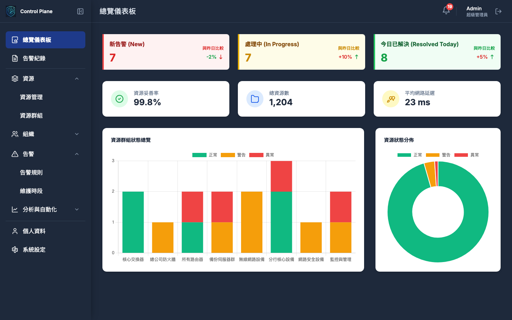

| 進度 | 方法 | 端點 | 摘要 |
|---|---|---|---|
| 🚧 僅有路由 | `GET` | `/api/v1/dashboard/summary` | 獲取儀表板摘要數據 |
| ❌ 未實現 | `GET` | `/api/v1/dashboard/trends` | 獲取指標趨勢數據 |
| ❌ 未實現 | `GET` | `/api/v1/dashboard/resource-distribution` | 獲取資源分佈統計 |

**總計**: 3個端點

### 1.2. 資源管理 (Resource Management)

集中管理所有受監控的資源，支援探索、查詢、CRUD 和批次操作。

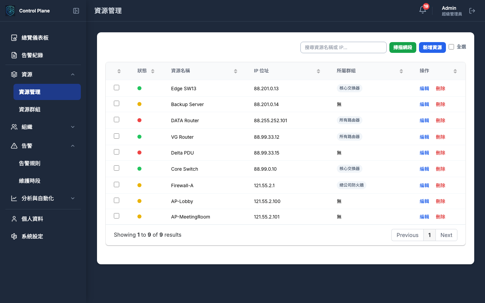
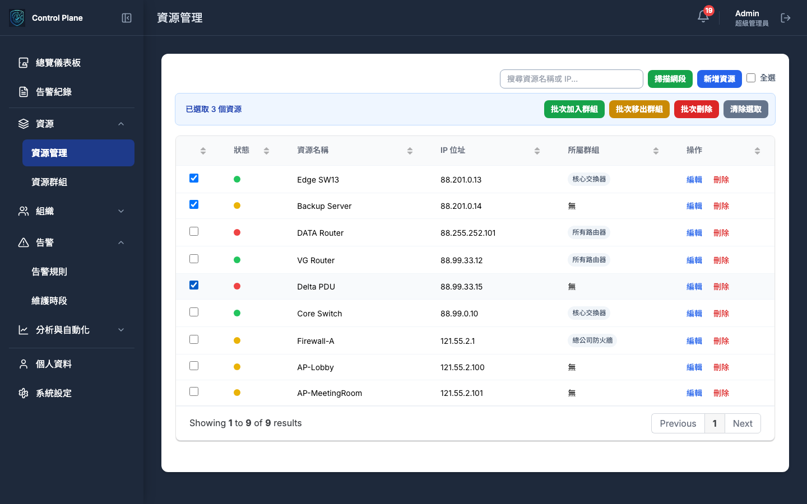
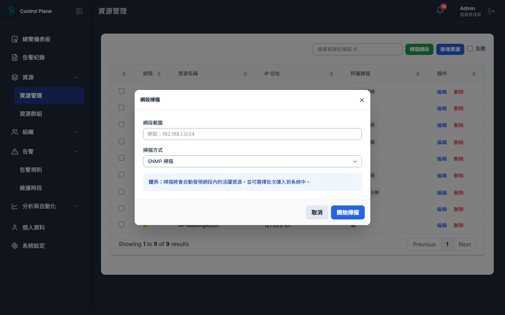

| 進度 | 方法 | 端點 | 摘要 |
|---|---|---|---|
| ✅ 已實現 | `GET` | `/api/v1/resources` | 獲取資源列表 |
| 🚧 僅有路由 | `POST` | `/api/v1/resources` | 創建新資源 |
| 🚧 僅有路由 | `GET` | `/api/v1/resources/{resourceId}` | 獲取特定資源詳情 |
| 🚧 僅有路由 | `PUT` | `/api/v1/resources/{resourceId}` | 更新資源資訊 |
| 🚧 僅有路由 | `DELETE` | `/api/v1/resources/{resourceId}` | 刪除資源 |
| 🚧 僅有路由 | `POST` | `/api/v1/resources/batch` | 批次操作資源 |
| 🚧 僅有路由 | `POST` | `/api/v1/resources/scan` | 掃描網段以發現新資源 |
| 🚧 僅有路由 | `GET` | `/api/v1/resources/scan/{taskId}` | 獲取網段掃描結果 |

**總計**: 8個端點

### 1.3. 資源群組管理 (Resource Groups)

| 進度 | 方法 | 端點 | 摘要 |
|---|---|---|---|
| ❌ 未實現 | `GET` | `/api/v1/resource-groups` | 獲取群組列表 |
| ❌ 未實現 | `POST` | `/api/v1/resource-groups` | 創建群組 |
| ❌ 未實現 | `PUT` | `/api/v1/resource-groups/{groupId}` | 更新群組 |
| ❌ 未實現 | `DELETE` | `/api/v1/resource-groups/{groupId}` | 刪除群組 |
| ❌ 未實現 | `POST` | `/api/v1/resource-groups/{groupId}/members` | 管理群組成員 |

**總計**: 5個端點

### 1.4. 告警與事件管理 (Incidents & Alerts)

提供一個集中介面來查看、篩選、管理所有告警事件，並利用 AI 生成分析報告。

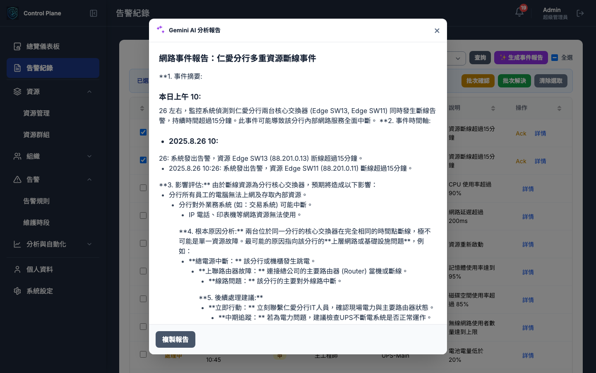

| 進度 | 方法 | 端點 | 摘要 |
|---|---|---|---|
| 🚧 僅有路由 | `GET` | `/api/v1/incidents` | 獲取事件列表 |
| 🚧 僅有路由 | `POST` | `/api/v1/incidents` | 手動創建事件 |
| 🚧 僅有路由 | `GET` | `/api/v1/incidents/{incidentId}` | 獲取事件詳情 |
| ❌ 未實現 | `PUT` | `/api/v1/incidents/{incidentId}` | 更新事件資訊 |
| 🚧 僅有路由 | `POST` | `/api/v1/incidents/{incidentId}/acknowledge` | 確認事件 |
| 🚧 僅有路由 | `POST` | `/api/v1/incidents/{incidentId}/resolve` | 解決事件 |
| 🚧 僅有路由 | `POST` | `/api/v1/incidents/{incidentId}/assign` | 指派處理人員 |
| 🚧 僅有路由 | `POST` | `/api/v1/incidents/{incidentId}/comments` | 新增註記 |
| 🚧 僅有路由 | `POST` | `/api/v1/incidents/generate-report` | **(SRE Assistant 驅動)** AI 生成事件報告 |
| ❌ 未實現 | `GET` | `/api/v1/alerts` | 獲取當前活躍告警 |

**總計**: 8個端點 (Incidents: 7個, Alerts: 1個)

### 1.5. 告警規則 (Alert Rules)

定義告警觸發條件，並可綁定自動化腳本進行響應。

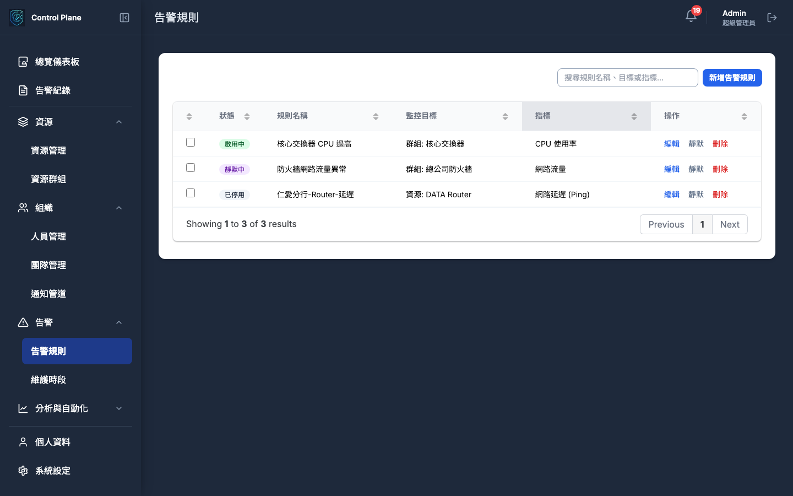
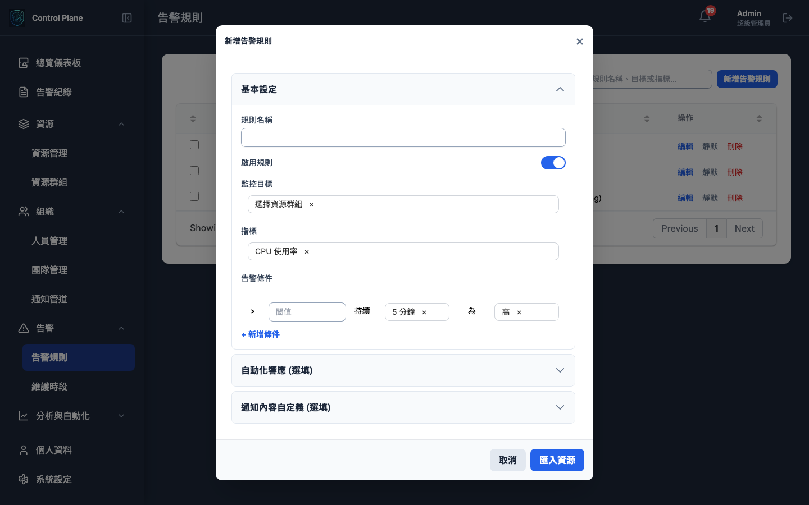

| 進度 | 方法 | 端點 | 摘要 |
|---|---|---|---|
| 🚧 僅有路由 | `GET` | `/api/v1/alert-rules` | 獲取告警規則列表 |
| 🚧 僅有路由 | `POST` | `/api/v1/alert-rules` | 創建告警規則 |
| 🚧 僅有路由 | `GET` | `/api/v1/alert-rules/{ruleId}` | 獲取規則詳情 |
| 🚧 僅有路由 | `PUT` | `/api/v1/alert-rules/{ruleId}` | 更新告警規則 |
| 🚧 僅有路由 | `DELETE` | `/api/v1/alert-rules/{ruleId}` | 刪除告警規則 |
| 🚧 僅有路由 | `POST` | `/api/v1/alert-rules/{ruleId}/test` | 測試告警規則 |
| ❌ 未實現 | `POST` | `/api/v1/alert-rules/{ruleId}/enable` | 啟用規則 |
| ❌ 未實現 | `POST` | `/api/v1/alert-rules/{ruleId}/disable` | 停用規則 |

**總計**: 8個端點

### 1.6. 自動化 (Automation)

管理自動化腳本庫與查看執行歷史。

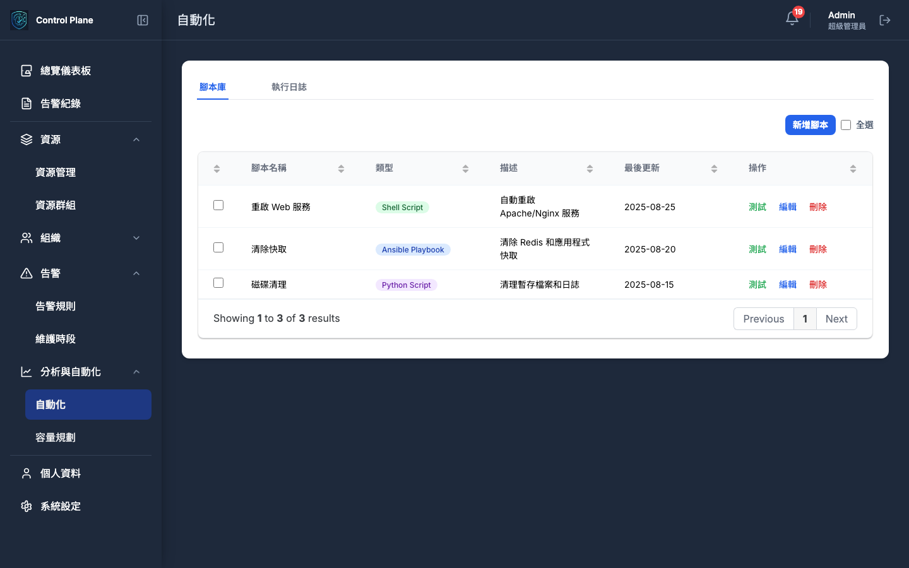

| 進度 | 方法 | 端點 | 摘要 |
|---|---|---|---|
| 🚧 僅有路由 | `GET` | `/api/v1/automation/scripts` | 獲取腳本列表 |
| 🚧 僅有路由 | `POST` | `/api/v1/automation/scripts` | 創建腳本 |
| ❌ 未實現 | `GET` | `/api/v1/automation/scripts/{scriptId}` | 獲取腳本詳情 |
| 🚧 僅有路由 | `PUT` | `/api/v1/automation/scripts/{scriptId}` | 更新腳本 |
| ❌ 未實現 | `DELETE` | `/api/v1/automation/scripts/{scriptId}` | 刪除腳本 |
| 🚧 僅有路由 | `POST` | `/api/v1/automation/execute` | 執行腳本 |
| 🚧 僅有路由 | `GET` | `/api/v1/automation/executions` | 查詢執行歷史 |
| ❌ 未實現 | `GET` | `/api/v1/automation/executions/{executionId}` | 獲取執行詳情 |
| ❌ 未實現 | `POST` | `/api/v1/automation/schedules` | 創建排程 |

**總計**: 9個端點

### 1.7. 組織管理 (Organization)

管理平台中的人員、團隊及其權限。

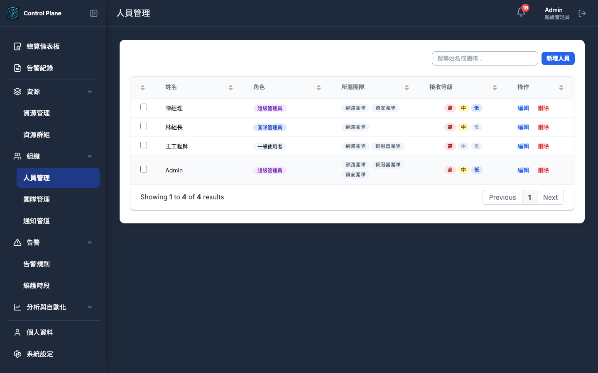
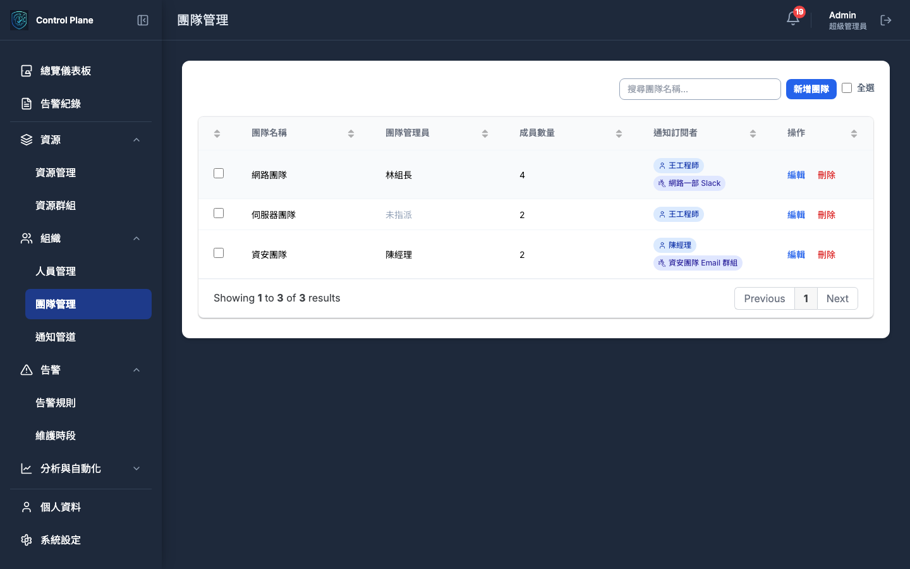

| 進度 | 方法 | 端點 | 摘要 |
|---|---|---|---|
| 🚧 僅有路由 | `GET` | `/api/v1/users` | 獲取使用者列表 |
| 🚧 僅有路由 | `POST` | `/api/v1/users` | 創建使用者 |
| ❌ 未實現 | `GET` | `/api/v1/users/{userId}` | 獲取使用者詳情 |
| 🚧 僅有路由 | `PUT` | `/api/v1/users/{userId}` | 更新使用者 |
| ❌ 未實現 | `DELETE` | `/api/v1/users/{userId}` | 刪除使用者 |
| 🚧 僅有路由 | `GET` | `/api/v1/users/profile` | 獲取個人資料 |
| 🚧 僅有路由 | `PUT` | `/api/v1/users/profile` | 更新個人資料 |
| ❌ 未實現 | `POST` | `/api/v1/users/profile/change-password` | 修改密碼 |
| ❌ 未實現 | `PUT` | `/api/v1/users/profile/notifications` | 更新通知設定 |
| ❌ 未實現 | `POST` | `/api/v1/users/profile/verify-contact` | 驗證聯絡方式 |
| 🚧 僅有路由 | `GET` | `/api/v1/teams` | 獲取團隊列表 |
| 🚧 僅有路由 | `POST` | `/api/v1/teams` | 創建團隊 |
| ❌ 未實現 | `GET` | `/api/v1/teams/{teamId}` | 獲取團隊詳情 |
| 🚧 僅有路由 | `PUT` | `/api/v1/teams/{teamId}` | 更新團隊 |
| ❌ 未實現 | `DELETE` | `/api/v1/teams/{teamId}` | 刪除團隊 |
| 🚧 僅有路由 | `POST` | `/api/v1/teams/{teamId}/members` | 管理團隊成員 |

**總計**: 16個端點 (Users: 10個, Teams: 6個)

### 1.8. 通知與設定 (Notifications & Settings)

管理通知管道、個人資料與系統級設定。

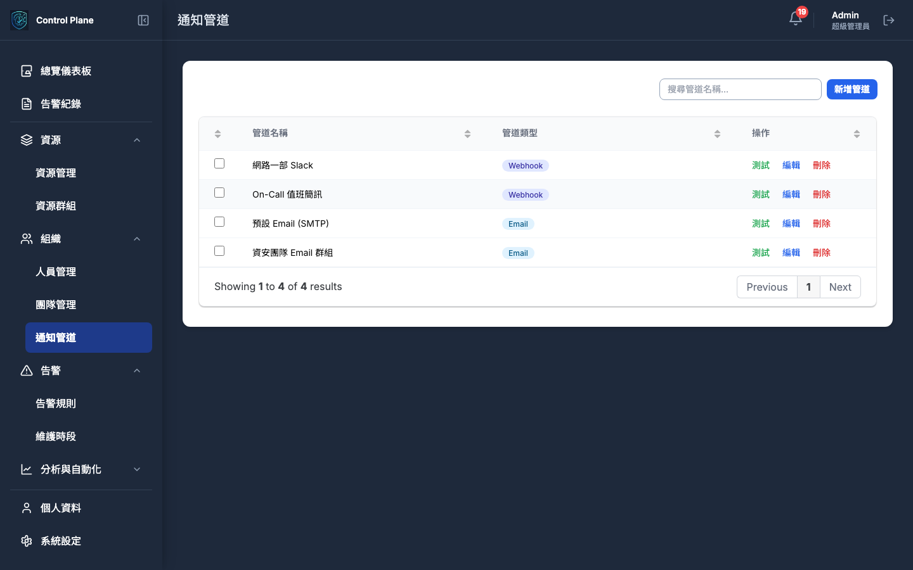
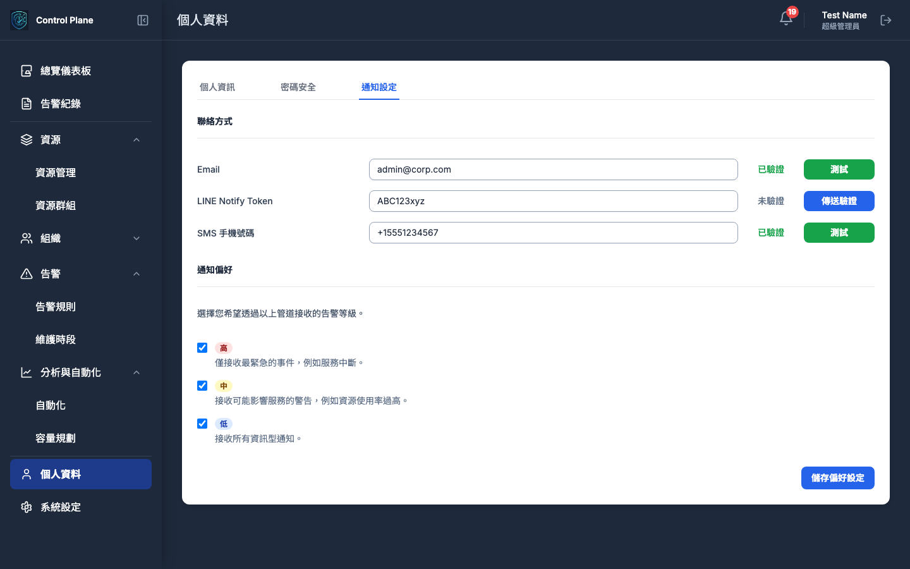

| 進度 | 方法 | 端點 | 摘要 |
|---|---|---|---|
| 🚧 僅有路由 | `GET` | `/api/v1/notification-channels` | 獲取通知管道列表 |
| 🚧 僅有路由 | `POST` | `/api/v1/notification-channels` | 創建通知管道 |
| ❌ 未實現 | `GET` | `/api/v1/notification-channels/{channelId}` | 獲取管道詳情 |
| 🚧 僅有路由 | `PUT` | `/api/v1/notification-channels/{channelId}` | 更新通知管道 |
| ❌ 未實現 | `DELETE` | `/api/v1/notification-channels/{channelId}` | 刪除通知管道 |
| 🚧 僅有路由 | `POST` | `/api/v1/notification-channels/{channelId}/test` | 測試通知管道 |
| 🚧 僅有路由 | `GET` | `/api/v1/settings` | 獲取系統設定 |
| 🚧 僅有路由 | `PUT` | `/api/v1/settings` | 更新系統設定 |
| ❌ 未實現 | `GET` | `/api/v1/settings/maintenance-windows` | 獲取維護時段 |

**總計**: 9個端點 (Notifications: 6個, Settings: 3個)

### 1.9. 審計與回調 (Audit & Callbacks)

| 進度 | 方法 | 端點 | 摘要 |
|---|---|---|---|
| ❌ 未實現 | `GET` | `/api/v1/audit-logs` | 查詢審計日誌 |
| ❌ 未實現 | `POST` | `/api/v1/callbacks/diagnosis-complete` | 接收診斷完成的回調 |

**總計**: 2個端點

---

## 2. SRE Assistant API

- **基礎 URL:** `http://localhost:8000`
- **規格文件:** [`pkg/api/sre-assistant-openapi.yaml`](../pkg/api/sre-assistant-openapi.yaml)

### 2.1. 診斷 (Diagnostics)

SRE Assistant 的核心功能，提供由 AI 驅動的非同步診斷與分析服務。

| 進度 | 方法 | 端點 | 摘要 |
|---|---|---|---|
| ✅ 已實現 | `POST` | `/api/v1/diagnostics/deployment` | **(非同步)** 觸發部署診斷 |
| ✅ 已實現 | `POST` | `/api/v1/diagnostics/alerts` | **(非同步)** 觸發告警分析 |
| ✅ 已實現 | `POST` | `/api/v1/diagnostics/capacity` | **(非同步)** 執行容量分析與預測 |
| ✅ 已實現 | `GET` | `/api/v1/diagnostics/{sessionId}/status` | 查詢非同步任務的狀態與結果 |
| ✅ 已實現 | `GET` | `/api/v1/diagnostics/history` | 查詢歷史診斷記錄 |

**總計**: 5個端點

### 2.2. 核心與輔助 (Core & Support)

| 進度 | 方法 | 端點 | 摘要 |
|---|---|---|---|
| ✅ 已實現 | `GET` | `/api/v1/healthz` | 服務健康檢查 |
| ✅ 已實現 | `GET` | `/api/v1/readyz` | 服務就緒檢查 |
| ✅ 已實現 | `GET` | `/api/v1/metrics` | Prometheus 指標 |
| ✅ 已實現 | `GET` | `/api/v1/workflows/templates` | 獲取可用的工作流模板 |
| ✅ 已實現 | `GET` | `/api/v1/tools/status` | 檢查所有外部工具的連線狀態 |
| ✅ 已實現 | `POST` | `/api/v1/execute` | 處理自然語言查詢 |

**總計**: 6個端點

## 📊 API 總覽統計

| 服務 | 端點總數 | 已實現 | 僅有路由 | 未實現 | 實現率 |
|------|----------|--------|----------|--------|--------|
| **Control Plane** | 49 | 4 | 26 | 19 | 8% |
| **SRE Assistant** | 11 | 11 | 0 | 0 | 100% |
| **總計** | **60** | **15** | **26** | **19** | **25%** |

### 實現狀態說明
- ✅ **已實現**: API 端點已完全實作並可正常運行
- 🚧 **僅有路由**: API 路由已定義但業務邏輯尚未實作
- ❌ **未實現**: API 端點尚未開始實作

### 關鍵發現
1. **SRE Assistant API 實現完善** (100%): 所有11個端點都已實現
2. **Control Plane API 進度緩慢** (8%): 僅4個核心端點已實現
3. **資源管理相對完整** (13%): GET /api/v1/resources 已實現
4. **多數功能處於路由定義階段**: 需要補全業務邏輯實作
