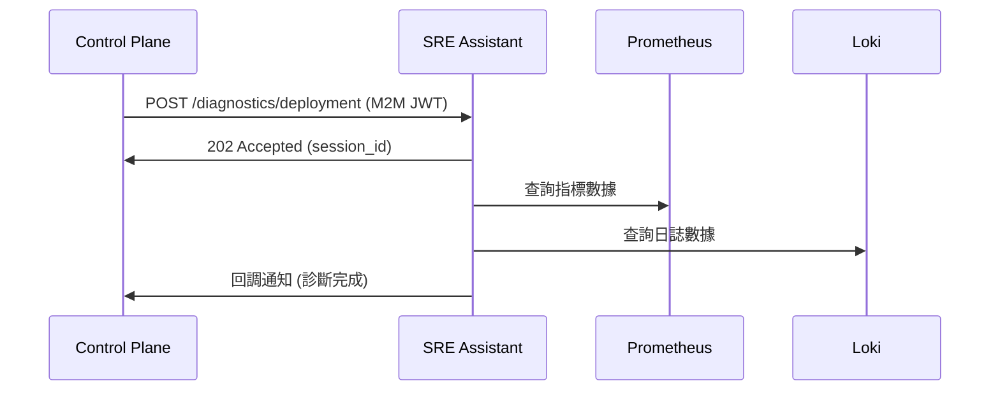

# SRE Assistant API 參考文檔

**服務**: SRE Assistant (AI 智能診斷引擎)  
**版本**: v1.0  
**基礎 URL**: `http://localhost:8000` (開發) | `https://sre-assistant.example.com` (生產)  
**技術棧**: FastAPI + Python 3.11+ + Google ADK  

---

## 📋 目錄

- [1. 服務概述](#1-服務概述)
- [2. 認證機制](#2-認證機制)
- [3. 健康檢查 API](#3-健康檢查-api)
- [4. 診斷分析 API](#4-診斷分析-api)
- [5. 容量規劃 API](#5-容量規劃-api)
- [6. 通用執行 API](#6-通用執行-api)
- [7. 工作流管理 API](#7-工作流管理-api)
- [8. 錯誤處理](#8-錯誤處理)
- [9. 效能與監控](#9-效能與監控)
- [10. 與 Control Plane 的整合](#10-與-control-plane-的整合)

---

## 1. 服務概述

### 1.1 SRE Assistant 定位

SRE Assistant 是**無界面的 AI 專家代理服務**，專門負責：

- 🧠 **智能診斷**: 利用 AI 分析部署、告警和系統問題
- 📊 **容量預測**: 基於歷史數據預測資源需求趨勢  
- 🔍 **根因分析**: 自動關聯告警，找出問題根源
- 🤖 **自動化執行**: 執行複雜的 SRE 工作流程
- 🛠️ **工具整合**: 串接 Prometheus、Loki、Kubernetes 等平台

### 1.2 架構特色

```python
# 核心非同步架構
@app.post("/api/v1/diagnostics/deployment", status_code=202)
async def diagnose_deployment(
    request: DiagnosticRequest,
    background_tasks: BackgroundTasks,
    token: Dict[str, Any] = Depends(verify_token)
) -> DiagnosticResponse:
    session_id = uuid.uuid4()
    background_tasks.add_task(run_workflow_bg, session_id, request)
    return DiagnosticResponse(session_id=session_id, status="accepted")
```

### 1.3 工具生態系統

| 工具名稱 | 功能 | 用途 |
|----------|------|------|
| **PrometheusQueryTool** | 指標數據查詢 | 監控數據分析 |
| **LokiLogTool** | 日誌檢索與分析 | 錯誤日誌診斷 |
| **KubernetesTool** | K8s 資源操作 | 集群狀態檢查 |
| **ControlPlaneTool** | 資源和審計查詢 | 平台數據獲取 |

---

## 2. 認證機制

### 2.1 M2M JWT 認證

所有 API 請求都需要 Machine-to-Machine JWT Token：

```http
Authorization: Bearer <M2M_JWT_TOKEN>
```

### 2.2 服務帳戶配置

- **服務帳戶**: `service-account-control-plane`
- **Token 有效期**: 24 小時
- **權限範圍**: `sre-assistant:execute`

---

## 3. 健康檢查 API

### 3.1 存活性檢查

**端點**: `GET /healthz`

```json
{
  "status": "ok",
  "timestamp": "2025-09-05T10:30:00Z",
  "service": "sre-assistant",
  "version": "1.0.0"
}
```

### 3.2 就緒性檢查

**端點**: `GET /readyz`

```json
{
  "ready": true,
  "dependencies": {
    "prometheus": {"status": "healthy", "response_time": "15ms"},
    "loki": {"status": "healthy", "response_time": "22ms"},
    "control_plane": {"status": "healthy", "response_time": "8ms"},
    "adk_runtime": {"status": "ready", "model_loaded": true}
  },
  "timestamp": "2025-09-05T10:30:00Z"
}
```

---

## 4. 診斷分析 API

### 4.1 部署診斷

**端點**: `POST /api/v1/diagnostics/deployment`

**請求範例**:
```json
{
  "incident_id": "INC-2025-001", 
  "severity": "P1",
  "title": "Payment API v2.1.0 部署失敗",
  "description": "部署後出現大量 502 錯誤",
  "affected_services": ["payment-api", "order-service"],
  "time_range": {
    "start": "2025-09-05T09:00:00Z",
    "end": "2025-09-05T10:00:00Z"
  },
  "context": {
    "deployment_id": "deploy-12345",
    "namespace": "production",
    "cluster": "prod-cluster-01"
  }
}
```

**回應範例**:
```json
{
  "session_id": "550e8400-e29b-41d4-a716-446655440000",
  "status": "accepted",
  "message": "部署診斷任務已接受，AI 正在分析中...",
  "estimated_time": 120,
  "workflow_steps": [
    "檢查部署狀態",
    "分析容器日誌", 
    "查詢相關指標",
    "執行健康檢查",
    "生成診斷報告"
  ]
}
```

### 4.2 告警關聯分析

**端點**: `POST /api/v1/diagnostics/alerts`

**請求範例**:
```json
{
  "alert_ids": ["alert-cpu-high-001", "alert-memory-leak-002"],
  "correlation_window": 300,
  "analysis_depth": "deep",
  "include_metrics": true,
  "include_logs": true
}
```

### 4.3 診斷狀態查詢

**端點**: `GET /api/v1/diagnostics/{session_id}/status`

**回應範例**:
```json
{
  "session_id": "550e8400-e29b-41d4-a716-446655440000",
  "status": "completed",
  "progress": 100,
  "current_step": "診斷完成",
  "execution_time": 118.5,
  "result": {
    "summary": "發現關鍵配置問題導致服務啟動失敗",
    "root_cause": "環境變數 DB_CONNECTION_POOL_SIZE 設定錯誤",
    "confidence_score": 0.94,
    "findings": [
      {
        "source": "container_logs",
        "severity": "critical", 
        "title": "資料庫連線池設定錯誤",
        "description": "DB_CONNECTION_POOL_SIZE=0 導致無法建立資料庫連線",
        "evidence": {
          "log_entries": [
            {
              "timestamp": "2025-09-05T09:15:23Z",
              "level": "ERROR",
              "message": "Failed to initialize database connection pool"
            }
          ]
        }
      }
    ],
    "recommended_actions": [
      {
        "priority": "immediate",
        "action": "修正環境變數 DB_CONNECTION_POOL_SIZE=10",
        "estimated_time": "2 分鐘"
      }
    ],
    "tools_used": ["kubernetes_tool", "prometheus_tool", "loki_tool"]
  }
}
```

---

## 5. 容量規劃 API

### 5.1 容量分析

**端點**: `POST /api/v1/capacity/analyze`

**請求範例**:
```json
{
  "target": {
    "type": "resource_group",
    "ids": ["group-core-services"]
  },
  "metrics": ["cpu_usage", "memory_usage", "disk_usage"],
  "analysis_type": "forecast", 
  "forecast_horizon_days": 30,
  "historical_period_days": 90,
  "optimization_target": "cost_efficiency"
}
```

**回應範例**:
```json
{
  "analysis_id": "cap-770g1622-g40d-63f6-c938-667877662222",
  "status": "completed",
  "current_usage": {
    "cpu": {
      "current_cores": 85.2,
      "allocated_cores": 120.0, 
      "utilization_percent": 71.0,
      "trend_7d": "+2.3%"
    },
    "memory": {
      "current_gb": 156.8,
      "allocated_gb": 200.0,
      "utilization_percent": 78.4,
      "trend_7d": "+5.1%"
    }
  },
  "forecast_results": {
    "cpu": {
      "capacity_alerts": [
        {
          "alert_type": "approaching_limit",
          "threshold": "80%",
          "estimated_date": "2025-09-28T00:00:00Z",
          "days_remaining": 23,
          "severity": "warning"
        }
      ]
    }
  },
  "recommendations": [
    {
      "type": "scale_up",
      "resource": "cpu",
      "priority": "medium",
      "current_allocation": 120.0,
      "recommended_allocation": 150.0,
      "reasoning": "預計在23天後達到80%使用率警戒線",
      "cost_impact": {"monthly_increase": 420.00, "currency": "USD"}
    }
  ]
}
```

---

## 6. 通用執行 API

### 6.1 自然語言查詢

**端點**: `POST /api/v1/execute`

**功能**: 接受自然語言查詢，AI 自動解析並執行相應操作

**請求範例**:
```json
{
  "query": "查看過去1小時內 payment-api 服務的 CPU 使用率和錯誤率",
  "context": {
    "namespace": "production",
    "user_role": "sre_engineer"
  },
  "options": {
    "include_visualizations": true,
    "response_format": "structured",
    "max_execution_time": 60
  }
}
```

**回應範例**:
```json
{
  "execution_id": "exec-880h2733-h51e-74g7-d049-778888773333",
  "status": "completed", 
  "query_understanding": {
    "intent": "monitoring_query",
    "entities": {
      "service": "payment-api",
      "metrics": ["cpu_usage", "error_rate"], 
      "time_range": "1h"
    },
    "confidence": 0.96
  },
  "results": {
    "summary": "payment-api 服務運行穩定，CPU 平均 45.2%，錯誤率 0.12%",
    "metrics": {
      "cpu_usage": {
        "average": 45.2,
        "peak": 67.8,
        "trend": "stable"
      },
      "error_rate": {
        "average": 0.12,
        "total_errors": 23,
        "total_requests": 19234
      }
    },
    "insights": [
      "CPU 使用率在 14:30 左右有短暫峰值",
      "錯誤率持續下降，服務穩定性改善"
    ]
  },
  "tools_invoked": [
    {
      "tool": "prometheus_query", 
      "query": "rate(container_cpu_usage_seconds_total{pod=~\"payment-api-.*\"}[5m])",
      "execution_time": 0.8
    }
  ]
}
```

### 6.2 串流回應模式

**端點**: `POST /api/v1/execute?stream=true`

**回應格式**: Server-Sent Events (SSE)

```
data: {"type": "progress", "step": "分析查詢意圖", "progress": 10}
data: {"type": "progress", "step": "查詢 Prometheus 指標", "progress": 30}
data: {"type": "partial_result", "data": {"cpu_avg": 45.2}}
data: {"type": "complete", "result": {...}}
```

---

## 7. 工作流管理 API

### 7.1 工作流模板

**端點**: `GET /api/v1/workflows/templates`

**回應範例**:
```json
{
  "templates": [
    {
      "id": "deployment-diagnosis",
      "name": "部署診斷工作流",
      "description": "自動診斷部署失敗問題",
      "version": "1.2.0",
      "steps": [
        {"name": "check_deployment_status", "tool": "kubernetes_tool"},
        {"name": "analyze_pod_logs", "tool": "loki_tool"},
        {"name": "query_metrics", "tool": "prometheus_tool"},
        {"name": "generate_report", "tool": "ai_analysis"}
      ],
      "estimated_duration": 240,
      "success_rate": 0.94
    }
  ]
}
```

### 7.2 工具狀態檢查

**端點**: `GET /api/v1/tools/status`

**回應範例**:
```json
{
  "tools": {
    "prometheus_tool": {
      "status": "healthy",
      "endpoint": "http://prometheus:9090",
      "response_time": "15ms",
      "capabilities": ["query", "query_range", "metadata"]
    },
    "loki_tool": {
      "status": "healthy", 
      "endpoint": "http://loki:3100",
      "response_time": "22ms",
      "capabilities": ["logs_query", "labels", "series"]
    },
    "kubernetes_tool": {
      "status": "healthy",
      "cluster": "prod-cluster-01",
      "capabilities": ["get", "list", "patch", "logs"]
    }
  }
}
```

---

## 8. 錯誤處理

### 8.1 標準錯誤格式

```json
{
  "error": "WORKFLOW_EXECUTION_FAILED",
  "message": "診斷工作流執行失敗",
  "details": {
    "session_id": "550e8400-e29b-41d4-a716-446655440000",
    "failed_step": "analyze_pod_logs",
    "error_reason": "Loki 服務連線超時"
  },
  "request_id": "req-12345",
  "timestamp": "2025-09-05T10:30:00Z"
}
```

### 8.2 常見錯誤碼

| HTTP 狀態碼 | 錯誤碼 | 說明 |
|-------------|--------|------|
| 400 | INVALID_QUERY | 查詢語法錯誤 |
| 401 | TOKEN_INVALID | M2M Token 無效 |
| 404 | SESSION_NOT_FOUND | 診斷會話不存在 |
| 408 | WORKFLOW_TIMEOUT | 工作流執行超時 |
| 422 | TOOL_UNAVAILABLE | 外部工具不可用 |
| 500 | AI_MODEL_ERROR | AI 模型執行錯誤 |
| 503 | SERVICE_OVERLOADED | 服務過載 |

---

## 9. 效能與監控

### 9.1 效能指標

**端點**: `GET /metrics`

```prometheus
# SRE Assistant 特有指標
sre_assistant_active_sessions_total 12
sre_assistant_workflow_executions_total{status="success"} 1456
sre_assistant_workflow_executions_total{status="failed"} 23
sre_assistant_avg_execution_time_seconds 45.2
sre_assistant_tool_calls_total{tool="prometheus"} 2341
sre_assistant_ai_confidence_score_avg 0.87
```

### 9.2 速率限制

| API 類型 | 限制 | 時間窗口 |
|----------|------|----------|
| 診斷 API | 10 次 | 每分鐘 |
| 查詢 API | 100 次 | 每分鐘 |
| 串流 API | 5 次 | 每分鐘 |

### 9.3 效能最佳化

- **背景任務**: 所有重型分析都在背景執行
- **結果快取**: 相似查詢結果快取 15 分鐘
- **連線池**: 外部工具連線重用
- **批次處理**: 多個指標查詢合併執行

---

## 10. 與 Control Plane 的整合

### 10.1 服務間通訊



### 10.2 回調機制

SRE Assistant 完成診斷後，會主動回調 Control Plane：

```http
POST /api/v1/callbacks/diagnosis-complete
Content-Type: application/json
Authorization: Bearer <M2M_JWT>

{
  "session_id": "550e8400-e29b-41d4-a716-446655440000",
  "status": "completed",
  "result_url": "/api/v1/diagnostics/550e8400-e29b-41d4-a716-446655440000/status"
}
```

---

## 附錄

### A. 開發環境設定

```bash
# 啟動 SRE Assistant
cd services/sre-assistant
poetry install
poetry run python -m sre_assistant.main

# 服務將在 http://localhost:8000 啟動
```

### B. 配置檔案範例

```yaml
# config/environments/development.yaml
sre_assistant:
  host: "0.0.0.0"
  port: 8000
  debug: true
  
external_services:
  prometheus:
    endpoint: "http://localhost:9090"
    timeout: 30
  loki:
    endpoint: "http://localhost:3100"
    timeout: 30
    
ai_config:
  model: "gemini-1.5-pro"
  max_tokens: 4096
  temperature: 0.1
```

### C. SDK 使用範例

```python
from sre_assistant_sdk import SREAssistantClient

client = SREAssistantClient(
    base_url="http://localhost:8000",
    token="your-m2m-jwt-token"
)

# 觸發部署診斷
response = await client.diagnose_deployment({
    "incident_id": "INC-001",
    "severity": "P1",
    "affected_services": ["payment-api"]
})

# 查詢診斷結果
result = await client.get_diagnosis_status(response.session_id)
```

---

*文檔版本: v1.0*  
*SRE Assistant Service - AI 智能診斷引擎*