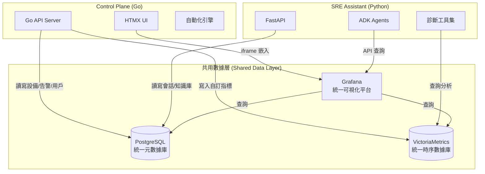

# 規格暨技術架構書

**文件版本：** 19.0 (Monorepo 統一版)
**最後更新日期：** 2025年9月04日

## 1. 核心理念與總體架構

本專案旨在打造一個名為 **SRE Platform** 的現代化維運平台。核心理念是將 **Control Plane** 作為提供 UI 和管理能力的「企業維運平台」，並將 **SRE Assistant** 作為可插拔的「智能決策大腦」。兩者共享底層基礎設施，緊密協作，形成一個從監控、告警到智能診斷與自動化修復的完整生態系統。

### 1.1 組件職責 (Component Roles)

- **Control Plane (Go)**
  - **角色**: **指揮官 (Commander) / 企業維運平台**
  - **職責**: 提供統一的 UI、管理應用生命週期、處理使用者身份驗證，並將複雜任務派發給 SRE Assistant。

- **SRE Assistant (Python)**
  - **角色**: **專家代理 (Specialist Agent) / 智能決策大腦**
  - **職責**: 作為無介面服務，接收來自 Control Plane 的請求，執行基於 LLM 的智能診斷、根因分析與自動化任務。

## 2. 共享基礎設施架構

為了實現高效協作與數據一致性，兩個核心服務建立在一個共用的基礎設施之上。

- **PostgreSQL (統一元數據中心)**: 儲存所有核心實體數據，如設備、使用者、告警規則、AI 診斷歷史等。
- **VictoriaMetrics (統一監控數據)**: 作為單一的時序數據庫，收集由 Control Plane 管理的設備指標與 SRE Assistant 的自訂指標。
- **Grafana (統一可視化平台)**: 連接數據源，提供豐富的儀表板，並可由 Control Plane 嵌入。

## 3. 服務間通訊與 API 設計

### 3.1 認證機制

- **使用者認證**: 採用 OIDC Authorization Code Flow，以 Keycloak 作為身份提供者。
- **服務間認證 (M2M)**: 採用 Keycloak 的 Client Credentials Flow。

### 3.2 API 設計理念：兩層式 API

- **第一層：通用入口 (`POST /execute`)**: 高彈性的「探索引擎」，用於 ad-hoc 查詢、原型測試或未固化的新功能。
- **第二層：語義化 API (`POST /diagnostics/*`)**: 穩定、明確的「產品接口」，用於 UI 上的固定功能或高頻自動化流程。

### 3.3 資料流範例：雙向數據增強

這個架構的核心價值在於數據的雙向流動與增強：
1.  **Control Plane 增強 SRE Assistant**: SRE Assistant 在分析過程中，可以透過 Control Plane 提供的只讀 API（如 `/api/v1/audit-logs`）回頭查詢更多上下文。
2.  **SRE Assistant 增強 Control Plane**: SRE Assistant 完成分析後，將結構化的 `AIAnalysis` 結果寫回共用的 PostgreSQL，供 Control Plane UI 呈現。

## 4. 實施路線圖與潛在挑戰

### 4.1 實施階段 (Phased Implementation)

- **Phase 1: 核心整合 (Core Integration)**
  - **主題**: 專注於完成 `sre-assistant` 與 `control-plane` 之間的所有技術對接工作。
  - **主要交付物**:
    - ✅ **API 契約符合性**: 確保 `sre-assistant` 嚴格遵守 `openapi.yaml`。
    - ✅ **服務對服務認證**: 完整實現基於 Keycloak 的 M2M 認證。
    - ✅ **開發 `ControlPlaneTool`**: 使 `sre-assistant` 能回頭呼叫 `control-plane` 的 API。
    - ✅ **端到端流程測試**: 建立一個模擬從 `control-plane` 觸發診斷的整合測試。

- **Phase 2: 功能擴展與遷移 (Feature Expansion & Migration)**
  - **主題**: 在完成核心整合的基礎上，將有價值的核心功能遷移並適應到新的指揮模式下。
  - **主要交付物**:
    - 🩺 **增強診斷能力**: 完善 `deployment` 和 `alert` 診斷流程的內部邏輯。
    - 📝 **結構化報告生成**: 重構覆盤報告生成功能。
    - 🧑‍💻 **人類介入流程**: 改造 `HumanApprovalTool`，將審批請求導向 `control-plane` 的 UI。

- **Phase 3: 聯邦化與主動預防 (Federation & Proactive Prevention)**
  - **主題**: 將 `sre-assistant` 從單一代理演進為多代理協同的聯邦化系統，並具備預測性維護能力。
  - **主要交付物**:
    - 🤖 **第一個專業化子代理**: 將一項核心功能重構為獨立的子代理（如 `PostmortemAgent`）。
    - 🔮 **主動預防能力**: 整合機器學習模型，實現異常檢測和趨勢預測。
    - 📊 **代理可觀測性**: 建立完善的 LLM 可觀測性儀表板。

### 4.2 潛在挑戰 (Potential Challenges)

- **整合複雜度**: 需謹慎管理多個外部系統（Keycloak, Grafana, VictoriaMetrics）的版本相容性與配置。
- **效能瓶頸**: 大規模設備監控的數據採集與即時告警處理，對後端效能構成挑戰。
- **安全性**: 需全面考慮 XSS/CSRF 防護、API Rate Limiting 及敏感資料加密等安全議題。

> 欲查看更詳細的、可執行的開發任務清單，請參閱 [**詳細開發路線圖 (Detailed Development Roadmap)**](ROADMAP.md)。

## 5. 技術棧總覽

* **後端**: Go (Control Plane), Python/FastAPI/ADK (SRE Assistant)
* **前端**: HTMX, Tailwind CSS, Alpine.js
* **資料庫**: PostgreSQL (元數據), VictoriaMetrics (時序數據)
* **核心服務**: Grafana (可視化), Keycloak (認證)
* **AI**: Google Gemini API
