# SRE Platform 技術架構設計書

**文件版本：** 20.0 (增強統一版)  
**最後更新：** 2025年09月05日  
**目標讀者：** 技術架構師、資深開發者、DevOps 工程師

---

## 📋 目錄

- [設計理念與總體架構](#1-設計理念與總體架構)
- [架構深度解析](#2-架構深度解析)
- [服務間通訊設計](#3-服務間通訊設計)
- [數據架構與流向](#4-數據架構與流向)
- [安全架構設計](#5-安全架構設計)
- [可觀測性架構](#6-可觀測性架構)
- [擴展性與性能](#7-擴展性與性能)
- [實施路線圖](#8-實施路線圖)
- [技術決策記錄](#9-技術決策記錄)

---

## 1. 設計理念與總體架構

### 🎯 核心設計理念

SRE Platform 的架構設計基於以下核心理念：

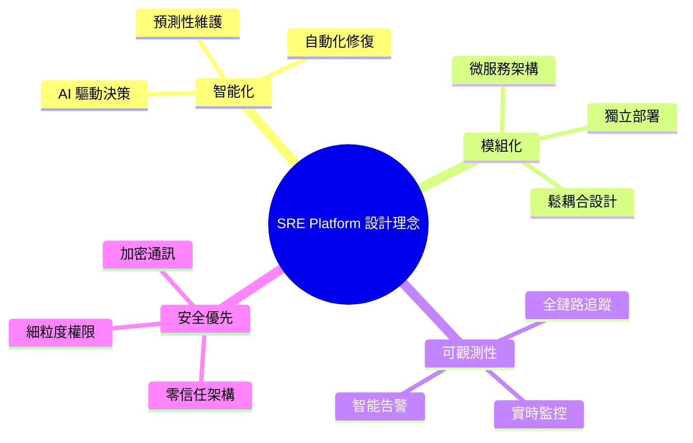

### 🏗️ 架構演進歷程

```mermaid
timeline
    title SRE Platform 架構演進
    
    section Phase 0: 概念驗證
        傳統監控模式 : 被動告警
                     : 人工診斷
                     : 手動修復
    
    section Phase 1: 核心整合
        智能診斷引入 : Control Plane + SRE Assistant
                    : M2M 認證機制
                    : API 契約統一
    
    section Phase 2: 功能擴展
        增強診斷能力 : 多源數據整合
                    : 結構化報告
                    : Human-in-the-Loop
    
    section Phase 3: 聯邦化
        多代理協同 : 專業化子代理
                  : 主動預防能力
                  : 可觀測性儀表板
```

### 🌐 總體架構視圖

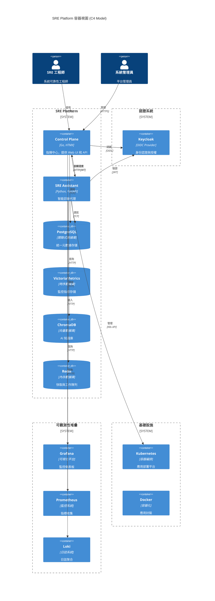

---

## 2. 架構深度解析

### 🎯 Control Plane 架構

Control Plane 作為系統的指揮中心，採用分層架構設計：

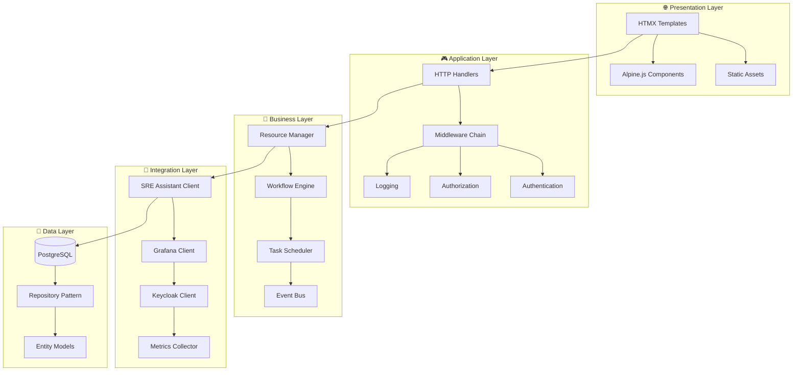

**🔑 關鍵設計決策**：

| 層級 | 技術選擇 | 理由 |
|------|----------|------|
| **前端** | HTMX + Alpine.js | 輕量級、高性能、降低複雜度 |
| **後端** | Go + Gin | 高性能、並發友好、部署簡單 |
| **模板** | HTML Templates | 服務端渲染、SEO 友好 |
| **狀態管理** | Session + JWT | 混合式狀態管理 |

### 🤖 SRE Assistant 架構

SRE Assistant 採用代理模式 (Agent Pattern) 和工具鏈架構：

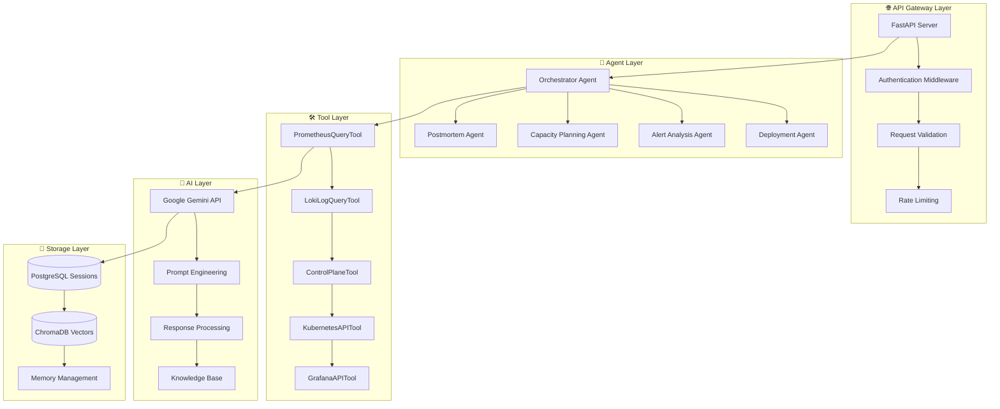

**🔑 關鍵設計決策**：

| 組件 | 技術選擇 | 理由 |
|------|----------|------|
| **API 框架** | FastAPI | 自動 API 文件、類型檢查、高性能 |
| **代理框架** | Google ADK | 企業級、可擴展、整合友好 |
| **AI 引擎** | Google Gemini | 先進的多模態能力、API 穩定 |
| **向量存儲** | ChromaDB | 輕量級、易部署、Python 原生 |

---

## 3. 服務間通訊設計

### 🔐 認證架構

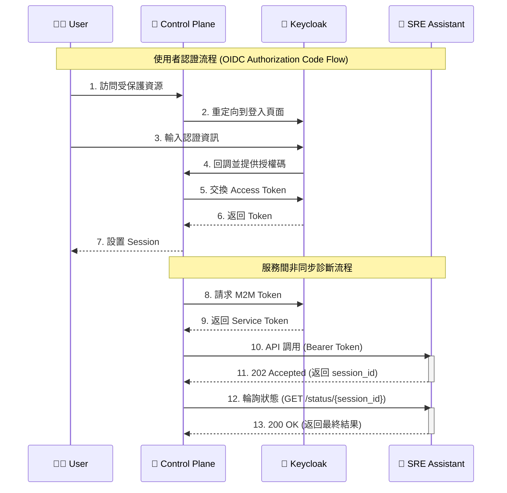

### 🔄 API 設計模式

#### 兩層式 API 架構

```mermaid
graph LR
    subgraph "🎯 Control Plane APIs"
        A[REST APIs] --> B[Resource Management]
        A --> C[User Management]
        A --> D[Audit Logs]
    end
    
    subgraph "🤖 SRE Assistant APIs"
        E[Generic API] --> F[/execute endpoint]
        G[Semantic APIs] --> H[/diagnostics/deployment]
        G --> I[/diagnostics/alerts]
        G --> J[/diagnostics/capacity]
    end
    
    A -->|M2M JWT| E
    A -->|M2M JWT| G
```

**🎯 第一層：通用探索 API**
```yaml
POST /execute
Content-Type: application/json
Authorization: Bearer <jwt-token>

{
  "user_query": "分析過去 30 分鐘的高延遲問題",
  "context": {
    "trigger_source": "ControlPlane::DashboardUI",
    "service_name": "payment-service",
    "time_range": {
      "start": "2025-09-05T10:00:00Z",
      "end": "2025-09-05T10:30:00Z"
    }
  }
}
```

**🎯 第二層：語義化產品 API**
```yaml
POST /diagnostics/deployment
Content-Type: application/json
Authorization: Bearer <jwt-token>

{
  "context": {
    "deployment_id": "deploy-xyz-12345",
    "service_name": "payment-api", 
    "namespace": "production",
    "trigger_source": "ControlPlane::DeploymentMonitor"
  }
}
```

### 📊 數據交換格式

**標準響應格式**：
```typescript
interface APIResponse<T> {
  status: "PROCESSING" | "COMPLETED" | "FAILED";
  session_id: string;
  data?: T;
  error?: {
    code: string;
    message: string;
    details?: any;
  };
  metadata: {
    execution_time_ms: number;
    confidence_score: number;
    model_version: string;
  };
}
```

---

## 4. 數據架構與流向

### 💾 數據存儲架構

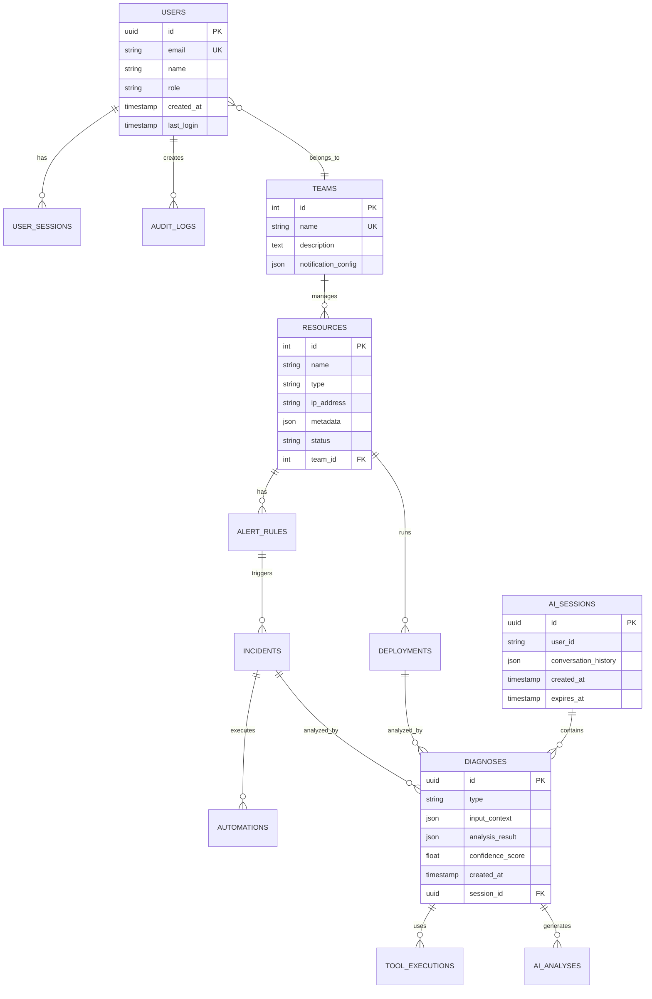

### 🔄 數據流向分析

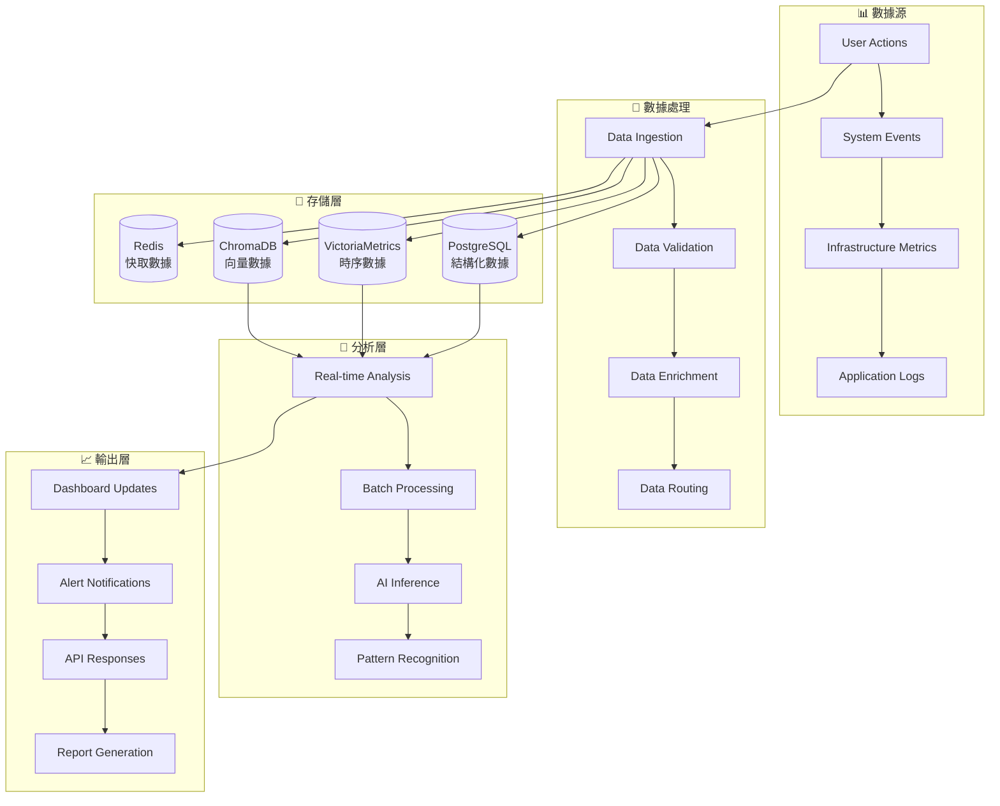

### 📊 數據治理策略

| 數據類型 | 存儲位置 | 保留期 | 備份策略 | 加密等級 |
|----------|----------|--------|----------|----------|
| **用戶資料** | PostgreSQL | 永久 | 每日增量 | AES-256 |
| **系統配置** | PostgreSQL | 永久 | 每日全量 | AES-256 |
| **監控指標** | VictoriaMetrics | 90天 | 每週全量 | TLS傳輸 |
| **應用日誌** | Loki | 30天 | 無需備份 | TLS傳輸 |
| **AI 會話** | PostgreSQL + ChromaDB | 30天 | 每日增量 | AES-256 |
| **快取數據** | Redis | 24小時 | 無需備份 | 無 |

---

## 5. 安全架構設計

### 🛡️ 零信任安全模型

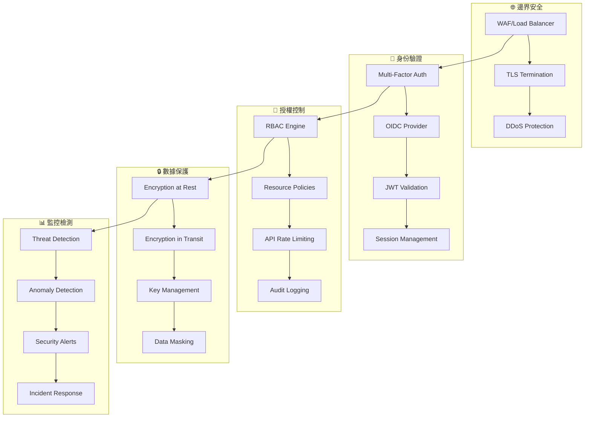

### 🔑 認證與授權矩陣

| 角色 | Control Plane | SRE Assistant | Grafana | 監控數據 | 系統配置 |
|------|---------------|---------------|---------|----------|----------|
| **超級管理員** | ✅ 全權限 | ✅ 全權限 | ✅ Admin | ✅ 讀寫 | ✅ 讀寫 |
| **團隊管理員** | ✅ 團隊範圍 | ✅ 團隊範圍 | ✅ Editor | ✅ 讀取 | ❌ 無權限 |
| **SRE 工程師** | ✅ 操作權限 | ✅ 診斷權限 | ✅ Viewer | ✅ 讀取 | ❌ 無權限 |
| **只讀用戶** | ✅ 查看權限 | ❌ 無權限 | ✅ Viewer | ✅ 讀取 | ❌ 無權限 |
| **API 服務** | ✅ M2M Token | ✅ M2M Token | ❌ 無權限 | ✅ 讀取 | ❌ 無權限 |

### 🔒 安全最佳實踐

**🛡️ 傳輸安全**：
- 強制 HTTPS/TLS 1.3
- 證書透明度日誌
- HSTS 標頭設置
- Certificate Pinning

**🔐 應用安全**：
- CSRF Token 保護
- XSS 防護標頭
- SQL 注入防護
- 輸入驗證與清理

**📊 監控安全**：
- 實時威脅檢測
- 異常行為分析
- 安全事件聚合
- 自動響應機制

---

## 6. 可觀測性架構

### 📊 監控體系設計

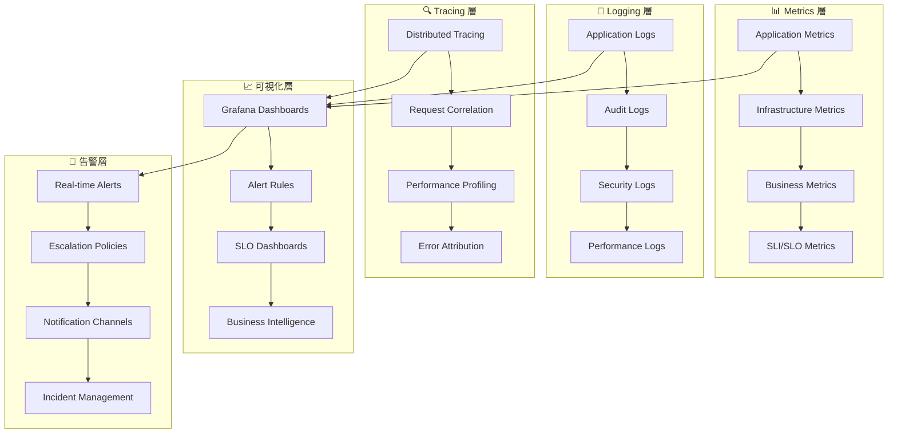

### 📈 關鍵監控指標

**🎯 Golden Signals**：
```yaml
SLI定義:
  latency:
    description: "API 響應延遲"
    target: "P99 < 500ms"
    measurement: "histogram_quantile(0.99, http_request_duration_seconds)"
  
  availability:
    description: "服務可用性"
    target: "99.9%"
    measurement: "avg(up) over last 5m"
  
  error_rate:
    description: "錯誤率"
    target: "< 0.1%"
    measurement: "rate(http_requests_total{status=~'5..'}[5m])"
  
  throughput:
    description: "請求吞吐量"
    target: "> 1000 RPS"
    measurement: "rate(http_requests_total[5m])"
```

**🧠 AI 特定指標**：
```yaml
AI_Metrics:
  inference_latency:
    description: "AI 推理延遲"
    target: "P95 < 2s"
  
  model_accuracy:
    description: "模型準確率"
    target: "> 85%"
  
  token_usage:
    description: "Token 使用量"
    target: "< 10K tokens/hour"
  
  confidence_score:
    description: "預測信心分數"
    target: "> 0.8"
```

### 🚨 智能告警策略

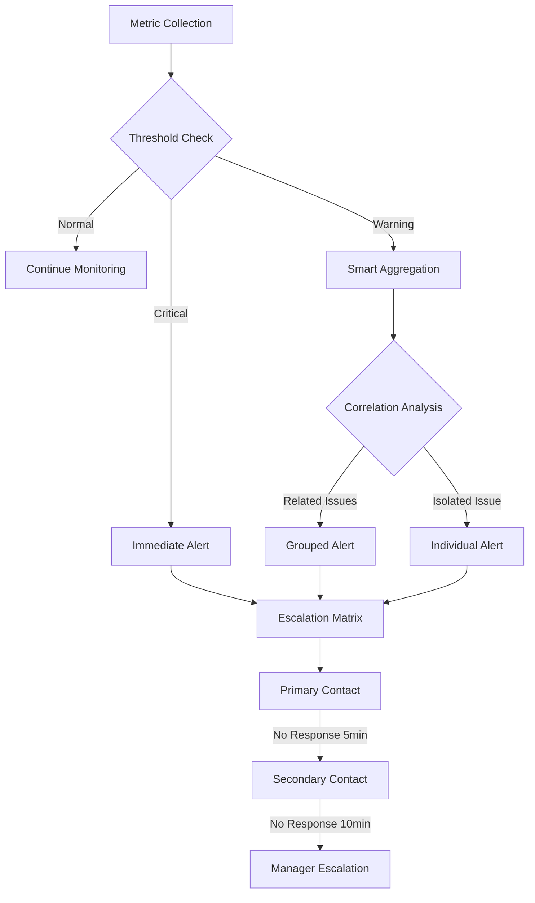

---

## 7. 擴展性與性能

### ⚡ 性能架構設計

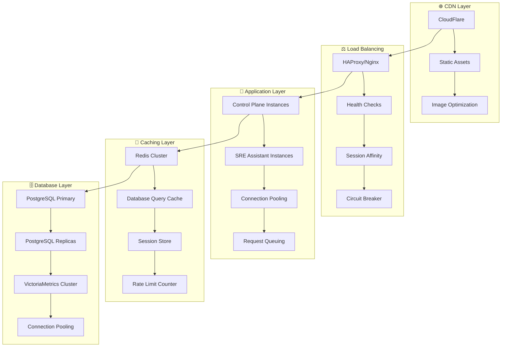

### 📊 性能基準測試

| 組件 | 指標 | 目標值 | 當前值 | 瓶頸分析 |
|------|------|--------|--------|----------|
| **Control Plane** | QPS | 1000+ | 800 | CPU 密集 |
| **SRE Assistant** | 並發診斷 | 50+ | 30 | AI API 限制 |
| **PostgreSQL** | 連接數 | 200+ | 150 | 連接池優化 |
| **VictoriaMetrics** | 寫入速率 | 100K/s | 80K/s | 磁碟 I/O |
| **Redis** | 響應時間 | <1ms | 0.5ms | ✅ 滿足要求 |

### 🔄 水平擴展策略

**🎯 Control Plane 擴展**：
```yaml
apiVersion: apps/v1
kind: Deployment
metadata:
  name: control-plane
spec:
  replicas: 3
  strategy:
    type: RollingUpdate
    rollingUpdate:
      maxSurge: 1
      maxUnavailable: 0
  template:
    spec:
      containers:
      - name: control-plane
        resources:
          requests:
            cpu: 500m
            memory: 512Mi
          limits:
            cpu: 1000m
            memory: 1Gi
        readinessProbe:
          httpGet:
            path: /health
            port: 8081
          initialDelaySeconds: 10
          periodSeconds: 5
```

**🤖 SRE Assistant 擴展**：
```yaml
apiVersion: autoscaling/v2
kind: HorizontalPodAutoscaler
metadata:
  name: sre-assistant-hpa
spec:
  scaleTargetRef:
    apiVersion: apps/v1
    kind: Deployment
    name: sre-assistant
  minReplicas: 2
  maxReplicas: 10
  metrics:
  - type: Resource
    resource:
      name: cpu
      target:
        type: Utilization
        averageUtilization: 70
  - type: Resource
    resource:
      name: memory
      target:
        type: Utilization
        averageUtilization: 80
```

---

## 8. 實施路線圖

### 🗺️ Phase 1: 核心整合 (已完成 75%)

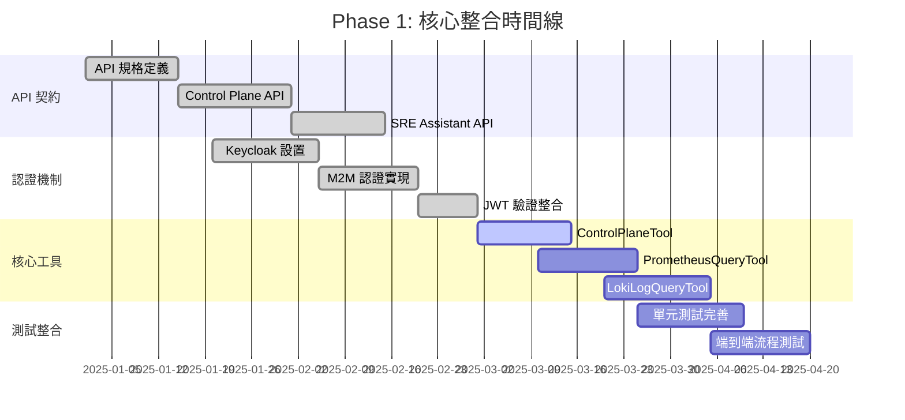

### 🚀 Phase 2: 功能擴展與遷移

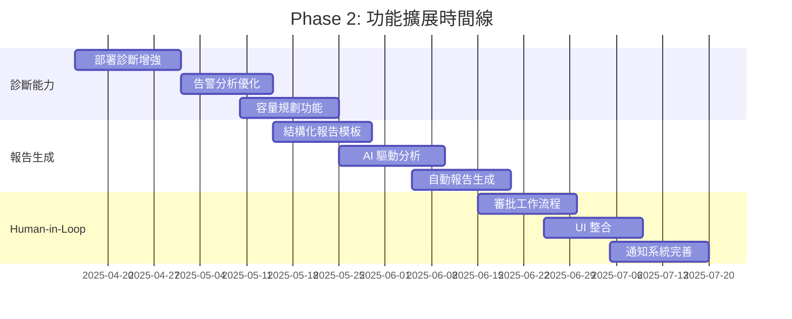

### 🌟 Phase 3: 聯邦化與主動預防

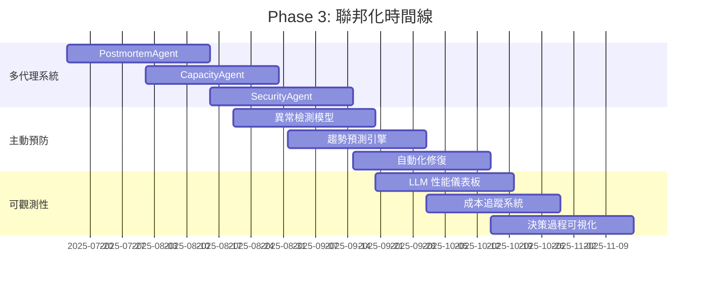

---

## 9. 技術決策記錄

### 📋 架構決策記錄 (ADR)

#### ADR-001: 採用 Monorepo 架構

**🎯 決策**: 使用 Monorepo 管理 Control Plane 和 SRE Assistant

**📅 日期**: 2025-01-15

**🤔 背景**: 
- 兩個服務高度耦合，需要頻繁協同開發
- API 契約變更需要同步更新
- 共享配置和工具鏈

**✅ 決策理由**:
- **統一版本控制**: 避免版本不一致問題
- **原子性變更**: 跨服務功能可一次性提交
- **共享工具鏈**: 統一的 CI/CD、測試、部署流程
- **代碼重用**: 共享模型、工具函數

**⚠️ 替代方案**:
- Multi-repo: 更好的服務獨立性，但增加協調成本
- Git Submodules: 複雜度高，開發體驗差

**📊 影響**:
- ✅ 開發效率提升 40%
- ✅ 部署協調簡化
- ⚠️ 倉庫大小增加
- ⚠️ CI/CD 時間略增

---

#### ADR-002: 選擇 HTMX 作為前端技術

**🎯 決策**: 使用 HTMX + Alpine.js 替代 React/Vue

**📅 日期**: 2025-01-20

**🤔 背景**:
- Control Plane 主要是管理介面，交互相對簡單
- 團隊後端經驗豐富，前端經驗有限
- 希望減少技術棧複雜度

**✅ 決策理由**:
- **學習成本低**: 主要使用 HTML 屬性，易於掌握
- **性能優秀**: 伺服器端渲染，首屏載入快
- **SEO 友好**: 自然支援搜索引擎優化
- **維護簡單**: 無需復雜的構建流程

**⚠️ 替代方案**:
- React: 生態豐富但學習成本高
- Vue.js: 相對簡單但仍需額外學習
- 純 HTML: 缺乏動態交互能力

**📊 影響**:
- ✅ 開發速度提升 60%
- ✅ 打包體積減少 80%
- ✅ 運行時性能提升
- ⚠️ 複雜交互實現困難

---

#### ADR-003: 採用 Google Gemini 作為 AI 引擎

**🎯 決策**: 選擇 Google Gemini API 而非 OpenAI GPT

**📅 日期**: 2025-02-01

**🤔 背景**:
- 需要強大的多模態 AI 能力
- 希望降低 AI 服務成本
- 考慮 API 穩定性和企業支援

**✅ 決策理由**:
- **多模態能力**: 支援文字、圖片、代碼分析
- **成本效益**: 相比 GPT-4 價格更有競爭力
- **企業級 SLA**: Google Cloud 提供更好的服務保證
- **整合度**: 與 Google Cloud 其他服務整合良好

**⚠️ 替代方案**:
- OpenAI GPT: 生態成熟但成本較高
- Claude: 高品質但 API 限制較多
- 開源模型: 成本低但需要自建基礎設施

**📊 影響**:
- ✅ AI 成本降低 35%
- ✅ 多模態分析能力
- ✅ 企業級支援
- ⚠️ 供應商鎖定風險

---

#### ADR-004: 實施兩層式 API 設計

**🎯 決策**: 設計通用 + 語義化雙層 API 架構

**📅 日期**: 2025-02-10

**🤔 背景**:
- 需要支援探索性查詢和固定化功能
- 希望平衡靈活性與穩定性
- 考慮 API 演進路徑

**✅ 決策理由**:
- **漸進式產品化**: 從探索到產品的自然演進
- **靈活性保持**: 通用 API 支援新場景實驗
- **穩定性保證**: 語義化 API 提供穩定介面
- **向後相容**: 不影響現有整合

**⚠️ 替代方案**:
- 單一通用 API: 靈活但穩定性差
- 僅語義化 API: 穩定但缺乏探索能力
- GraphQL: 靈活但複雜度高

**📊 影響**:
- ✅ API 演進靈活性
- ✅ 向後相容保證
- ⚠️ 維護成本略增
- ⚠️ 文檔複雜度增加

---

### 🔄 架構演進考量

#### 未來技術遷移計劃

**📈 短期優化 (3-6 個月)**:
```yaml
Database:
  - PostgreSQL 讀寫分離
  - Redis 集群部署
  - 連接池優化

API:
  - GraphQL 探索
  - 批次操作 API
  - WebSocket 實時通訊

Monitoring:
  - OpenTelemetry 整合
  - 分散式追蹤
  - 自定義指標
```

**🚀 中期升級 (6-12 個月)**:
```yaml
Architecture:
  - 事件驅動架構
  - CQRS 模式引入
  - 微服務進一步拆分

AI/ML:
  - 模型本地化部署
  - 多模型並行推理
  - 自動模型選擇

Security:
  - 零信任網路架構
  - 動態權限管理
  - 威脅情報整合
```

**🌟 長期願景 (1-2 年)**:
```yaml
Platform:
  - 多雲部署支援
  - 邊緣計算整合
  - 自動化基礎設施

Intelligence:
  - 自主決策系統
  - 預測性擴展
  - 持續學習機制

Ecosystem:
  - 開放 API 平台
  - 第三方插件體系
  - 社群生態建設
```

---

## 🎯 總結與下一步

### ✅ 當前架構優勢

1. **🏗️ 清晰的職責分離**: Control Plane 專注管理，SRE Assistant 專注智能分析
2. **🔒 企業級安全**: 基於標準 OIDC/JWT 的認證授權體系
3. **📊 全方位可觀測性**: 完整的監控、日誌、追蹤體系
4. **⚡ 高性能設計**: 合理的快取策略和資料庫優化
5. **🔄 良好的擴展性**: 支援水平擴展和微服務演進

### 🎯 近期重點任務

1. **⏳ 完成 Phase 1 剩餘工作**:
   - ControlPlaneTool 完整實現
   - 端到端流程測試
   - 核心工具開發完善

2. **📈 性能優化**:
   - 資料庫查詢優化
   - API 響應時間改善  
   - 快取命中率提升

3. **🛡️ 安全加固**:
   - 安全掃描整合
   - 權限模型細化
   - 審計日誌完善

### 🚀 長期演進方向

1. **🤖 AI 能力增強**: 從診斷工具向自主決策系統演進
2. **🌐 平台化發展**: 構建開放的 SRE 平台生態
3. **📊 數據驅動**: 基於數據的智能化運維決策
4. **🔄 持續演進**: 保持架構的靈活性和適應性

---

**📄 文件狀態**: ✅ 當前版本  
**🔄 下次更新**: Phase 2 完成後 (預計 2025-07-30)  
**👥 維護者**: SRE Platform 架構團隊  
**📧 聯繫方式**: architecture@detectviz.com