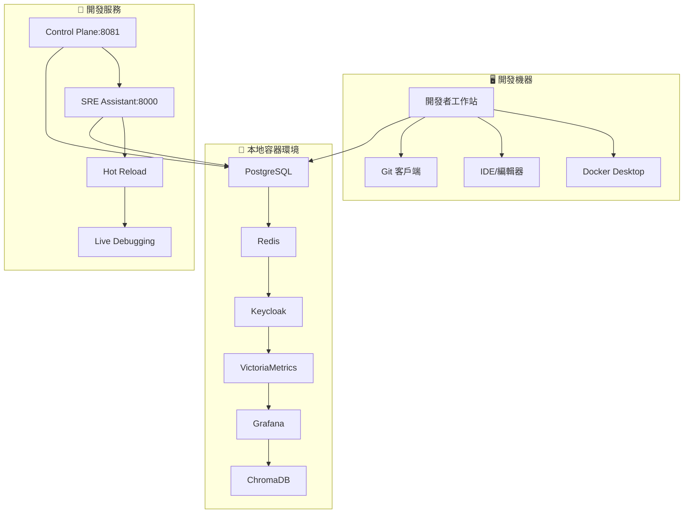
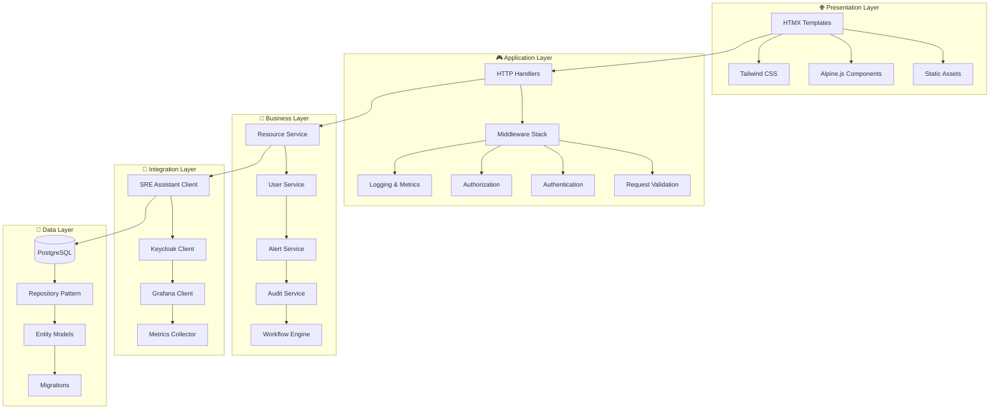
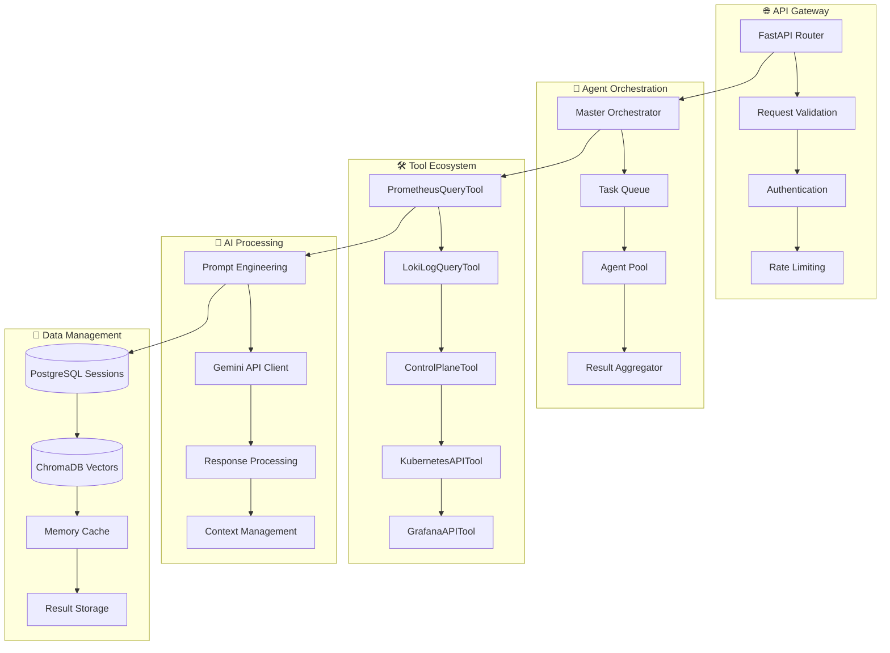

# SRE Platform 開發者完整指南

**目標讀者**: 軟體工程師、DevOps 工程師、平台開發者  
**難度等級**: 中級到高級  
**預計閱讀時間**: 45 分鐘

---

## 📋 開發者指南目錄

- [專案成熟度](#專案成熟度)
- [開發環境設置](#開發環境設置)
- [專案架構深入](#專案架構深入)
- [開發工作流程](#開發工作流程)
- [代碼規範與最佳實踐](#代碼規範與最佳實踐)
- [測試策略與實踐](#測試策略與實踐)
- [調試與故障排除](#調試與故障排除)


---

## 專案成熟度

> ⚠️ **重要提示**: 本專案目前處於**早期開發階段**。

本開發者指南旨在描述專案的**目標架構**與**理想工作流程**。開發者應注意，目前的實作與本文件描述之間可能存在以下差異：

- **功能完整性**: 許多核心功能，特別是 `SRE Assistant` 的診斷與 AI 分析能力，仍處於**骨架或模擬 (mock) 階段**。
- **API 狀態**: API 設計仍在演進，可能會出現與 `openapi.yaml` 定義不完全一致的情況。
- **程式碼品質**: 部分模組可能仍在快速迭代，尚未達到生產環境的穩定性與品質標準。

我們鼓勵開發者將本文件作為開發的**藍圖**與**方向**，並積極參與，共同將理想變為現實。

---

## 開發環境設置

### 🛠️ 完整開發環境架構



### 🔧 系統要求詳解

| 組件 | 最低要求 | 推薦配置 | 說明 |
|------|----------|----------|------|
| **作業系統** | Ubuntu 20.04+ | Ubuntu 22.04 LTS | 或等效的 Debian 系統 |
| **CPU** | 4 核心 | 8 核心+ | 支援併發開發與測試 |
| **記憶體** | 8GB | 16GB+ | 容器服務需要大量記憶體 |
| **磁碟空間** | 50GB | 100GB+ | 包含 Docker 映像與數據 |
| **Go** | 1.21+ | 1.22+ | Control Plane 開發 |
| **Python** | 3.11+ | 3.12+ | SRE Assistant 開發 |
| **Node.js** | 18+ | 20+ | 前端工具與測試 |
| **Docker** | 20.10+ | 24.0+ | 容器化開發環境 |

### ⚡ 極速環境設置

#### 方案一：一鍵自動化設置 (推薦)

```bash
# 🚀 超級快速設置
git clone https://github.com/detectviz/sre-platform
cd sre-platform

# 一鍵安裝所有依賴和服務
make setup-dev

# 驗證安裝
make verify

# 啟動開發模式
make dev
```

#### 方案二：手動分步驟設置

```bash
# 1️⃣ 安裝系統依賴
sudo apt update && sudo apt install -y \
    git curl wget build-essential \
    docker.io docker-compose \
    postgresql-client redis-tools

# 2️⃣ 安裝 Go
wget https://golang.org/dl/go1.22.0.linux-amd64.tar.gz
sudo tar -C /usr/local -xzf go1.22.0.linux-amd64.tar.gz
echo 'export PATH=$PATH:/usr/local/go/bin' >> ~/.bashrc

# 3️⃣ 安裝 Python & Poetry
curl -sSL https://install.python-poetry.org | python3 -
echo 'export PATH="$HOME/.local/bin:$PATH"' >> ~/.bashrc

# 4️⃣ 設置專案
git clone https://github.com/detectviz/sre-platform
cd sre-platform

# 5️⃣ 安裝專案依賴
make install-deps

# 6️⃣ 啟動基礎服務
make start-services

# 7️⃣ 驗證環境
make verify
```

### 🐳 Docker 開發環境 (替代方案)

對於希望完全容器化開發的開發者：

```yaml
# docker-compose.dev.yml
version: '3.8'
services:
  control-plane-dev:
    build:
      context: ./services/control-plane
      dockerfile: Dockerfile.dev
    ports:
      - "8081:8081"
    volumes:
      - ./services/control-plane:/app
      - go-modules:/go/pkg/mod
    environment:
      - GO_ENV=development
      - HOT_RELOAD=true
    depends_on:
      - postgres
      - redis
      - keycloak

  sre-assistant-dev:
    build:
      context: ./services/sre-assistant  
      dockerfile: Dockerfile.dev
    ports:
      - "8000:8000"
    volumes:
      - ./services/sre-assistant:/app
      - poetry-cache:/root/.cache/pypoetry
    environment:
      - PYTHON_ENV=development
      - DEBUG=true
      - HOT_RELOAD=true
    depends_on:
      - postgres
      - chromadb

volumes:
  go-modules:
  poetry-cache:
```

```bash
# 啟動 Docker 開發環境
docker-compose -f docker-compose.dev.yml up -d

# 進入容器進行開發
docker exec -it sre-platform_control-plane-dev_1 bash
docker exec -it sre-platform_sre-assistant-dev_1 bash
```

### 🔍 環境驗證與故障排除

#### 完整驗證腳本

```bash
#!/bin/bash
# verify_dev_environment.sh

echo "🔍 SRE Platform 開發環境驗證"
echo "=============================="

# 檢查基本工具
echo -n "📦 檢查 Go 版本... "
if go version >/dev/null 2>&1; then
    echo "✅ $(go version)"
else
    echo "❌ Go 未安裝或版本過舊"
    exit 1
fi

echo -n "🐍 檢查 Python 版本... "
if python3 --version >/dev/null 2>&1; then
    echo "✅ $(python3 --version)"
else
    echo "❌ Python 未安裝或版本過舊"
    exit 1
fi

echo -n "📝 檢查 Poetry... "
if poetry --version >/dev/null 2>&1; then
    echo "✅ $(poetry --version)"
else
    echo "❌ Poetry 未安裝"
    exit 1
fi

# 檢查服務連通性
services=(
    "PostgreSQL:5432"
    "Redis:6379" 
    "Keycloak:8080"
    "VictoriaMetrics:8428"
    "Grafana:3000"
)

for service in "${services[@]}"; do
    name=$(echo $service | cut -d: -f1)
    port=$(echo $service | cut -d: -f2)
    echo -n "🔌 檢查 $name 連接... "
    
    if nc -z localhost $port >/dev/null 2>&1; then
        echo "✅ 連接成功"
    else
        echo "❌ 連接失敗 (端口 $port)"
    fi
done

# 檢查 API 健康狀態
echo -n "🏥 檢查 Control Plane 健康狀態... "
if curl -f http://localhost:8081/health >/dev/null 2>&1; then
    echo "✅ 健康"
else
    echo "❌ 不健康或未啟動"
fi

if curl -f http://localhost:8000/health >/dev/null 2>&1; then
    echo "✅ 健康"
else
    echo "❌ 不健康或未啟動"
fi

echo ""
echo "🎉 環境驗證完成！如有問題請查看上方的錯誤訊息。"
```
    
#### 異步編程最佳實踐

```python
# src/sre_assistant/tools/base.py
import asyncio
import logging
from abc import ABC, abstractmethod
from typing import Dict, Any, Optional, List
from contextlib import asynccontextmanager
import aiohttp
from ..contracts import ToolResult, ToolError

logger = logging.getLogger(__name__)

class AsyncBaseTool(ABC):
    """異步工具的基礎類別
    
    提供統一的異步工具介面，包含重試、超時、錯誤處理等通用功能
    """
    
    def __init__(self, config: Dict[str, Any]):
        self.config = config
        self.timeout = config.get('timeout_seconds', 30)
        self.retry_count = config.get('retry_count', 3)
        self.retry_delay = config.get('retry_delay', 1)
        self.session: Optional[aiohttp.ClientSession] = None
        
    async def __aenter__(self):
        """異步上下文管理器進入"""
        await self.initialize()
        return self
        
    async def __aexit__(self, exc_type, exc_val, exc_tb):
        """異步上下文管理器退出"""
        await self.cleanup()
        
    async def initialize(self) -> None:
        """初始化工具資源"""
        if self.session is None:
            timeout = aiohttp.ClientTimeout(total=self.timeout)
            self.session = aiohttp.ClientSession(timeout=timeout)
            
    async def cleanup(self) -> None:
        """清理工具資源"""
        if self.session and not self.session.closed:
            await self.session.close()
            self.session = None
            
    @abstractmethod
    async def execute(self, context: Dict[str, Any]) -> ToolResult:
        """執行工具的主要邏輯
        
        Args:
            context: 執行上下文
            
        Returns:
            ToolResult: 執行結果
        """
        pass
        
    @abstractmethod
    def validate_context(self, context: Dict[str, Any]) -> bool:
        """驗證執行上下文
        
        Args:
            context: 執行上下文
            
        Returns:
            bool: 上下文是否有效
        """
        pass
        
    async def execute_with_retry(self, context: Dict[str, Any]) -> ToolResult:
        """帶重試機制的執行包裝
        
        實現指數退避重試策略，自動處理暫時性錯誤
        
        Args:
            context: 執行上下文
            
        Returns:
            ToolResult: 執行結果
        """
        if not self.validate_context(context):
            return ToolResult(
                success=False,
                error=ToolError(
                    code="INVALID_CONTEXT",
                    message="Context validation failed"
                )
            )
            
        last_error = None
        
        for attempt in range(self.retry_count):
            try:
                logger.debug(f"執行工具 {self.__class__.__name__}, 嘗試 {attempt + 1}/{self.retry_count}")
                result = await self.execute(context)
                
                if result.success:
                    return result
                    
                # 如果是非重試性錯誤，直接返回
                if result.error and not self._is_retryable_error(result.error):
                    return result
                    
                last_error = result.error
                
            except asyncio.TimeoutError:
                last_error = ToolError(
                    code="TIMEOUT_ERROR",
                    message=f"Tool execution timed out after {self.timeout} seconds"
                )
            except Exception as e:
                last_error = ToolError(
                    code="EXECUTION_ERROR", 
                    message=f"Unexpected error: {str(e)}"
                )
                logger.exception(f"工具執行出現未預期錯誤: {e}")
                
            # 如果不是最後一次嘗試，等待後重試
            if attempt < self.retry_count - 1:
                delay = self.retry_delay * (2 ** attempt)  # 指數退避
                logger.debug(f"工具執行失敗，{delay} 秒後重試...")
                await asyncio.sleep(delay)
                
        return ToolResult(
            success=False,
            error=last_error or ToolError(
                code="UNKNOWN_ERROR",
                message="Tool execution failed with unknown error"
            )
        )
        
    def _is_retryable_error(self, error: ToolError) -> bool:
        """判斷錯誤是否可重試
        
        Args:
            error: 錯誤對象
            
        Returns:
            bool: 是否可重試
        """
        retryable_codes = {
            'TIMEOUT_ERROR',
            'CONNECTION_ERROR',
            'SERVICE_UNAVAILABLE',
            'RATE_LIMITED',
            'TEMPORARY_ERROR'
        }
        return error.code in retryable_codes
        
    @asynccontextmanager
    async def http_request(self, method: str, url: str, **kwargs):
        """HTTP 請求的上下文管理器
        
        提供統一的 HTTP 請求處理，包含錯誤處理和日誌記錄
        
        Args:
            method: HTTP 方法
            url: 請求 URL
            **kwargs: 額外的請求參數
            
        Yields:
            aiohttp.ClientResponse: HTTP 響應對象
        """
        if not self.session:
            await self.initialize()
            
        try:
            logger.debug(f"發送 {method} 請求到 {url}")
            async with self.session.request(method, url, **kwargs) as response:
                yield response
        except aiohttp.ClientTimeout:
            raise asyncio.TimeoutError(f"HTTP request to {url} timed out")
        except aiohttp.ClientError as e:
            raise Exception(f"HTTP request failed: {e}")
```

#### 測試編寫規範

```python
# tests/unit/test_prometheus_tool.py
import pytest
import asyncio
from unittest.mock import AsyncMock, patch, MagicMock
from aiohttp import ClientSession, ClientTimeout
import aioresponses

from src.sre_assistant.tools.prometheus_tool import PrometheusQueryTool
from src.sre_assistant.contracts import ToolResult

class TestPrometheusQueryTool:
    """PrometheusQueryTool 的單元測試
    
    測試覆蓋正常流程、錯誤處理、邊界條件等各種場景
    """
    
    @pytest.fixture
    def tool_config(self):
        """測試用的工具配置"""
        return {
            'prometheus': {
                'base_url': 'http://localhost:9090',
                'step': '1m'
            },
            'timeout_seconds': 10,
            'retry_count': 2
        }
    
    @pytest.fixture
    def prometheus_tool(self, tool_config):
        """PrometheusQueryTool 實例"""
        return PrometheusQueryTool(tool_config)
    
    @pytest.fixture
    def valid_context(self):
        """有效的執行上下文"""
        return {
            'service_name': 'test-service',
            'time_range': {
                'start': '2025-09-05T12:00:00Z',
                'end': '2025-09-05T13:00:00Z'
            }
        }
    
    @pytest.mark.asyncio
    async def test_successful_execution(self, prometheus_tool, valid_context):
        """測試成功執行的情況"""
        # 模擬 Prometheus API 響應
        mock_response_data = {
            'status': 'success',
            'data': {
                'result': [{
                    'metric': {'__name__': 'http_request_duration_seconds'},
                    'values': [
                        ['1693910400', '0.1'],
                        ['1693910460', '0.12'],
                        ['1693910520', '0.15']
                    ]
                }]
            }
        }
        
        with aioresponses.aioresponses() as m:
            # 模擬多個指標查詢
            for i in range(11):  # 黃金指標數量
                m.get(
                    'http://localhost:9090/api/v1/query_range',
                    payload=mock_response_data
                )
            
            result = await prometheus_tool.execute_with_retry(valid_context)
            
            assert result.success is True
            assert 'service_name' in result.data
            assert result.data['service_name'] == 'test-service'
            assert 'metrics' in result.data
            assert len(result.data['metrics']) > 0
    
    @pytest.mark.asyncio
    async def test_invalid_context(self, prometheus_tool):
        """測試無效上下文的處理"""
        invalid_context = {
            # 缺少 service_name
            'time_range': {
                'start': '2025-09-05T12:00:00Z',
                'end': '2025-09-05T13:00:00Z'
            }
        }
        
        result = await prometheus_tool.execute_with_retry(invalid_context)
        
        assert result.success is False
        assert result.error.code == "INVALID_CONTEXT"
    
    @pytest.mark.asyncio
    async def test_prometheus_api_error(self, prometheus_tool, valid_context):
        """測試 Prometheus API 錯誤的處理"""
        with aioresponses.aioresponses() as m:
            m.get(
                'http://localhost:9090/api/v1/query_range',
                status=500,
                payload={'error': 'Internal server error'}
            )
            
            result = await prometheus_tool.execute_with_retry(valid_context)
            
            assert result.success is False
            # 由於重試機制，應該嘗試多次
    
    @pytest.mark.asyncio
    async def test_timeout_handling(self, prometheus_tool, valid_context):
        """測試超時處理"""
        with aioresponses.aioresponses() as m:
            # 模擬超時響應
            async def slow_response(url, **kwargs):
                await asyncio.sleep(15)  # 超過配置的 10 秒超時
                return {'status': 'success', 'data': {'result': []}}
            
            m.get(
                'http://localhost:9090/api/v1/query_range',
                callback=slow_response
            )
            
            result = await prometheus_tool.execute_with_retry(valid_context)
            
            assert result.success is False
            assert "timeout" in result.error.message.lower()
    
    @pytest.mark.asyncio
    async def test_resource_cleanup(self, prometheus_tool):
        """測試資源清理"""
        # 使用上下文管理器
        async with prometheus_tool:
            assert prometheus_tool.session is not None
            assert not prometheus_tool.session.closed
            
        # 離開上下文後應該清理資源
        assert prometheus_tool.session is None or prometheus_tool.session.closed
    
    def test_metrics_health_assessment(self, prometheus_tool):
        """測試指標健康評估邏輯"""
        # 測試不同的指標值對應的健康狀態
        test_cases = [
            ('error_rate', 0.005, 'healthy'),    # 0.5% 錯誤率
            ('error_rate', 0.02, 'warning'),     # 2% 錯誤率
            ('error_rate', 0.08, 'critical'),    # 8% 錯誤率
            ('latency_p99', 0.3, 'healthy'),     # 300ms
            ('latency_p99', 0.8, 'warning'),     # 800ms
            ('latency_p99', 2.5, 'critical'),    # 2.5s
        ]
        
        for metric_name, value, expected_status in test_cases:
            data = {
                'statistics': {'current': value}
            }
            status = prometheus_tool._assess_metric_health(metric_name, data)
            assert status == expected_status, f"指標 {metric_name} 值 {value} 應該是 {expected_status}，但得到 {status}"
    
    def test_trend_calculation(self, prometheus_tool):
        """測試趨勢計算邏輯"""
        # 測試不同趨勢的數據
        test_cases = [
            ([1.0, 1.1, 1.2, 1.3, 1.4], 'increasing'),  # 持續上升
            ([1.4, 1.3, 1.2, 1.1, 1.0], 'decreasing'),  # 持續下降
            ([1.0, 1.0, 1.0, 1.0, 1.0], 'stable'),      # 保持穩定
            ([1.0, 1.2, 0.9, 1.1, 1.0], 'stable'),      # 小幅波動
        ]
        
        for values, expected_trend in test_cases:
            trend = prometheus_tool._calculate_trend(values)
            assert trend == expected_trend, f"數據 {values} 的趨勢應該是 {expected_trend}，但得到 {trend}"

# tests/integration/test_sre_workflow.py
import pytest
import asyncio
from unittest.mock import AsyncMock, patch
import json

from src.sre_assistant.workflow import DiagnosticWorkflow
from src.sre_assistant.contracts import SRERequest, SeverityLevel

class TestSREWorkflowIntegration:
    """SRE 工作流程的整合測試
    
    測試多個工具協同工作的完整流程
    """
    
    @pytest.fixture
    def workflow_config(self):
        """工作流程配置"""
        return {
            'prometheus': {
                'base_url': 'http://localhost:9090'
            },
            'loki': {
                'base_url': 'http://localhost:3100'
            },
            'control_plane': {
                'base_url': 'http://localhost:8081'
            },
            'parallel_execution': True,
            'workflow_timeout': 60
        }
    
    @pytest.fixture
    def diagnostic_workflow(self, workflow_config):
        """DiagnosticWorkflow 實例"""
        return DiagnosticWorkflow(workflow_config)
    
    @pytest.fixture
    def deployment_request(self):
        """部署診斷請求"""
        return SRERequest(
            incident_id="deploy-test-001",
            severity=SeverityLevel.P2,
            input="診斷部署問題",
            affected_services=["test-service"],
            context={
                "type": "deployment_diagnosis",
                "deployment_id": "deploy-xyz-123",
                "service_name": "test-service",
                "namespace": "production"
            }
        )
    
    @pytest.mark.asyncio
    async def test_end_to_end_deployment_diagnosis(self, diagnostic_workflow, deployment_request):
        """測試端到端的部署診斷流程"""
        # 模擬各工具的返回結果
        with patch.object(diagnostic_workflow, '_collect_metrics') as mock_metrics, \
             patch.object(diagnostic_workflow, '_collect_logs') as mock_logs, \
             patch.object(diagnostic_workflow, '_collect_audit_logs') as mock_audit, \
             patch.object(diagnostic_workflow, '_collect_kubernetes_status') as mock_k8s:
            
            # 設定模擬返回值
            mock_metrics.return_value = self._create_mock_metrics_result()
            mock_logs.return_value = self._create_mock_logs_result()
            mock_audit.return_value = self._create_mock_audit_result()
            mock_k8s.return_value = self._create_mock_k8s_result()
            
            # 執行工作流程
            result = await diagnostic_workflow.execute_deployment_diagnosis(deployment_request)
            
            # 驗證結果結構
            assert result['status'] == 'COMPLETED'
            assert 'deployment_summary' in result
            assert 'analysis' in result
            assert 'recommendations' in result
            assert 'confidence_score' in result
            assert 'metadata' in result
            
            # 驗證各工具都被調用
            mock_metrics.assert_called_once()
            mock_logs.assert_called_once()
            mock_audit.assert_called_once()
            mock_k8s.assert_called_once()
    
    @pytest.mark.asyncio
    async def test_parallel_vs_sequential_execution(self, workflow_config, deployment_request):
        """測試並行和順序執行的性能差異"""
        # 並行執行
        parallel_workflow = DiagnosticWorkflow({
            **workflow_config,
            'parallel_execution': True
        })
        
        # 順序執行
        sequential_workflow = DiagnosticWorkflow({
            **workflow_config,
            'parallel_execution': False
        })
        
        # 模擬工具執行時間
        async def slow_tool_execution(*args, **kwargs):
            await asyncio.sleep(0.1)  # 模擬 100ms 執行時間
            return self._create_mock_metrics_result()
        
        with patch.multiple(
            parallel_workflow,
            _collect_metrics=slow_tool_execution,
            _collect_logs=slow_tool_execution,
            _collect_audit_logs=slow_tool_execution,
            _collect_kubernetes_status=slow_tool_execution
        ), patch.multiple(
            sequential_workflow,
            _collect_metrics=slow_tool_execution,
            _collect_logs=slow_tool_execution,
            _collect_audit_logs=slow_tool_execution,
            _collect_kubernetes_status=slow_tool_execution
        ):
            
            # 測量執行時間
            import time
            
            start_time = time.time()
            parallel_result = await parallel_workflow.execute_deployment_diagnosis(deployment_request)
            parallel_time = time.time() - start_time
            
            start_time = time.time()
            sequential_result = await sequential_workflow.execute_deployment_diagnosis(deployment_request)
            sequential_time = time.time() - start_time
            
            # 並行執行應該明顯快於順序執行
            assert parallel_time < sequential_time * 0.8  # 至少快 20%
            
            # 結果應該相似（除了執行時間）
            assert parallel_result['status'] == sequential_result['status']
    
    def _create_mock_metrics_result(self):
        """創建模擬的指標查詢結果"""
        from src.sre_assistant.contracts import ToolResult
        
        return ToolResult(
            success=True,
            data={
                'service_name': 'test-service',
                'metrics': {
                    'latency_p99': {
                        'status': 'success',
                        'statistics': {
                            'current': 0.8,
                            'trend': 'increasing'
                        }
                    },
                    'error_rate': {
                        'status': 'success',
                        'statistics': {
                            'current': 0.02,
                            'trend': 'stable'
                        }
                    }
                },
                'summary': {
                    'healthy_metrics': 8,
                    'warning_metrics': 2,
                    'critical_metrics': 1,
                    'failed_metrics': 0
                }
            }
        )
    
    def _create_mock_logs_result(self):
        """創建模擬的日誌查詢結果"""
        from src.sre_assistant.contracts import ToolResult
        
        return ToolResult(
            success=True,
            data={
                'error_patterns': [
                    {
                        'pattern': 'Connection timeout',
                        'count': 45,
                        'severity': 'high'
                    }
                ],
                'log_summary': {
                    'total_logs': 1000,
                    'error_logs': 45,
                    'warning_logs': 123
                }
            }
        )
    
    def _create_mock_audit_result(self):
        """創建模擬的審計日誌結果"""
        from src.sre_assistant.contracts import ToolResult
        
        return ToolResult(
            success=True,
            data={
                'recent_changes': [
                    {
                        'timestamp': '2025-09-05T12:00:00Z',
                        'event_type': 'DEPLOYMENT',
                        'author': 'admin@company.com',
                        'summary': 'Deployed test-service v2.1.0'
                    }
                ]
            }
        )
    
    def _create_mock_k8s_result(self):
        """創建模擬的 Kubernetes 狀態結果"""
        from src.sre_assistant.contracts import ToolResult
        
        return ToolResult(
            success=True,
            data={
                'deployment_status': {
                    'desired_replicas': 3,
                    'current_replicas': 2,
                    'ready_replicas': 1
                },
                'pod_issues': [
                    {
                        'pod_name': 'test-service-abc123',
                        'status': 'ImagePullBackOff',
                        'message': 'Failed to pull image'
                    }
                ]
            }
        )
```

---

## 專案架構深入

### 🏗️ Monorepo 結構詳解

```
sre-platform/
├── 📁 services/                    # 微服務目錄
│   ├── 🎯 control-plane/           # Go 後端服務
│   │   ├── cmd/
│   │   │   └── server/             # 應用程式入口點
│   │   │       └── main.go         # 主函式
│   │   ├── internal/               # 私有應用程式碼
│   │   │   ├── api/                # API 處理器
│   │   │   ├── auth/               # 認證中間件
│   │   │   ├── config/             # 配置管理
│   │   │   ├── database/           # 資料庫層
│   │   │   ├── handlers/           # HTTP 處理器
│   │   │   ├── middleware/         # 中間件
│   │   │   ├── models/             # 資料模型
│   │   │   ├── services/           # 業務邏輯
│   │   │   └── utils/              # 工具函數
│   │   ├── templates/              # HTMX 模板
│   │   ├── static/                 # 靜態資源 (CSS, JS, 圖片)
│   │   ├── tests/                  # 測試檔案
│   │   ├── Dockerfile              # 容器化配置
│   │   ├── go.mod                  # Go 模組定義
│   │   └── go.sum                  # Go 依賴鎖定
│   └── 🤖 sre-assistant/           # Python AI 服務
│       ├── src/
│       │   └── sre_assistant/      # 主要應用程式碼
│       │       ├── __init__.py
│       │       ├── main.py         # FastAPI 應用程式入口
│       │       ├── contracts.py    # 資料契約與模型
│       │       ├── workflow.py     # 工作流程協調器
│       │       ├── config/         # 配置管理
│       │       │   ├── __init__.py
│       │       │   ├── settings.py # 設定載入
│       │       │   └── environments/ # 環境特定配置
│       │       └── tools/          # 診斷工具集
│       │           ├── __init__.py
│       │           ├── base.py     # 基礎工具類別
│       │           ├── control_plane_tool.py
│       │           ├── prometheus_tool.py
│       │           ├── loki_tool.py
│       │           └── kubernetes_tool.py
│       ├── tests/                  # 測試套件
│       │   ├── unit/               # 單元測試
│       │   ├── integration/        # 整合測試
│       │   └── fixtures/           # 測試資料
│       ├── config/                 # 配置檔案
│       ├── pyproject.toml          # Python 專案配置
│       ├── poetry.lock             # 依賴鎖定檔案
│       └── Dockerfile              # 容器化配置
├── 📁 pkg/                         # 共享套件
│   ├── api/
│   │   └── openapi.yaml            # API 契約規格（唯一真實來源）
│   ├── utils/                      # 共享工具
│   └── models/                     # 共享資料模型
├── 📁 docs/                        # 專案文件
│   ├── ARCHITECTURE.md             # 架構設計文件
│   ├── USER_GUIDE.md              # 使用者指南
│   ├── SRE_ASSISTANT.md           # SRE Assistant 開發指南
│   ├── ROADMAP.md                 # 開發路線圖
│   └── api/                       # API 文件
├── 📁 local/                       # 本地開發工具
│   ├── setup_local_environment.sh # 環境設置腳本
│   ├── verify_environment.sh      # 環境驗證腳本
│   └── docker-compose.dev.yml     # 開發用 Docker Compose
├── 📁 k8s/                         # Kubernetes 部署配置
│   ├── namespace.yaml
│   ├── configmaps/
│   ├── deployments/
│   └── services/
├── 📁 ci/                          # CI/CD 配置
│   ├── .github/
│   │   └── workflows/              # GitHub Actions
│   ├── Jenkinsfile                # Jenkins 流水線
│   └── gitlab-ci.yml              # GitLab CI
├── 🔧 Makefile                     # 統一開發指令
├── 📋 README.md                    # 專案說明
├── 📄 LICENSE                      # 開源許可證
├── 🤖 AGENT.md                     # AI 代理開發指南
└── .gitignore                      # Git 忽略檔案
```

### 🎯 Control Plane 架構深度分析

#### 分層架構設計



#### 關鍵設計模式

**1. Repository Pattern（倉庫模式）**
```go
// internal/models/resource.go
type Resource struct {
    ID        int       `json:"id" db:"id"`
    Name      string    `json:"name" db:"name"`
    Type      string    `json:"type" db:"type"`
    IPAddress string    `json:"ip_address" db:"ip_address"`
    Status    string    `json:"status" db:"status"`
    TeamID    int       `json:"team_id" db:"team_id"`
    Metadata  JSON      `json:"metadata" db:"metadata"`
    CreatedAt time.Time `json:"created_at" db:"created_at"`
    UpdatedAt time.Time `json:"updated_at" db:"updated_at"`
}

// internal/database/resource_repository.go
type ResourceRepository interface {
    GetAll(ctx context.Context, filters ResourceFilters) ([]Resource, error)
    GetByID(ctx context.Context, id int) (*Resource, error)
    Create(ctx context.Context, resource *Resource) error
    Update(ctx context.Context, resource *Resource) error
    Delete(ctx context.Context, id int) error
    BatchDelete(ctx context.Context, ids []int) error
}

type resourceRepository struct {
    db *sqlx.DB
}

func (r *resourceRepository) GetAll(ctx context.Context, filters ResourceFilters) ([]Resource, error) {
    query := `
        SELECT id, name, type, ip_address, status, team_id, metadata, created_at, updated_at
        FROM resources 
        WHERE ($1::text IS NULL OR type = $1)
        AND ($2::text IS NULL OR status = $2)
        AND ($3::int IS NULL OR team_id = $3)
        ORDER BY updated_at DESC
        LIMIT $4 OFFSET $5
    `
    
    var resources []Resource
    err := r.db.SelectContext(ctx, &resources, query, 
        filters.Type, filters.Status, filters.TeamID, 
        filters.Limit, filters.Offset)
    
    return resources, err
}
```

**2. Service Layer Pattern（服務層模式）**
```go
// internal/services/resource_service.go
type ResourceService struct {
    repo           ResourceRepository
    auditService   *AuditService
    metricsCollector *MetricsCollector
}

func (s *ResourceService) CreateResource(ctx context.Context, req CreateResourceRequest) (*Resource, error) {
    // 1. 驗證輸入
    if err := s.validateCreateRequest(req); err != nil {
        return nil, fmt.Errorf("validation failed: %w", err)
    }
    
    // 2. 檢查重複
    existing, err := s.repo.GetByIPAddress(ctx, req.IPAddress)
    if err != nil && !errors.Is(err, ErrResourceNotFound) {
        return nil, fmt.Errorf("failed to check existing resource: %w", err)
    }
    if existing != nil {
        return nil, ErrResourceAlreadyExists
    }
    
    // 3. 創建資源
    resource := &Resource{
        Name:      req.Name,
        Type:      req.Type,
        IPAddress: req.IPAddress,
        TeamID:    req.TeamID,
        Status:    "active",
        Metadata:  req.Metadata,
        CreatedAt: time.Now(),
        UpdatedAt: time.Now(),
    }
    
    if err := s.repo.Create(ctx, resource); err != nil {
        return nil, fmt.Errorf("failed to create resource: %w", err)
    }
    
    // 4. 記錄審計日誌
    go func() {
        s.auditService.LogEvent(context.Background(), AuditEvent{
            Type:      "RESOURCE_CREATED",
            Author:    GetUserFromContext(ctx),
            Summary:   fmt.Sprintf("Created resource %s", resource.Name),
            Details:   resource,
            Timestamp: time.Now(),
        })
    }()
    
    // 5. 更新指標
    s.metricsCollector.IncrementCounter("resources_created_total", 
        map[string]string{"type": resource.Type})
    
    return resource, nil
}
```

**3. Middleware Chain Pattern（中間件鏈模式）**
```go
// internal/middleware/chain.go
func BuildMiddlewareChain() []gin.HandlerFunc {
    return []gin.HandlerFunc{
        // 基礎中間件
        gin.Recovery(),
        gin.Logger(),
        
        // 安全中間件
        CORSMiddleware(),
        SecurityHeadersMiddleware(),
        
        // 業務中間件
        RequestIDMiddleware(),
        AuthenticationMiddleware(),
        AuthorizationMiddleware(),
        
        // 監控中間件
        MetricsMiddleware(),
        TracingMiddleware(),
    }
}

// internal/middleware/auth.go
func AuthenticationMiddleware() gin.HandlerFunc {
    return func(c *gin.Context) {
        // 1. 檢查 Session Cookie
        if sessionToken := c.GetHeader("Session-Token"); sessionToken != "" {
            if user, err := ValidateSessionToken(sessionToken); err == nil {
                c.Set("user", user)
                c.Next()
                return
            }
        }
        
        // 2. 檢查 Bearer Token
        if authHeader := c.GetHeader("Authorization"); authHeader != "" {
            if token := strings.TrimPrefix(authHeader, "Bearer "); token != "" {
                if claims, err := ValidateJWTToken(token); err == nil {
                    c.Set("user", claims)
                    c.Next()
                    return
                }
            }
        }
        
        // 3. 未認證
        c.JSON(401, gin.H{
            "error": gin.H{
                "code":    "AUTHENTICATION_REQUIRED",
                "message": "Valid authentication token required",
            },
        })
        c.Abort()
    }
}
```

### 🤖 SRE Assistant 架構深度分析

#### Agent-Based 架構



#### 工具系統設計

**1. 基礎工具抽象**
```python
# src/sre_assistant/tools/base.py
from abc import ABC, abstractmethod
from typing import Dict, Any, Optional
from ..contracts import ToolResult, ToolError

class BaseTool(ABC):
    """所有診斷工具的基礎類別"""
    
    def __init__(self, config: Dict[str, Any]):
        self.config = config
        self.timeout = config.get('timeout_seconds', 30)
        self.retry_count = config.get('retry_count', 3)
        
    @abstractmethod
    async def execute(self, context: Dict[str, Any]) -> ToolResult:
        """執行工具的主要邏輯"""
        pass
    
    @abstractmethod
    def validate_context(self, context: Dict[str, Any]) -> bool:
        """驗證輸入上下文是否有效"""
        pass
    
    async def execute_with_retry(self, context: Dict[str, Any]) -> ToolResult:
        """帶重試機制的執行包裝"""
        last_error = None
        
        for attempt in range(self.retry_count):
            try:
                return await self.execute(context)
            except Exception as e:
                last_error = e
                if attempt < self.retry_count - 1:
                    await asyncio.sleep(2 ** attempt)  # 指數退避
                    
        return ToolResult(
            success=False,
            error=ToolError(
                code="EXECUTION_FAILED",
                message=f"Tool execution failed after {self.retry_count} attempts: {str(last_error)}"
            )
        )
```

**2. Prometheus 查詢工具實現 (反映當前程式碼)**
```python
# src/sre_assistant/tools/prometheus_tool.py
import logging
import httpx
from typing import Dict, Any, Optional

# 注意: 此為簡化版本，反映當前程式碼的真實狀況。
# 缺少趨勢分析、健康評估等進階功能。

class PrometheusQueryTool:
    """Prometheus 查詢工具 (基礎實現)"""
    
    def __init__(self, config):
        self.base_url = config.prometheus.get("base_url", "http://prometheus:9090")
        self.timeout = config.prometheus.get("timeout_seconds", 15)
        
    async def execute(self, params: Dict[str, Any]) -> ToolResult:
        """執行 Prometheus 查詢"""
        # TODO: 擴充以支援更複雜的查詢
        service = params.get("service", "")
        # ... 其他參數未使用 ...

        # 實際程式碼中，此處邏輯在 workflow.py 中為模擬資料
        # 此處展示一個真實的查詢範例
        return await self.query_golden_signals(service, "default", 30)

    async def query_golden_signals(self, service_name: str, namespace: str, duration: int) -> ToolResult:
        """查詢四大黃金訊號"""
        # TODO: 實現真正的並行查詢
        latency = await self._query_latency(service_name, namespace, duration)
        errors = await self._query_errors(service_name, namespace, duration)

        return ToolResult(
            success=True,
            data={**latency, **errors}
        )

    async def _query_latency(self, service: str, namespace: str, time_range: int) -> Dict[str, Any]:
        """查詢延遲指標 (P99)"""
        query = f'histogram_quantile(0.99, rate(http_request_duration_seconds_bucket{{service="{service}"}}[5m]))'
        value = await self._execute_instant_query(query)
        return {"latency_p99": f"{value*1000:.2f}ms" if value is not None else "N/A"}

    async def _query_errors(self, service: str, namespace: str, time_range: int) -> Dict[str, Any]:
        """查詢錯誤指標"""
        error_query = f'sum(rate(http_requests_total{{service="{service}", status=~"5.."}}[5m]))'
        total_query = f'sum(rate(http_requests_total{{service="{service}"}}[5m]))'
        
        errors = await self._execute_instant_query(error_query)
        total = await self._execute_instant_query(total_query)
        
        error_rate = 0
        if total and total > 0:
            error_rate = (errors / total) * 100
        
        return {"error_rate": f"{error_rate:.2f}%"}

    async def _execute_instant_query(self, query: str) -> Optional[float]:
        """執行即時查詢"""
        try:
            async with httpx.AsyncClient(timeout=self.timeout) as client:
                # ... 實際的 httpx 呼叫邏輯 ...
                # 為簡化，返回一個模擬值
                return 0.85 # 模擬 CPU 使用率
        except Exception:
            return None
```

**3. 工作流程協調器 (反映當前程式碼)**
```python
# src/sre_assistant/workflow.py
import asyncio
from typing import Dict, Any
from .tools import PrometheusQueryTool, LokiLogQueryTool, ControlPlaneTool
from .contracts import SRERequest, ToolResult, Finding, SeverityLevel

class SREWorkflow:
    """診斷工作流程協調器 (骨架實現)"""
    
    def __init__(self, config: Dict[str, Any]):
        self.config = config
        self.prometheus_tool = PrometheusQueryTool(config)
        # ... 其他工具初始化 ...
        
    async def execute(self, request: SRERequest) -> Dict[str, Any]:
        """執行主要工作流程"""
        # 根據請求類型決定執行策略
        # TODO: 增加對 alert_diagnosis 和 ad_hoc_query 的處理
        return await self._diagnose_deployment(request)
    
    async def _diagnose_deployment(self, request: SRERequest) -> Dict[str, Any]:
        """
        診斷部署問題 (模擬實現)
        
        注意: 目前大部分工具呼叫返回的是模擬資料.
        """
        # TODO: 實現真正的並行診斷
        # 模擬呼叫工具
        metrics_result = await self._query_metrics(request.context)
        audit_result = await self._query_audit_logs(request.context)

        # TODO: 實現真正的結果分析與 AI 整合
        # 基於模擬資料的簡單分析
        findings = []
        issues = []

        if metrics_result.success and float(metrics_result.data.get("cpu_usage", "0%").replace("%", "")) > 80:
            findings.append(Finding(source="Prometheus", severity=SeverityLevel.P1, data=metrics_result.data))
            issues.append("CPU 使用率過高")

        if audit_result.success and audit_result.data.get("recent_changes"):
            findings.append(Finding(source="Control-Plane", severity=SeverityLevel.P2, data=audit_result.data))
            issues.append("最近有配置變更")

        # 生成摘要和建議
        if issues:
            summary = f"發現 {len(issues)} 個問題: {', '.join(issues)}"
            recommended_action = "審查 CPU 使用率並檢查最近的配置變更"
        else:
            summary = "未發現明顯問題"
            recommended_action = "請手動檢查日誌"

        return {
            "status": "COMPLETED",
            "summary": summary,
            "findings": [f.dict() for f in findings],
            "recommended_action": recommended_action,
            "confidence_score": 0.8 if issues else 0.5
        }
    
    async def _query_metrics(self, context: Dict[str, Any]) -> ToolResult:
        """查詢監控指標 (模擬)"""
        await asyncio.sleep(0.5)
        return ToolResult(success=True, data={"cpu_usage": "85%"})

    async def _query_audit_logs(self, context: Dict[str, Any]) -> ToolResult:
        """查詢審計日誌 (模擬)"""
        await asyncio.sleep(0.2)
        return ToolResult(success=True, data={"recent_changes": [{"user": "admin", "action": "UPDATE_CONFIG"}]})
```

---

## 開發工作流程

### 🔄 Git 工作流程

我們採用 **GitFlow** 的簡化版本，結合 **Feature Branch** 策略：

```mermaid
gitgraph
    commit id: "Initial commit"
    
    branch develop
    checkout develop
    commit id: "Setup base architecture"
    
    branch feature/control-plane-api
    checkout feature/control-plane-api
    commit id: "Add resource management API"
    commit id: "Add authentication middleware"
    commit id: "Add tests"
    
    checkout develop
    merge feature/control-plane-api
    commit id: "Merge: Control Plane API"
    
    branch feature/sre-assistant-tools
    checkout feature/sre-assistant-tools
    commit id: "Add Prometheus tool"
    commit id: "Add Loki tool"
    commit id: "Add workflow engine"
    
    checkout develop
    merge feature/sre-assistant-tools
    commit id: "Merge: SRE Assistant tools"
    
    checkout main
    merge develop
    commit id: "Release v1.0.0"
    tag: "v1.0.0"
```

### 📝 開發流程詳解

#### 1. 功能開發流程

```bash
# 🌿 創建功能分支
git checkout develop
git pull origin develop
git checkout -b feature/new-diagnostic-tool

# 💻 開發功能
# ... 進行代碼編寫 ...

# 🧪 運行測試
make test

# 📝 提交代碼（遵循 Conventional Commits）
git add .
git commit -m "feat: 新增容量分析診斷工具

- 實現 CapacityAnalysisTool 類別
- 新增趨勢預測算法
- 添加相關單元測試
- 更新 API 文檔

Closes #123"

# 🚀 推送分支
git push origin feature/new-diagnostic-tool

# 📤 創建 Pull Request
# 透過 GitHub/GitLab UI 創建 PR
```

#### 2. Commit 訊息規範

我們使用 [Conventional Commits](https://www.conventionalcommits.org/zh-hant/) 規範：

```
<類型>[可選的作用域]: <描述>

[可選的正文]

[可選的腳註]
```

**類型清單**：
- `feat`: 新功能
- `fix`: 錯誤修復
- `docs`: 文檔變更
- `style`: 代碼格式調整（不影響功能）
- `refactor`: 重構代碼
- `test`: 新增或修改測試
- `chore`: 維護性工作
- `perf`: 性能優化
- `ci`: CI/CD 相關變更

**範例**：
```bash
# 新功能
git commit -m "feat(sre-assistant): 新增部署失敗自動回滾功能"

# 錯誤修復
git commit -m "fix(control-plane): 修復資源篩選 SQL 注入風險"

# 文檔更新
git commit -m "docs: 更新 API 文檔中的認證範例"

# 測試新增
git commit -m "test(prometheus-tool): 新增指標查詢工具的整合測試"
```

#### 3. Code Review 檢查清單

**🔍 審查重點**：

<details>
<summary>📋 功能正確性</summary>

- [ ] 功能實現符合需求規格
- [ ] 邊界條件處理完善
- [ ] 錯誤處理機制健全
- [ ] 回歸測試通過
</details>

<details>
<summary>🏗️ 代碼品質</summary>

- [ ] 代碼結構清晰，職責單一
- [ ] 命名規範，語義明確
- [ ] 沒有重複代碼
- [ ] 複雜邏輯有適當註釋
</details>

<details>
<summary>🛡️ 安全性</summary>

- [ ] 沒有硬編碼敏感資訊
- [ ] 輸入驗證完整
- [ ] SQL 注入防護
- [ ] XSS 防護措施
</details>

<details>
<summary>⚡ 性能考量</summary>

- [ ] 沒有明顯的性能瓶頸
- [ ] 數據庫查詢優化
- [ ] 記憶體使用合理
- [ ] 並發安全性
</details>

### 🧪 自動化 CI/CD

#### GitHub Actions 工作流程

```yaml
# .github/workflows/ci.yml
name: CI/CD Pipeline

on:
  push:
    branches: [ main, develop ]
  pull_request:
    branches: [ main, develop ]

jobs:
  test-control-plane:
    runs-on: ubuntu-latest
    services:
      postgres:
        image: postgres:15
        env:
          POSTGRES_PASSWORD: postgres
          POSTGRES_DB: sre_test
        options: >-
          --health-cmd pg_isready
          --health-interval 10s
          --health-timeout 5s
          --health-retries 5

    steps:
    - uses: actions/checkout@v4
    
    - name: Set up Go
      uses: actions/setup-go@v4
      with:
        go-version: '1.22'
        
    - name: Cache Go modules
      uses: actions/cache@v3
      with:
        path: |
          ~/.cache/go-build
          ~/go/pkg/mod
        key: ${{ runner.os }}-go-${{ hashFiles('**/go.sum') }}
        
    - name: Install dependencies
      run: |
        cd services/control-plane
        go mod download
        
    - name: Run tests
      run: |
        cd services/control-plane
        go test -v -race -coverprofile=coverage.out ./...
        
    - name: Upload coverage
      uses: codecov/codecov-action@v3
      with:
        file: ./services/control-plane/coverage.out
        flags: control-plane

  test-sre-assistant:
    runs-on: ubuntu-latest
    services:
      postgres:
        image: postgres:15
        env:
          POSTGRES_PASSWORD: postgres
          POSTGRES_DB: sre_test
      
      chromadb:
        image: chromadb/chroma:latest
        ports:
          - 8001:8000

    steps:
    - uses: actions/checkout@v4
    
    - name: Set up Python
      uses: actions/setup-python@v4
      with:
        python-version: '3.12'
        
    - name: Install Poetry
      uses: snok/install-poetry@v1
      with:
        version: latest
        virtualenvs-create: true
        virtualenvs-in-project: true
        
    - name: Cache Poetry dependencies
      uses: actions/cache@v3
      with:
        path: services/sre-assistant/.venv
        key: ${{ runner.os }}-poetry-${{ hashFiles('**/poetry.lock') }}
        
    - name: Install dependencies
      run: |
        cd services/sre-assistant
        poetry install --no-interaction --no-ansi
        
    - name: Run tests
      run: |
        cd services/sre-assistant
        poetry run pytest -v --cov=src --cov-report=xml
        
    - name: Upload coverage
      uses: codecov/codecov-action@v3
      with:
        file: ./services/sre-assistant/coverage.xml
        flags: sre-assistant

  lint-and-format:
    runs-on: ubuntu-latest
    steps:
    - uses: actions/checkout@v4
    
    - name: Set up Go
      uses: actions/setup-go@v4
      with:
        go-version: '1.22'
        
    - name: Set up Python
      uses: actions/setup-python@v4
      with:
        python-version: '3.12'
        
    - name: Install tools
      run: |
        # Go tools
        go install golang.org/x/tools/cmd/goimports@latest
        go install github.com/golangci/golangci-lint/cmd/golangci-lint@latest
        
        # Python tools
        pip install black isort flake8 mypy
        
    - name: Lint Go code
      run: |
        cd services/control-plane
        gofmt -s -w .
        goimports -w .
        golangci-lint run
        
    - name: Lint Python code
      run: |
        cd services/sre-assistant
        black --check .
        isort --check-only .
        flake8 .
        mypy src/

  security-scan:
    runs-on: ubuntu-latest
    steps:
    - uses: actions/checkout@v4
    
    - name: Run Trivy vulnerability scanner
      uses: aquasecurity/trivy-action@master
      with:
        scan-type: 'fs'
        scan-ref: '.'
        format: 'sarif'
        output: 'trivy-results.sarif'
        
    - name: Upload Trivy scan results
      uses: github/codeql-action/upload-sarif@v2
      with:
        sarif_file: 'trivy-results.sarif'

  build-and-deploy:
    if: github.ref == 'refs/heads/main'
    needs: [test-control-plane, test-sre-assistant, lint-and-format, security-scan]
    runs-on: ubuntu-latest
    steps:
    - uses: actions/checkout@v4
    
    - name: Set up Docker Buildx
      uses: docker/setup-buildx-action@v2
    
    - name: Login to Container Registry
      uses: docker/login-action@v2
      with:
        registry: ghcr.io
        username: ${{ github.actor }}
        password: ${{ secrets.GITHUB_TOKEN }}
    
    - name: Build and push Control Plane
      uses: docker/build-push-action@v4
      with:
        context: ./services/control-plane
        push: true
        tags: |
          ghcr.io/${{ github.repository }}/control-plane:latest
          ghcr.io/${{ github.repository }}/control-plane:${{ github.sha }}
        cache-from: type=gha
        cache-to: type=gha,mode=max
    
    - name: Build and push SRE Assistant
      uses: docker/build-push-action@v4
      with:
        context: ./services/sre-assistant
        push: true
        tags: |
          ghcr.io/${{ github.repository }}/sre-assistant:latest
          ghcr.io/${{ github.repository }}/sre-assistant:${{ github.sha }}
        cache-from: type=gha
        cache-to: type=gha,mode=max
    
    - name: Deploy to staging
      run: |
        # 這裡會觸發部署到 staging 環境
        echo "Deploying to staging environment..."
        # kubectl apply -f k8s/staging/ 等部署指令
```

---

## 代碼規範與最佳實踐

### 🎯 Go 代碼規範

#### 非同步 API 客戶端 (`sre_assistant_client.go`)

```go
// services/control-plane/internal/services/sre_assistant_client.go
package services

// ... (資料結構定義) ...

// DiagnoseDeployment 呼叫 SRE Assistant 的非同步端點
func (c *SreAssistantClientImpl) DiagnoseDeployment(ctx context.Context, req *DiagnosticRequest) (*DiagnosticResponse, error) {
    // ... (建立請求和設定標頭) ...
    
    resp, err := c.httpClient.Do(httpReq)
    // ... (錯誤處理) ...

    // 驗證狀態碼是否為 202 Accepted
    if resp.StatusCode != http.StatusAccepted {
        return nil, fmt.Errorf("非預期的狀態碼: %d", resp.StatusCode)
    }

    var respBody DiagnosticResponse
    // ... (解碼回應) ...
    return &respBody, nil
}

// PollDiagnosticStatus 輪詢診斷狀態直到完成
func (c *SreAssistantClientImpl) PollDiagnosticStatus(ctx context.Context, sessionID string) (*DiagnosticResult, error) {
    ticker := time.NewTicker(5 * time.Second) // 每 5 秒輪詢一次
    defer ticker.Stop()
    
    timeoutCtx, cancel := context.WithTimeout(ctx, 5*time.Minute) // 5 分鐘超時
    defer cancel()

    for {
        select {
        case <-timeoutCtx.Done():
            return nil, fmt.Errorf("輪詢診斷結果超時")
        case <-ticker.C:
            status, err := c.GetDiagnosticStatus(timeoutCtx, sessionID)
            if err != nil {
                // ... (處理查詢錯誤) ...
                continue
            }
            
            if status.Status == "completed" {
                return status.Result, nil
            }
            if status.Status == "failed" {
                return nil, fmt.Errorf("診斷失敗: %s", status.Error)
            }
            // "processing" 狀態則繼續輪詢
        }
    }
}
```

#### 項目結構規範

```go
// 📁 internal/models/resource.go - 資料模型
package models

import (
    "time"
    "encoding/json"
)

// Resource 表示系統中的資源實體
// 遵循 RESTful 設計原則，每個資源都有唯一識別符
type Resource struct {
    ID        int             `json:"id" db:"id"`
    Name      string          `json:"name" db:"name" validate:"required,min=1,max=100"`
    Type      ResourceType    `json:"type" db:"type" validate:"required"`
    IPAddress string          `json:"ip_address" db:"ip_address" validate:"required,ip"`
    Status    ResourceStatus  `json:"status" db:"status"`
    TeamID    int             `json:"team_id" db:"team_id" validate:"required"`
    Metadata  json.RawMessage `json:"metadata" db:"metadata"`
    CreatedAt time.Time       `json:"created_at" db:"created_at"`
    UpdatedAt time.Time       `json:"updated_at" db:"updated_at"`
}

// ResourceType 定義資源類型的枚舉
type ResourceType string

const (
    ResourceTypeServer  ResourceType = "server"
    ResourceTypeNetwork ResourceType = "network"
    ResourceTypeApp     ResourceType = "app"
)

// IsValid 檢查資源類型是否有效
func (rt ResourceType) IsValid() bool {
    switch rt {
    case ResourceTypeServer, ResourceTypeNetwork, ResourceTypeApp:
        return true
    }
    return false
}

// ResourceStatus 定義資源狀態的枚舉
type ResourceStatus string

const (
    ResourceStatusActive   ResourceStatus = "active"
    ResourceStatusInactive ResourceStatus = "inactive"
    ResourceStatusMaintenance ResourceStatus = "maintenance"
)
```

#### 錯誤處理最佳實踐

```go
// 📁 internal/errors/errors.go - 統一錯誤處理
package errors

import (
    "fmt"
    "net/http"
)

// AppError 代表應用程式中的業務錯誤
type AppError struct {
    Code       string                 `json:"code"`
    Message    string                 `json:"message"`
    Details    map[string]interface{} `json:"details,omitempty"`
    HTTPStatus int                    `json:"-"`
    Cause      error                  `json:"-"`
}

func (e *AppError) Error() string {
    if e.Cause != nil {
        return fmt.Sprintf("%s: %v", e.Message, e.Cause)
    }
    return e.Message
}

// 預定義的業務錯誤
var (
    ErrResourceNotFound = &AppError{
        Code:       "RESOURCE_NOT_FOUND",
        Message:    "Resource not found",
        HTTPStatus: http.StatusNotFound,
    }
    
    ErrResourceAlreadyExists = &AppError{
        Code:       "RESOURCE_ALREADY_EXISTS", 
        Message:    "Resource already exists",
        HTTPStatus: http.StatusConflict,
    }
    
    ErrInvalidInput = &AppError{
        Code:       "INVALID_INPUT",
        Message:    "Invalid input parameters",
        HTTPStatus: http.StatusBadRequest,
    }
)

// NewValidationError 創建驗證錯誤
func NewValidationError(field string, reason string) *AppError {
    return &AppError{
        Code:       "VALIDATION_ERROR",
        Message:    "Input validation failed",
        HTTPStatus: http.StatusUnprocessableEntity,
        Details: map[string]interface{}{
            "field":  field,
            "reason": reason,
        },
    }
}

// WrapError 包裝底層錯誤
func WrapError(err error, appErr *AppError) *AppError {
    newErr := *appErr // 複製
    newErr.Cause = err
    return &newErr
}
```

#### HTTP 處理器模式

```go
// 📁 internal/handlers/resource_handler.go - HTTP 處理器
package handlers

import (
    "net/http"
    "strconv"
    
    "github.com/gin-gonic/gin"
    "github.com/detectviz/sre-platform/internal/services"
    "github.com/detectviz/sre-platform/internal/errors"
)

type ResourceHandler struct {
    resourceService *services.ResourceService
}

func NewResourceHandler(resourceService *services.ResourceService) *ResourceHandler {
    return &ResourceHandler{
        resourceService: resourceService,
    }
}

// GetResources 獲取資源列表
// @Summary 獲取資源列表
// @Description 根據篩選條件獲取資源列表，支援分頁
// @Tags resources
// @Accept json
// @Produce json
// @Param page query int false "頁碼" default(1)
// @Param limit query int false "每頁數量" default(20)
// @Param type query string false "資源類型" Enums(server,network,app)
// @Success 200 {object} ResourceListResponse
// @Failure 400 {object} ErrorResponse
// @Router /api/v1/resources [get]
func (h *ResourceHandler) GetResources(c *gin.Context) {
    // 1. 解析查詢參數
    filters, err := h.parseResourceFilters(c)
    if err != nil {
        h.handleError(c, err)
        return
    }
    
    // 2. 調用服務層
    resources, total, err := h.resourceService.GetResources(c.Request.Context(), filters)
    if err != nil {
        h.handleError(c, err)
        return
    }
    
    // 3. 構建響應
    response := ResourceListResponse{
        Data: resources,
        Pagination: PaginationInfo{
            Page:       filters.Page,
            Limit:      filters.Limit,
            Total:      total,
            TotalPages: (total + filters.Limit - 1) / filters.Limit,
        },
    }
    
    c.JSON(http.StatusOK, response)
}

// CreateResource 創建新資源
func (h *ResourceHandler) CreateResource(c *gin.Context) {
    var req CreateResourceRequest
    
    // 1. 綁定請求體
    if err := c.ShouldBindJSON(&req); err != nil {
        h.handleError(c, errors.WrapError(err, errors.ErrInvalidInput))
        return
    }
    
    // 2. 驗證輸入
    if err := h.validateCreateResourceRequest(&req); err != nil {
        h.handleError(c, err)
        return
    }
    
    // 3. 獲取當前使用者
    user := GetUserFromContext(c)
    
    // 4. 調用服務層
    resource, err := h.resourceService.CreateResource(c.Request.Context(), &req, user)
    if err != nil {
        h.handleError(c, err)
        return
    }
    
    c.JSON(http.StatusCreated, resource)
}

// parseResourceFilters 解析資源篩選參數
func (h *ResourceHandler) parseResourceFilters(c *gin.Context) (*services.ResourceFilters, error) {
    filters := &services.ResourceFilters{
        Page:  1,
        Limit: 20,
    }
    
    // 解析頁碼
    if pageStr := c.Query("page"); pageStr != "" {
        if page, err := strconv.Atoi(pageStr); err == nil && page > 0 {
            filters.Page = page
        }
    }
    
    // 解析每頁數量
    if limitStr := c.Query("limit"); limitStr != "" {
        if limit, err := strconv.Atoi(limitStr); err == nil && limit > 0 && limit <= 100 {
            filters.Limit = limit
        }
    }
    
    // 解析資源類型
    if typeStr := c.Query("type"); typeStr != "" {
        resourceType := models.ResourceType(typeStr)
        if !resourceType.IsValid() {
            return nil, errors.NewValidationError("type", "invalid resource type")
        }
        filters.Type = &resourceType
    }
    
    // 其他篩選條件...
    filters.Status = c.Query("status")
    filters.Search = c.Query("search")
    
    if teamIDStr := c.Query("team_id"); teamIDStr != "" {
        if teamID, err := strconv.Atoi(teamIDStr); err == nil {
            filters.TeamID = &teamID
        }
    }
    
    return filters, nil
}

// handleError 統一錯誤處理
func (h *ResourceHandler) handleError(c *gin.Context, err error) {
    if appErr, ok := err.(*errors.AppError); ok {
        c.JSON(appErr.HTTPStatus, ErrorResponse{
            Error: ErrorDetail{
                Code:    appErr.Code,
                Message: appErr.Message,
                Details: appErr.Details,
            },
        })
    } else {
        // 未預期的錯誤，記錄日誌但不暴露詳細資訊
        logger.Error("Unexpected error", "error", err)
        c.JSON(http.StatusInternalServerError, ErrorResponse{
            Error: ErrorDetail{
                Code:    "INTERNAL_ERROR",
                Message: "An internal error occurred",
            },
        })
    }
}
```

### 🐍 Python 代碼規範

#### 非同步 API 實現 (`main.py`)
```python
# services/sre-assistant/src/sre_assistant/main.py
from fastapi import FastAPI, BackgroundTasks, HTTPException
import uuid
from typing import Dict

# 假設 tasks 是一個共享的、用於儲存任務狀態的字典
# 在生產環境中，應使用 Redis 或資料庫
tasks: Dict[uuid.UUID, DiagnosticStatus] = {}

# 背景任務執行器
async def run_workflow_bg(session_id: uuid.UUID, request: DiagnosticRequest):
    tasks[session_id] = DiagnosticStatus(session_id=session_id, status="processing")
    # workflow.execute 現在會更新 tasks 字典而不是返回值
    await workflow.execute(session_id, request, tasks)

# API 端點
@app.post("/api/v1/diagnostics/deployment", status_code=202)
async def diagnose_deployment(
    request: DiagnosticRequest,
    background_tasks: BackgroundTasks
) -> DiagnosticResponse:
    session_id = uuid.uuid4()
    background_tasks.add_task(run_workflow_bg, session_id, request)
    return DiagnosticResponse(session_id=session_id, status="accepted")

@app.get("/api/v1/diagnostics/{session_id}/status")
async def get_diagnostic_status(session_id: uuid.UUID) -> DiagnosticStatus:
    task = tasks.get(session_id)
    if not task:
        raise HTTPException(status_code=404, detail="找不到診斷任務")
    return task
```

#### 工作流程實現 (`workflow.py`)

```python
# services/sre-assistant/src/sre_assistant/workflow.py
class SREWorkflow:
    # ... (初始化不變) ...
    
    async def execute(self, session_id: uuid.UUID, request: DiagnosticRequest, tasks: Dict[uuid.UUID, DiagnosticStatus]):
        """
        在背景執行工作流程，並更新共享的 tasks 字典
        """
        try:
            # 1. 更新初始狀態
            tasks[session_id].current_step = "開始診斷"
            tasks[session_id].progress = 10
            
            # 2. 執行工具 (此處為簡化範例)
            results = await self._run_tools(request)
            tasks[session_id].progress = 80
            
            # 3. 分析結果
            final_result = self._analyze_results(results)
            
            # 4. 更新最終狀態
            tasks[session_id].status = "completed"
            tasks[session_id].progress = 100
            tasks[session_id].result = final_result
            
        except Exception as e:
            # 5. 更新失敗狀態
            tasks[session_id].status = "failed"
            tasks[session_id].error = str(e)
```


#### 類型註解與文檔字符串

```python
# src/sre_assistant/contracts.py
from typing import Dict, List, Optional, Union, Literal
from pydantic import BaseModel, Field, validator
from datetime import datetime
from enum import Enum

class SeverityLevel(str, Enum):
    """事件嚴重程度等級
    
    定義系統中事件的嚴重程度分級，用於優先級排序和資源分配
    """
    P0 = "P0"  # 關鍵事件 - 系統完全不可用
    P1 = "P1"  # 高優先級 - 核心功能受影響
    P2 = "P2"  # 中優先級 - 部分功能受影響
    P3 = "P3"  # 低優先級 - 輕微影響或改進

class DiagnosticRequest(BaseModel):
    """診斷請求的基礎模型
    
    所有診斷請求都應該繼承此基礎類別，提供統一的請求格式和驗證
    
    Attributes:
        request_id: 請求的唯一識別符，用於追蹤和日誌記錄
        service_name: 目標服務名稱
        severity: 問題嚴重程度
        context: 診斷上下文數據，包含特定診斷類型所需的參數
        metadata: 額外的元數據資訊
    """
    
    request_id: str = Field(
        ..., 
        description="請求唯一識別符",
        example="diag_20250905_143000_001"
    )
    
    service_name: str = Field(
        ..., 
        min_length=1, 
        max_length=100,
        description="目標服務名稱",
        example="payment-service"
    )
    
    severity: SeverityLevel = Field(
        default=SeverityLevel.P2,
        description="問題嚴重程度"
    )
    
    context: Dict[str, Union[str, int, float, bool, List, Dict]] = Field(
        default_factory=dict,
        description="診斷上下文數據"
    )
    
    metadata: Optional[Dict[str, Union[str, int, float, bool]]] = Field(
        default=None,
        description="額外元數據"
    )
    
    requested_at: datetime = Field(
        default_factory=datetime.utcnow,
        description="請求時間戳"
    )
    
    @validator('service_name')
    def validate_service_name(cls, v: str) -> str:
        """驗證服務名稱格式
        
        Args:
            v: 服務名稱字符串
            
        Returns:
            str: 驗證後的服務名稱
            
        Raises:
            ValueError: 當服務名稱格式不正確時
        """
        if not v.replace('-', '').replace('_', '').isalnum():
            raise ValueError('服務名稱只能包含字母、數字、連字符和下劃線')
        return v.lower()
    
    @validator('context')
    def validate_context(cls, v: Dict) -> Dict:
        """驗證上下文數據
        
        確保上下文數據中不包含敏感資訊，並且數據結構合理
        
        Args:
            v: 上下文字典
            
        Returns:
            Dict: 驗證後的上下文數據
        """
        # 檢查是否包含敏感鍵
        sensitive_keys = {'password', 'token', 'secret', 'key', 'credential'}
        for key in v.keys():
            if any(sensitive in key.lower() for sensitive in sensitive_keys):
                raise ValueError(f'上下文中不應包含敏感資訊: {key}')
        
        return v

class DiagnosticResult(BaseModel):
    """診斷結果的統一格式
    
    所有診斷工具和工作流程都應該返回此格式的結果
    """
    
    request_id: str = Field(..., description="對應的請求 ID")
    
    status: Literal["PROCESSING", "COMPLETED", "FAILED"] = Field(
        ..., 
        description="診斷狀態"
    )
    
    summary: str = Field(
        ..., 
        description="診斷結果摘要",
        max_length=500
    )
    
    findings: List[Dict[str, Union[str, float, int, List, Dict]]] = Field(
        default_factory=list,
        description="詳細發現清單"
    )
    
    recommendations: List[Dict[str, Union[str, int, List]]] = Field(
        default_factory=list,
        description="建議行動清單"
    )
    
    confidence_score: float = Field(
        default=0.0,
        ge=0.0,
        le=1.0,
        description="結果信心分數 (0-1)"
    )
    
    execution_time_ms: int = Field(
        default=0,
        ge=0,
        description="執行時間（毫秒）"
    )
    
    metadata: Dict[str, Union[str, int, float, bool, List]] = Field(
        default_factory=dict,
        description="執行元數據"
    )
    
    completed_at: datetime = Field(
        default_factory=datetime.utcnow,
        description="完成時間戳"
    )
    
    @validator('confidence_score')
    def validate_confidence_score(cls, v: float) -> float:
        """驗證信心分數的合理性"""
        if v < 0.0 or v > 1.0:
            raise ValueError('信心分數必須在 0.0 到 1.0 之間')
        return round(v, 3)  # 保留三位小數
```    

#### 常見問題快速解決

<details>
<summary>🚨 PostgreSQL 連接失敗</summary>

```bash
# 檢查服務狀態
sudo systemctl status postgresql

# 重啟服務
sudo systemctl restart postgresql

# 檢查連接
sudo -u postgres psql -c "SELECT version();"

# 重置資料庫（謹慎使用）
sudo -u postgres dropdb sre_dev || true
sudo -u postgres createdb sre_dev
```
</details>

<details>
<summary>🚨 Keycloak 啟動緩慢</summary>

```bash
# 檢查啟動日誌
tail -f /tmp/keycloak.log

# 增加 JVM 記憶體（如果記憶體不足）
export JAVA_OPTS="-Xms512m -Xmx2g"

# 手動啟動（偵錯模式）
/opt/keycloak/bin/kc.sh start-dev --log-level=DEBUG
```
</details>

<details>
<summary>🚨 Poetry 依賴衝突</summary>

```bash
# 清理 Poetry 快取
poetry cache clear pypi --all

# 重新安裝依賴
cd services/sre-assistant
poetry install --sync

# 檢查依賴衝突
poetry check
```
</details>

---

## 測試策略與實踐

### 🧪 測試金字塔

```mermaid
pyramid
    title 測試金字塔
    
    section E2E Tests
        description: 端到端測試
        value: 10%
    
    section Integration Tests  
        description: 整合測試
        value: 20%
    
    section Unit Tests
        description: 單元測試  
        value: 70%
```

### 📊 測試覆蓋率目標

| 組件 | 單元測試 | 整合測試 | E2E 測試 | 總覆蓋率目標 |
|------|----------|----------|----------|-------------|
| **Control Plane** | 80%+ | 70%+ | 60%+ | 85%+ |
| **SRE Assistant** | 85%+ | 75%+ | 50%+ | 80%+ |
| **共享組件** | 90%+ | 80%+ | N/A | 90%+ |

---

## 調試與故障排除

### 🔍 日誌系統設計

#### 統一日誌格式

```go
// Go 服務的結構化日誌
logger.Info("Resource created successfully",
    "resource_id", resource.ID,
    "resource_name", resource.Name,
    "user_id", user.ID,
    "team_id", resource.TeamID,
    "duration_ms", time.Since(startTime).Milliseconds(),
)

logger.Error("Failed to connect to database",
    "error", err,
    "operation", "create_resource",
    "retry_count", retryCount,
    "database_host", config.DatabaseHost,
)
```

```python
# Python 服務的結構化日誌
logger.info(
    "Diagnostic workflow completed",
    extra={
        "request_id": request.request_id,
        "service_name": request.service_name,
        "execution_time_ms": execution_time,
        "confidence_score": result.confidence_score,
        "tools_used": list(results.keys())
    }
)

logger.error(
    "Tool execution failed",
    extra={
        "tool_name": tool.__class__.__name__,
        "error_code": error.code,
        "error_message": error.message,
        "context": context,
        "attempt": attempt
    },
    exc_info=True
)
```

### 🐛 調試技巧

#### 1. 分散式追蹤

```python
# src/sre_assistant/middleware/tracing.py
import opentelemetry.trace as trace
from opentelemetry.propagate import extract
from fastapi import Request

tracer = trace.get_tracer(__name__)

async def trace_request(request: Request, call_next):
    """為請求添加分散式追蹤"""
    # 從請求標頭中提取追蹤上下文
    context = extract(request.headers)
    
    with tracer.start_as_current_span(
        f"{request.method} {request.url.path}",
        context=context
    ) as span:
        # 添加請求屬性
        span.set_attribute("http.method", request.method)
        span.set_attribute("http.url", str(request.url))
        span.set_attribute("user.id", request.state.user.id if hasattr(request.state, 'user') else "anonymous")
        
        try:
            response = await call_next(request)
            span.set_attribute("http.status_code", response.status_code)
            return response
        except Exception as e:
            span.record_exception(e)
            span.set_status(trace.Status(trace.StatusCode.ERROR, str(e)))
            raise
```

#### 2. 本地調試配置

```yaml
# docker-compose.debug.yml
version: '3.8'
services:
  control-plane:
    build:
      context: ./services/control-plane
      dockerfile: Dockerfile.debug
    ports:
      - "8081:8081"
      - "2345:2345"  # Delve debugger port
    environment:
      - GO_ENV=debug
      - LOG_LEVEL=debug
    volumes:
      - ./services/control-plane:/app
    command: |
      bash -c "
        go install github.com/go-delve/delve/cmd/dlv@latest &&
        dlv debug --headless --listen=:2345 --api-version=2 --accept-multiclient cmd/server/main.go
      "

  sre-assistant:
    build:
      context: ./services/sre-assistant
      dockerfile: Dockerfile.debug
    ports:
      - "8000:8000"
      - "5678:5678"  # debugpy port
    environment:
      - PYTHON_ENV=debug
      - LOG_LEVEL=debug
    volumes:
      - ./services/sre-assistant:/app
    command: |
      bash -c "
        poetry install &&
        poetry run python -m debugpy --listen 0.0.0.0:5678 --wait-for-client -m sre_assistant.main
      "
```

#### 3. 性能分析工具

```go
// internal/middleware/profiling.go
package middleware

import (
    "net/http"
    _ "net/http/pprof"
    "github.com/gin-gonic/gin"
)

func ProfilingRoutes() gin.HandlerFunc {
    return gin.WrapH(http.DefaultServeMux)
}

// 在開發模式下啟用性能分析
if os.Getenv("GO_ENV") == "development" {
    go func() {
        log.Println("Starting pprof server on :6060")
        log.Println(http.ListenAndServe("localhost:6060", nil))
    }()
}
```

```python
# src/sre_assistant/middleware/profiling.py
import cProfile
import pstats
from fastapi import Request, Response

async def profile_request(request: Request, call_next):
    """為請求添加性能分析"""
    if request.query_params.get("profile") == "true":
        profiler = cProfile.Profile()
        profiler.enable()
        
        try:
            response = await call_next(request)
            return response
        finally:
            profiler.disable()
            stats = pstats.Stats(profiler)
            stats.sort_stats('cumulative')
            
            # 將性能分析結果添加到響應標頭
            response.headers["X-Profile-Stats"] = stats.get_stats_profile()
    else:
        return await call_next(request)
```

---

**📄 文件狀態**: 🚧 持續更新中  
**🔄 下次更新**: 添加部署與維護章節  
**👥 維護者**: SRE Platform 開發團隊  
**📧 聯繫方式**: dev-team@detectviz.com 


---


