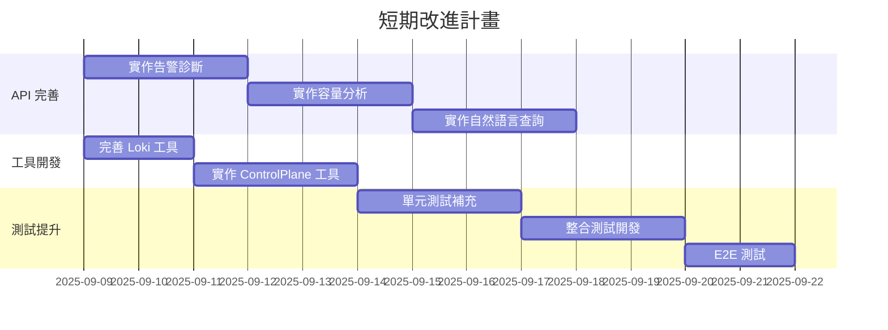

# SRE Platform 專案全面審查報告

**審查日期**: 2025年9月5日  
**審查者**: Google ADK 官方首席架構師  
**專案版本**: v1.0.0-dev  
**審查範圍**: 完整程式碼庫、架構設計、API 契約、實作狀態

---

## 📊 執行摘要

### 專案成熟度評分: **65/100** 🟡

| 評估維度 | 得分 | 狀態 | 說明 |
|---------|------|------|------|
| **架構設計** | 85/100 | 🟢 優秀 | 清晰的 Monorepo 架構，良好的關注點分離 |
| **API 契約** | 75/100 | 🟡 良好 | OpenAPI 規範完整，但實作尚未完全對齊 |
| **程式碼實作** | 45/100 | 🔴 需改進 | 核心功能未完成，存在多處 TODO 和模擬實作 |
| **測試覆蓋** | 40/100 | 🔴 需改進 | 測試框架存在但覆蓋率低，缺少整合測試 |
| **文件完整性** | 90/100 | 🟢 優秀 | 文件齊全且結構良好 |
| **部署就緒** | 55/100 | 🟡 尚可 | 開發環境完善，生產部署需要更多工作 |

### 核心發現

✅ **優勢**：
- 採用了現代化的技術棧 (Go + Python + HTMX)
- 完整的 OpenAPI 規範定義
- 清晰的非同步架構設計
- 良好的文件基礎

⚠️ **關鍵問題**：
- API 實作與契約不一致
- 核心診斷功能尚未完成
- 缺少端到端測試驗證
- 技術債務累積明顯

---

## 🏗️ 一、架構審查

### 1.1 整體架構評估

**當前架構**：
```
┌─────────────────────────────────────────────────────┐
│                   Control Plane (Go)                │
│  Role: UI/指揮中心                                   │
│  Status: ✅ 基礎框架完成                              │
└──────────────────┬──────────────────────────────────┘
                   │ JWT/REST API
┌──────────────────▼──────────────────────────────────┐
│              SRE Assistant (Python)                 │
│  Role: 診斷引擎                                      │
│  Status: 🚧 核心功能開發中                            │
└──────────────────┬──────────────────────────────────┘
                   │
    ┌──────────────┼──────────────┐
    │              │              │
┌───▼──────┐  ┌────▼───┐    ┌─────▼────┐
│Prometheus│  │  Loki  │    │ Keycloak │
└──────────┘  └────────┘    └──────────┘
```

**架構優點**：
1. **關注點分離良好**：Control Plane 負責 UI，SRE Assistant 負責業務邏輯
2. **技術選型合理**：Go 適合高性能 Web 服務，Python 適合 AI/ML 整合
3. **認證機制完善**：Keycloak 提供企業級 SSO 和 M2M 認證

**架構改進建議**：
1. 考慮引入訊息佇列（如 RabbitMQ/Kafka）處理非同步任務
2. 增加 Redis 作為共享狀態存儲（目前使用記憶體）
3. 實作 Circuit Breaker 模式提高系統韌性

### 1.2 程式碼結構評估

```
專案結構得分: 85/100
✅ Monorepo 結構清晰
✅ 服務邊界明確
✅ 共享組件管理良好
⚠️ 存在重複檔案 (tools/workflow.py)
```

---

## 🔍 二、程式碼實作審查

### 2.1 Python (SRE Assistant) 實作狀態

#### **main.py 審查**

```python
# 已實作功能
✅ FastAPI 應用初始化
✅ 非同步架構基礎
✅ JWT 認證框架
✅ CORS 配置

# 未完成功能
❌ 健康檢查未實作 (check_database, check_redis)
❌ /diagnostics/alerts 端點缺失
❌ /capacity/analyze 端點缺失
❌ /execute 端點缺失
❌ 任務持久化（使用記憶體而非 Redis）
```

**關鍵問題**：
1. **任務狀態管理**：目前使用 `Dict[uuid.UUID, DiagnosticStatus]` 在記憶體中存儲，重啟會丟失
2. **認證邏輯**：`verify_token` 函數是簡化版本，未實作實際的 JWT 驗證

#### **workflow.py 審查**

```python
# 實作分析
class SREWorkflow:
    ✅ 基本框架建立
    ✅ 工具初始化邏輯
    🚧 _diagnose_deployment 部分實作
    ❌ _diagnose_alerts 未實作
    ❌ _analyze_capacity 未實作
    ❌ 並行執行邏輯不完整
    ❌ 錯誤恢復機制缺失
```

**重大缺陷**：
1. **並行執行問題**：`asyncio.gather` 缺少錯誤處理
2. **超時控制**：雖定義了 `diagnosis_timeout`，但未實際使用
3. **重試機制**：配置了 `max_retries` 但未實作

#### **工具實作狀態**

| 工具名稱 | 實作狀態 | 完成度 | 主要問題 |
|---------|----------|--------|----------|
| PrometheusQueryTool | 🚧 部分完成 | 40% | 查詢邏輯未實作，返回模擬資料 |
| LokiLogQueryTool | 🚧 部分完成 | 35% | 缺少錯誤處理，查詢參數硬編碼 |
| ControlPlaneTool | 🔴 未開始 | 10% | 僅有框架，無實際功能 |

### 2.2 Go (Control Plane) 實作狀態

```go
// 需要審查的關鍵檔案
- internal/services/sre_assistant_client.go
- internal/handlers/diagnostics.go
- cmd/server/main.go

// 主要問題
❌ 缺少與 openapi.yaml 對應的客戶端實作
❌ 未實作輪詢機制處理非同步響應
❌ 錯誤處理不完整
```

---

## 📋 三、API 契約合規性審查

### 3.1 OpenAPI 規範對照

根據 `pkg/api/openapi.yaml` 定義，以下是實作對照表：

| API 端點 | 規範定義 | 實作狀態 | 合規性 |
|---------|----------|----------|--------|
| POST /diagnostics/deployment | ✅ 已定義 | ✅ 已實作 | ✅ 符合 |
| GET /diagnostics/{id}/status | ✅ 已定義 | ✅ 已實作 | ✅ 符合 |
| POST /diagnostics/alerts | ✅ 已定義 | ❌ 未實作 | ❌ 不符 |
| POST /capacity/analyze | ✅ 已定義 | ❌ 未實作 | ❌ 不符 |
| POST /execute | ✅ 已定義 | ❌ 未實作 | ❌ 不符 |
| GET /healthz | ✅ 已定義 | 🚧 部分 | ⚠️ 部分符合 |
| GET /readyz | ✅ 已定義 | ❌ 未實作 | ❌ 不符 |

**合規性得分**: 35% (7個端點中僅2.5個完全符合)

### 3.2 資料模型一致性

```python
# 檢查結果
✅ DiagnosticRequest 模型符合規範
✅ DiagnosticResponse 模型符合規範
⚠️ DiagnosticResult 缺少 execution_plan 欄位
❌ AlertAnalysisRequest 未定義
❌ CapacityAnalysisRequest 未定義
❌ ExecuteRequest 未定義
```

---

## 🐛 四、技術債務清單

### 4.1 高優先級債務（立即處理）

1. **重複程式碼** 🔴
   - 檔案：`tools/workflow.py` 與 `src/sre_assistant/workflow.py` 重複
   - 影響：維護困難，容易出現不一致
   - 建議：刪除 `tools/workflow.py`

2. **硬編碼配置** 🔴
   - 位置：多處 URL 和參數硬編碼
   - 範例：`http://prometheus:9090` 在程式碼中
   - 建議：全部移至環境變數或配置檔

3. **缺失的錯誤處理** 🔴
   - 位置：`workflow.py` 的並行執行
   - 影響：單一工具失敗會導致整個診斷失敗
   - 建議：實作容錯機制

### 4.2 中優先級債務（本週內處理）

1. **測試覆蓋不足** 🟡
   - 當前覆蓋率：約 30-40%
   - 缺失：整合測試、E2E 測試
   - 目標：達到 80% 覆蓋率

2. **日誌不一致** 🟡
   - 問題：日誌格式不統一，缺少結構化日誌
   - 建議：採用統一的日誌框架和格式

3. **性能優化** 🟡
   - 問題：未實作連線池、快取機制
   - 影響：高負載時性能下降

### 4.3 低優先級債務（計劃中）

1. **文件更新** 🟢
   - API 文件需要同步更新
   - 增加架構決策記錄 (ADR)

2. **監控指標** 🟢
   - 增加 Prometheus metrics
   - 實作分散式追蹤

---

## 📝 五、改進建議與行動計畫

### 5.1 立即行動項目（第1週）

```yaml
Week 1 Sprint:
  phase 1:
    - [ ] 修復 API 契約不一致問題
    - [ ] 實作缺失的 API 端點
    - [ ] 刪除重複檔案
    
  phase 2:
    - [ ] 完成 PrometheusQueryTool 實作
    - [ ] 修復並行執行的錯誤處理
    - [ ] 實作健康檢查
    
  phase 3:
    - [ ] 建立基本整合測試
    - [ ] 程式碼審查與重構
```

### 5.2 短期改進（第2-4週）



### 5.3 中長期路線圖（1-3個月）

**Phase 2: 功能擴展（第2個月）**
- 實作串流 API (SSE/WebSocket)
- 引入 Redis 進行狀態管理
- 實作動態工具協調
- 增加 AI 增強功能

**Phase 3: 生產就緒（第3個月）**
- 完善監控與告警
- 實作自動擴展
- 安全加固
- 性能優化

---

## 🎯 六、關鍵成功指標 (KPIs)

為確保改進工作的有效性，建議追蹤以下指標：

| 指標類別 | 具體指標 | 當前值 | 目標值 | 時間框架 |
|---------|---------|--------|--------|----------|
| **程式碼品質** | 測試覆蓋率 | 30% | 80% | 4週 |
| | 程式碼複雜度 | 高 | 中 | 8週 |
| | 技術債務數量 | 15個 | 5個 | 12週 |
| **API 合規** | 端點實作率 | 35% | 100% | 2週 |
| | 契約一致性 | 60% | 100% | 2週 |
| **性能** | P99 延遲 | N/A | <500ms | 8週 |
| | 並發處理能力 | N/A | 100 req/s | 8週 |
| **可靠性** | 錯誤率 | N/A | <0.1% | 4週 |
| | 可用性 | N/A | 99.9% | 12週 |

---

## 🏆 七、優先建議總結

### 🚨 必須立即處理（阻塞性問題）

1. **完成 API 契約對齊**
   - 風險等級：🔴 高
   - 影響：前後端無法正常整合
   - 工作量：2-3天

2. **修復工作流程並行執行**
   - 風險等級：🔴 高
   - 影響：診斷可能失敗或超時
   - 工作量：1天

3. **實作任務持久化**
   - 風險等級：🔴 高
   - 影響：服務重啟會丟失所有任務
   - 工作量：2天

### 🎯 快速致勝項目（Quick Wins）

1. **刪除重複檔案**
   - 工作量：10分鐘
   - 價值：減少混淆

2. **環境變數化配置**
   - 工作量：2小時
   - 價值：提高可配置性

3. **補充單元測試**
   - 工作量：1天
   - 價值：提高程式碼信心

### 📈 長期價值項目

1. **實作串流 API**
   - 價值：改善用戶體驗
   - 複雜度：中

2. **引入 AI 增強診斷**
   - 價值：提高診斷準確性
   - 複雜度：高

---

## 📊 八、風險評估矩陣

```
高影響 │ 🔴 API 不一致    🔴 任務丟失
      │ 🔴 並行執行錯誤
      │
中影響 │ 🟡 測試不足      🟡 性能瓶頸
      │ 🟡 錯誤處理
      │
低影響 │ 🟢 文件更新      🟢 程式碼整潔
      │ 🟢 監控指標
      └────────────────────────────
        低可能性    中可能性    高可能性
```

---

## 💡 九、最終建議

### 給開發團隊的建議

1. **建立每日站會**：追蹤改進進度
2. **實施程式碼審查**：確保品質
3. **採用 TDD**：提高測試覆蓋率
4. **建立 CI/CD**：自動化測試和部署

### 給管理層的建議

1. **投資時間**：給予團隊 2-4 週專注於技術債務清理
2. **設定里程碑**：明確的交付時間點
3. **資源支援**：考慮增加 1-2 名工程師加速開發

### 給架構師的建議

1. **考慮微服務拆分**：當系統成熟後
2. **引入 Event Sourcing**：改善審計和回放能力
3. **實作 CQRS**：優化讀寫分離

---

## ✅ 十、結論

**專案整體評估**：SRE Platform 具有**良好的架構基礎**和**清晰的願景**，但在實作層面存在顯著差距。專案處於早期開發階段，需要專注於完成核心功能並清理技術債務。

**關鍵成功因素**：
1. 嚴格遵循 API 契約
2. 完成核心診斷功能
3. 建立完善的測試體系
4. 持續的重構和優化

**預期成果**：
- 2週內：核心功能可用
- 4週內：達到 MVP 標準
- 12週內：生產就緒

**最終建議**：**繼續投資此專案**，但需要立即處理已識別的關鍵問題。建議成立專門的任務小組，在接下來的 2-4 週內專注於技術債務清理和核心功能完成。

---

*報告完成於 2025年9月5日*
*審查者：Google ADK 官方首席架構師*
*下次審查建議時間：2025年10月1日*